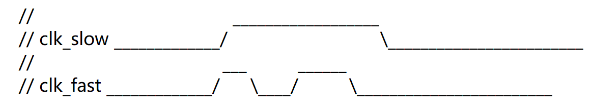
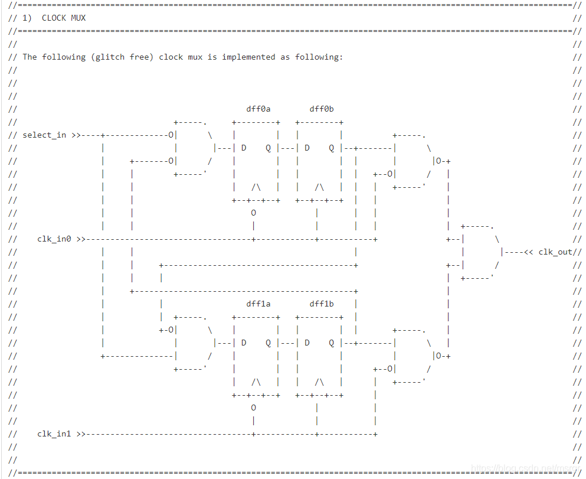

良好的编码风格，有助于代码的阅读、调试和修改。虽然 Verilog 代码可以在保证语法正确的前提下任意编写，但是潦草的编码风格往往是一锤子买卖。有时回看自己编写的代码，既看不出信号的意义，也不了解模块的功能，还得从逻辑上一步步分析，就会消耗大量的时间和精力去消化，严重影响设计进度。

为了不让别人或自己由衷的感叹出：这特喵的是哪个"小傻宝"写的代码！下面对编码风格进行一定意义上的建议。

### 关于命名

信号变量、模块等一定要使用有意义的名字，且信号名称在模块间穿梭时也应该保持不变，以便代码自身就具有清晰的说明信息，增强可读性。

当名字单词数量过多时，可以使用首字母大写或下划线"_"进行拼接。个人喜欢后者，比较清晰。

 **reg**   DataToDestinationClock ;
 **reg**   data_to_destination_clock ; *//推荐*

建议使用单词缩写的方式对信号进行命名，并懂得取舍，避免过长的信号命名。例如 clock 缩写为 clk, destination 缩写为 dest，source 缩写为 src 等。

reg data_to_destination_clock ; reg des_data ; //推荐

巧用数字代表英文字母，例如 2 代表 to, 4 代表 for, 可以省略一丢丢代码空间。

```Verilog
  reg     clk_for_test, sig_uart_to_spi ;
  reg     clk4test, sig_uart2spi ; //推荐
```

虽然 Verilog 区分大小写，但是建议一般功能模块的名称、端口、信号变量等全部使用小写，parameter 使用大写，一些电源、pad 等特殊端口使用大写。只为编写代码方便，容易区分常量变量，不用考虑大小写不一样但名字相同的信号变量的差异。

```Verilog
  parameter         DW = 8 ; //常量
  reg [DW-1 : 0]    wdata ;  //变量
```

寄存器变量一般加后缀 **_r**, 延迟打拍的变量加后缀 **_r1**、**_r2**等。主要有两大好处。一是 RTL 设计时容易根据变量类型对数据进行操作。二是综合后网表的信号名字经常会改变，加入后缀容易在综合后网表中找到与 RTL 中对应的信号变量。

```Verilog
  wire      dout_en ;
  reg       dout_en_r ;
  ...  //dout_en_r 的逻辑
  assign    dout_en = dout_en_r ;
```

其他尾缀：**_d** 可以表示延迟后的信号，**_t** 可以表示暂时存储的信号，**_n** 可以表示低有效的信号，**_s** 可以表示 slave 信号，**_m** 可以表示 master 信号等。

避免使用关键字对信号进行命名，例如 **in, out, x, z** 均不建议作为变量。

文件名字保持与设计的 **module** 名字一致，文件内尽量只包含一个设计模块。

### 关于注释

每一个设计模块开头，都应该包含文件说明信息，包括版权、模块名字、作者、日期、梗概、修改记录等信息。例如：

```Verilog
/**********************************************************
// Copyright 1891.06.02-2017.07.14
// Contact with willrious@sina.com
================ runoob.v ======================
>> Author       : willrious
>> Date         : 1995.09.07
>> Description  : Welcome
>> note         : (1)To 
>>              : (2)My
>> V180121      : World.
************************************************************/
```

注释应该精炼的表达出代码所描述的意义，简短的注释在一行语句代码之后添加，过长的注释提前一行书写。

```Verilog
   //输出位宽小于输入位宽，求取缩小的倍数及对应的位数
   parameter       SHRINK       = DWI/DWO ;
   reg [AWI-1:0]         ADDR_WR ; //写地址
```

注释尽量用英文书写，以保证不同操作系统、不同编辑器下能够正常显示。

端口信号中，除一般的时钟和复位信号，其他信号最好也进行注释。

注释功能非常强大，可以使用注释信息画出时序图，甚至可以使用注释画出数字电路结构图。





### 关于优化

使用圆括号确定程序的优先级或逻辑结构。为避免操作符优先级问题导致设计错误，建议多多使用圆括号。同时，圆括号的巧妙使用有时候也会优化逻辑综合后的结构。例如：

```Verilog
    //往往被综合成串行的 3 个加法器
    assign F = A + B + C + D ;
    //往往被综合成并行的的 2 个加法器和 1 个级联的加法器，时序更加宽松
    assign F = (A + B) + (C + D) ;
 
    //不推荐
    assign flag = cnt == 4'd2 && mode == 2'b01;
    //推荐
    assign flag = (cnt == 4'd2) && (mode == 2'b01);  
```

条件语句尽量使用 case 语句代替 if 语句。当同级别的条件判断语句过多时，使用 case 语句综合后的硬件结构，往往比 if 语句消耗更少的资源，拥有更好的时序。

状态机编写时，尽量使用 3 段式，以保证代码具有良好的整洁性和安全性。

系统设计时，尽量采用模块按功能分割、然后进行模块例化的方法。相比成千上万行代码都集成在一个文件中，模块分割有利于团队设计，便于更新维护。

### 关于美观

端口信号保证每行一个信号，逗号紧跟在端口声明之后，强迫症患者请保持逗号也对齐。

```Verilog
//不推荐
module even_divisor (input rstn, clk, output clk_div2, clk_div4, clk_div10) ;

//推荐
module even_divisor    (
    input               rstn     ,
    input               clk      ,
    output              clk_div2 ,
    output              clk_div4 ,
    output              clk_div10
    );
```

一行代码内容过长时，尽量换行编写，无需使用换行符，例如：

```Verilog
      assign rempty    = (rover_flag == rq2_wptr_decode[AWI]) &&
                         (raddr_ex >= rq2_wptr_decode[AWI-1:0]);
```

尽量使用 begin + end 的方式保证执行语句间的层叠关系。begin 与关键字同行，end 另起一行。例如，always 语句块使用时，或条件语句只有一条执行语句时，都可以省略 begin + end 关键字。但为保证结构的完整性，以及后续代码的调试与修改，还是建议加入此类关键字。

```Verilog
   always @(posedge dout_clk or negedge rstn) begin
      if (!rstn) begin
         dout_en_r       <= 1'b0 ;
      end
      else begin
         dout_en_r       <= rd_en_wir ;
      end
   end
```


尽量使用 tab 键和空格，保证语句按照层级结构对齐，变量、关键字、操作符之间也应该留有空隙，便于逻辑判断。

```Verilog
   generate
      if (DWO >= DWI) begin
         reg [DWI-1:0]         mem [(1<<AWI)-1 : 0] ;
         always @(posedge CLK_WR) begin
            if (WR_EN) begin
               mem[ADDR_WR]  <= D ;
            end
         end
      end
   endgenerate
```

模块例化时，端口信号尽量与连接信号隔开，并各自对齐。连接信号为向量时指明其位宽，方便阅读、调试。

  ```Verilog
  ram  u_ram(
      .CLK_WR      (clk),
      .WR_EN      (wren), *//写满时禁止写*
      .ADDR_WR     (addr),
      .D        (wdata[9:0]),
      .Q        (rdata[31:0])
      );
  ```

例化多个相同的模块时，尽量使用 generate 语句，避免过长的例化代码描述。