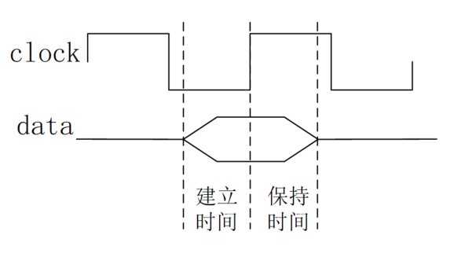
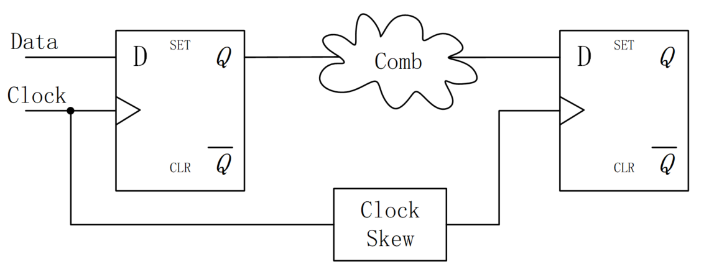
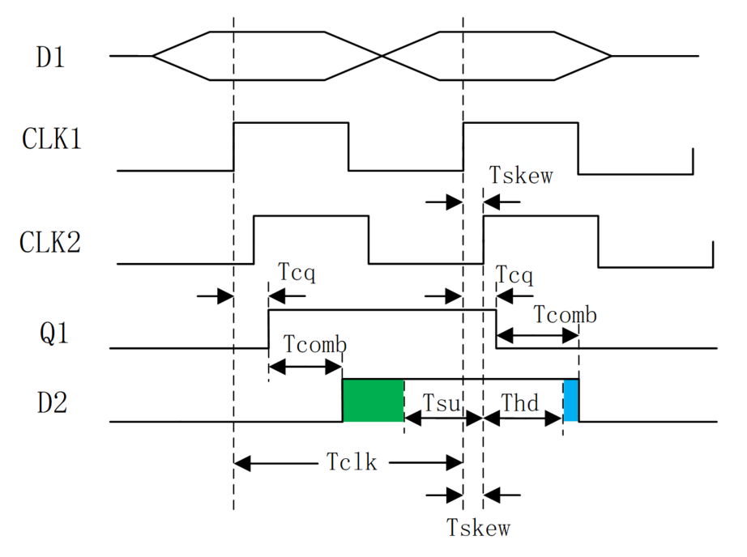
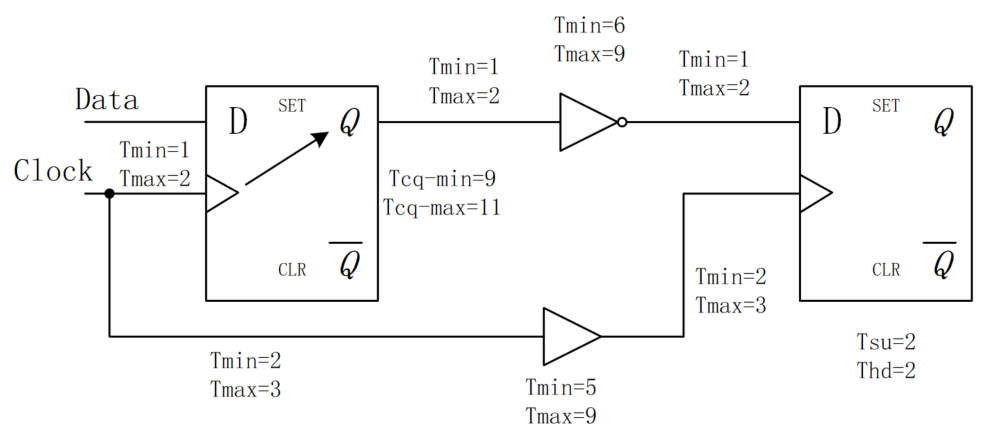
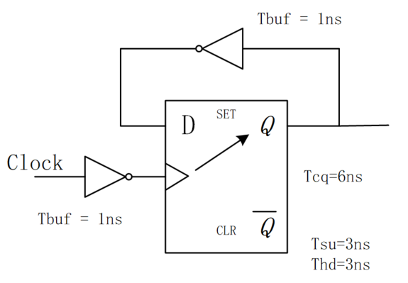
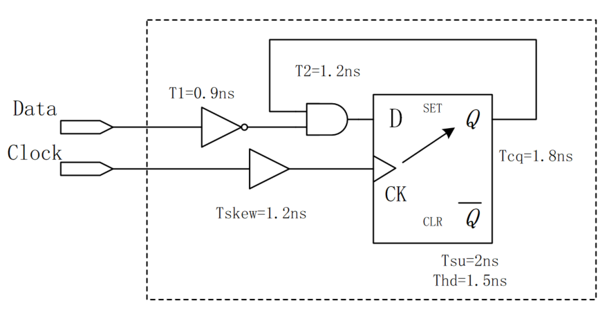
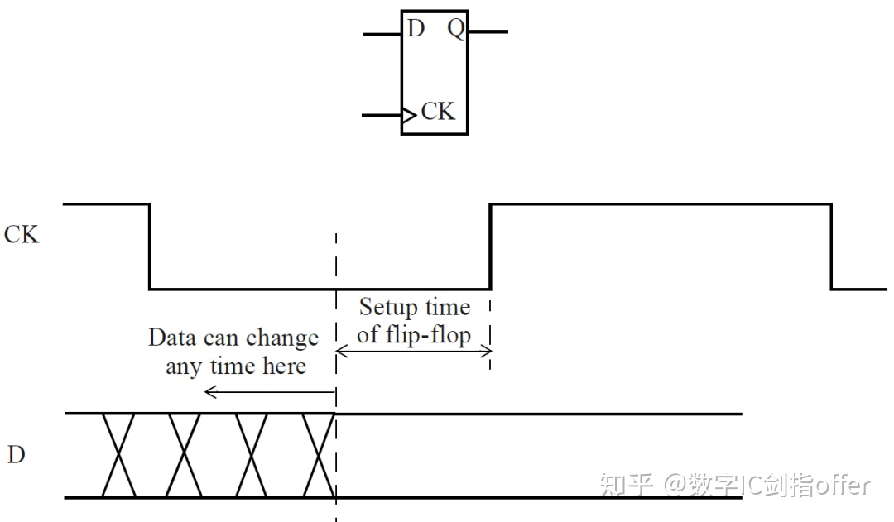
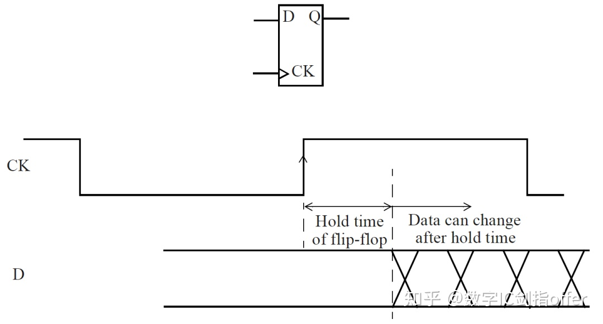
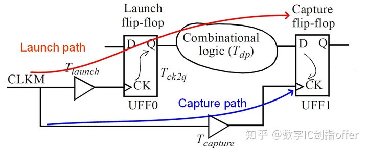

对于数字系统而言，建立时间（setup time）和保持时间（hold time）是数字电路时序的基础。数字电路系统的稳定性，基本取决于时序是否满足建立时间和保持时间。所以，这里用一整节的篇幅，来详细的说明建立时间和保持时间的概念。

## 基本概念

建立时间就是时钟触发事件来临之前，数据需要保持稳定的最小时间，以便数据能够被时钟正确的采样。

保持时间就是时钟触发事件来临之后，数据需要保持稳定的最小时间，以便数据能够被电路准确的传输。**保持时间保障了下一个新数据到来之前, 老的数据输出稳定**

可以通俗的理解为：时钟到来之前，数据需要提前准备好；时钟到来之后，数据还要稳定一段时间。建立时间和保持时间组成了数据稳定的窗口，如下图所示。



## 约束条件

### 建立时间约束条件

下图是一个典型的触发器到触发器之间的数据传输示意图。其中 "Comb" 代表组合逻辑延迟，"Clock Skew" 表示时钟偏移，数据均在时钟上升沿触发。



时钟到来之前，数据需要提前准备好，才能被时钟正确采样，要求数据路径 （data path） 比时钟路径 （clock path）更快，即数据到达时间（data arrival time）小于数据要求时间（data required time）。则建立时间需要满足的表达式为：

```
Tcq + Tcomb + Tsu <= Tclk + Tskew （1）
```

各个时间参数说明如下：

- Tcq: 寄存器 clock 端到 Q 端的延迟；
- Tcomb： data path 中的组合逻辑延迟；
- Tsu: 建立时间；
- Tclk: 时钟周期；
- Tskew: 时钟偏移。

对上式进行变换，则理论上电路能够承载的最小时钟周期和最快时钟频率分别为：

```
最小时钟周期 = Tcq + Tcomb + Tsu - Tskew
最快时钟频率 = 1 / (Tcq + Tcomb + Tsu - Tskew) 
```

### 保持时间约束条件

时钟到来之后，数据还要稳定一段时间，**这就要求前一级的数据延迟**（data delay time）大于触发器的保持时间，以免数据被冲刷掉。则保持时间需要满足的表达式为：

```
Tcq + Tcomb(前一级数据到来的时间) >= Thd + Tskew(本次数据保持稳定输出的时间) (2)
```

各个时间参数说明如下：

- Tcq: 寄存器 clock 端到 Q 端的延迟；
- Tcomb： data path 中的组合逻辑延迟；
- Thd: 保持时间；
- Tskew: 时钟偏移。

### 建立时间与保持时间时序图

一个关于建立时间和保持时间的复杂时序图如下所示。

其中，绿色部分表示建立时间的裕量（margin），蓝色部分表示保持时间的裕量。时间裕量，其实就是电路在满足时序约束的条件下，不等式 (1) 或 (2) 两边时间的差值。

```
建立时间裕量为：（时钟路径时间）-（数据路径时间）
保持时间裕量为：（数据延迟时间） - （保持时间 + 时钟偏移）
```



### 计算举例

#### 例1:

考虑线网延迟，某电路各种延迟值（单位：ns）如下，时钟周期为 15ns，请判断该电路的建立时间和保持时间是否存在 violation ？



**解：**

这里涉及了延迟值的最大值和最小值。

因为要求时序约束恒成立，所以式 (1) (2) 的变形为：

```
max (data path time) <= min (clock path time)
min (data delay time) >= max (Thd + Tskew)
```

建立时间检查：

```
max (data path time) = 2 + 11 + 2 + 9 + 2 + 2 = 28ns
min (clock path time) = 15 + 2 + 5 + 2 = 24ns
```

因此建立时间存在 violation。

保持时间检查：

```
min (data delay time) = 1 + 9 + 1 + 6 + 1 = 18ns
max (Thd + Tskew) = 3 + 3 + 9 + 2 = 17ns
```

因此保持时间不存在 violation，裕量（margin）为 1ns。

#### 例2：

一道知名公司的面试题：时钟周期为 T, 第一级触发器 D1 建立时间最大值为 T1max，最小值为 T1min。组合逻辑最大延迟为 T2max, 最小值为 T2min。问：第二级触发器 D2 的建立时间和保持时间应该满足什么条件？

**解：**

第二级的建立时间和保持时间和第一级触发器没有直接关系，所以这里的 T1max 和 T1min 是迷惑项。

例题中也没有给出时钟到 Q 端的延迟和时钟偏移，这里也不用考虑。

结合例 1 的指示，所以 D2 建立时间 Tsu 和保持时间 Thd 应该满足：

```
T2max + Tsu <= T
T2min >= Thold
```

#### 例3：

一种简单的分频电路如下所示。该触发器建立时间为 3ns, 保持时间为 3ns， 逻辑延迟为 6ns，两个反相器延迟为 1ns，连线延迟为0。则该电路的最高工作频率是多少？



这里的逻辑延迟要理解为时钟端到 Q 端的延迟，一定要注意不是电路中的组合逻辑延迟。

因为触发器 Q 端和 D 端连接，可以理解为两个触发器直接进行传输，所以 data path 没有组合逻辑延迟，只有一个反相器延迟。

因为只有一个钟，所以也没有时钟偏移，clock path 的反相器延迟也是迷惑项。

所以，时序约束条件为：

```
Tcq + Tbuf + Tsu <= Tclk
```

可得该电路最高工作频率为：

```
1 / (6ns + 1ns + 3ns) = 100Mhz。
```

注意时钟偏斜是指两级触发器之间的时钟偏移, 这里可以理解成时钟都加了一个反相器, 之间并不会有偏差

#### 例4:

- （1）以下电路固有的建立时间和保持时间？(时间裕量)
- （2）该电路最高的工作频率？



该电路固有的建立时间为：**2.1 + 2 - 1.2 = 2.9ns**

固有的保持时间为：**1.2 + 1.5 - 2.1 = 0.6ns**

由此可知，数据路径的延迟会增加电路固有的建立时间，但是会减少电路固有的保持时间。而时钟偏移会减少电路固有的建立时间，增加电路固有的保持时间。

(2) 此电路仍然是自身到自身的反馈电路。所以没有时钟偏移，也无需考虑 T1= 0.9ns 的延迟。所以最高工作频率为： **1 / (1.8 + 1.2 + 2)ns = 200MHz**


### 知乎分析

setup time是指在时钟有效沿（下图为上升沿）之前，数据输入端信号必须保持稳定的最短时间。



hold time是指在时钟有效沿（下图为上升沿）之后，数据输入端信号必须保持稳定的最短时间。hold time时序检查确保新数据不会在触发器稳定输出初始数据之前过早到达D端而覆盖其初始数据。



。发送数据的触发器称为Launch flip-flop，接收/捕获数据的触发器称为Capture flip-flop。两触发器时钟端信号为同一时钟。

如图3所示，launch_path为：

CLKM→BUF(launch)→UFF0/CK→UFF0/Q→Comb_logic→UFF1/D;

capture path为：

CLKM→BUF(capture)→UFF1/CK;



**（1）Setup Time**

两触发器间的数据传输通常在一个时钟周期内完成。

数据到达UFF1/D所需时间Arrival time为：

Ta = T_launch + T_ck2q + T_dp

满足setup要求时所允许的最长时间Required time为：

Tr = T_capture + T_clk - T_setup

因此setup time要求可表示为：Tr - Ta = T_margin >= 0。

根据图4，setup time要求还可表示为：

T_launch + T_ck2q + T_dp + T_margin + T_setup = T_capture + T_clk

其中：

T_launch：CLKM到UFF0时钟端CK的延时

T_ck2q：UFF0的CK->Q的传输时间

T_dp：组合逻辑延时

T_margin：设计裕量

T_setup：UFF1的setup时间要求

T_capture：CLKM到UFF1时钟端CK的延时

T_clk: 时钟周期

由此可见，setup检查发生在不同时钟边沿，与时钟频率有关。

**（2）Hold Time**

数据到达UFF1/D所需时间Arrival time为：

Ta = T_launch + T_ck2q + T_dp

满足hold要求时所允许的最短时间Required time为：

Tr = T_capture + T_hold

因此hold time要求可表示为：Ta - Tr = T_margin >= 0。

根据图4，hold time要求还可表示为：

T_launch + T_ck2q + T_dp = T_capture + T_hold + T_margin

其中：

T_launch：CLKM到UFF0时钟端CK的延时

T_ck2q：UFF0的CK->Q的传输时间

T_dp：组合逻辑延时

T_hold：UFF1的hold时间要求

T_margin：设计裕量

T_capture：CLKM到UFF1时钟端的延时

T_clk: 时钟周期

由此可见，hold检查发生在同一时钟边沿，与时钟频率无关。

### setup violation修复方法包括：

T_clk：增加T_clk，也就是降频

 T_dp：优化组合逻辑延时，具体包括：

* 增加一个中间触发器来切割Timing Path，分割组合逻辑延时（流水线结构）
* 对于有较大负载的节点可以考虑插buffer、逻辑复制的方法来优化扇出，减少关键路径上的负载
* 小Cell换成大Cell，更换更大驱动的Cell，增强驱动能力
* 更换SVT/LVT的Cell
* T_skew：采用positive skew(T_skew >0)，但是要注意可能引入的hold问题，以及前后级的margin问题
*  T_ck2q：更换更快的时序逻辑单元，如HVT->LVT

### hold violation修复方法包括：

T_dp：增加组合路径延时，通过插buffer、插delay cell、更换驱动、更换阈值的方法（组合逻辑深度的增加会增加芯片的面积、布线资源、功耗，可能产生在慢速工艺库条件下建立时间违例）

 T_skew：减小skew，甚至采用negative skew，但需做好时钟树的balance。

插入低电平有效的锁存器(Lock-up Latch)：高电平期间，锁存器输出保持不变，相当于人为将数据推迟了半个时钟周期，以保证满足hold时间要求。