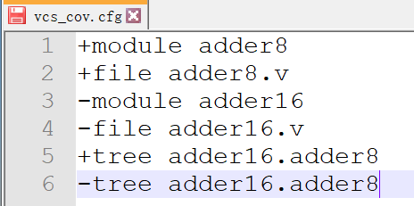
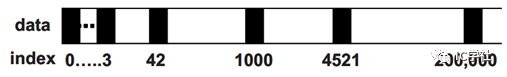

### 1. 说一下建立时间, 保持时间, 时钟偏移, 以及clock tip的概念


- 建立时间(Tsu):

  是指在触发器的时钟信号上升沿到来以前，数据稳定不变的时间，如果建立时间不够，数据将不能在这个时钟上升沿被稳定的打入触发器，Tsu就是指这个最小的稳定时间.

- 保持时间(Th)

  是指在触发器的时钟信号上升沿到来以后，数据稳定不变的时间，如果保持时间不够，数据同样不能被稳定的打入触发器，Th就是指这个最小的保持时间。

- 输出相应时间(To)

  触发器输出的响应时间，也就是触发器的输出在clk时钟上升沿到来之后多长的时间内发生变化，也即触发器的输出延时

- 时钟抖动(jitter) 时钟在频率上的不确定

  两个时钟周期之间存在的差值，这个误差是在时钟发生器内部产生的，和晶振或者PLL内部电路有关，布线对其没有影响

  解决时钟抖动的方法:

  1. 采用FPGA片内的锁相环（PLL）对输入时钟进行锁相。因为其内部的环路滤波器能够对输如时钟进行滤波，从而改善时钟抖动性能。
  2. 采用合适的逻辑电平并以查分形式传输时钟。诸如LVDS或LVPECL等查分方式传输信号，能极大的降低时钟抖动；这种查分通路还能消减信号通路上的工模噪声、干扰和串扰。
  3. 选用相位噪声特性（时钟抖动小）更好的晶振
  4. 谨慎处理印制板时钟信号走线。时钟走线越短越好，以避免寄生，且走线不与其他高速信号相邻甚至交叉。

  

  

- 时钟偏移(skew) 时钟在相位上的不确定

  同一个时钟信号到达两个不同寄存器之间的时间差值，时钟偏斜永远存在，到一定程度就会严重影响电路的时序

### 2. 流水线、超流水线、超标量（superscalar）技术对比

**超流水**

  超级流水线以增加流水线级数的方法来缩短机器周期，相同的时间内超级流水线执行了更多的机器指令, 那么，要提高时钟频率，一种可能的方法就是减小每个阶段的时间消耗。其中一种最简单的办法，就是将每个阶段再进行细分成更小的步骤，同样是细分后的每个阶段，单个阶段的运算量小了，单位耗时s也就减少，这样实际上就是提高了时钟频率。这种将标准流水线细分的技术，就是超级流水线技术。当然，流水线和超级流 水线之间并没有很明显的区别。这样的技术，虽然提高了CPU的主频，但是也带来了很大的副作用：

首先，细分后的每一个阶段都要在其后使用锁存器锁存，因此将一个阶段细分为N的子阶段并不能让单位时间减少到s/N, 而是s/N + d, 其中d为锁存器的反应时间。这实际上就是增加了多余的时间消耗。

 其次，随着流水线级数的加深，一旦分支预测出现错误，会导致CPU中大量的指令作废，这样的消耗是十分巨大的。以上原因，也就是什么Pentium IV具有31级的流水线，指令的执行效率却赶不上只有14级流水线的Pentium M

**超标量**

超标量（superscalar）是指在CPU中有一条以上的流水线，并且每时钟周期内可以完成一条以上的指令，这种设计就叫超标量技术。 其实质是以空间换取时间。而超流水线是通过细化流水、提高主频，使得在一个机器周期内完成一个甚至多个操作，其实质是以时间换取空间。超级标量是指cpu内一般能有多条流水线,这些流水线能够并行处理。每个周期可以发射多条指令(2-4条居多)。可以使得cpu的IPC(InstructionPerClock)>，从而提高cpu处理速度。超级标量机能同时对若干条指令进行译码，将可以并行执行的指令送往不同的执行部件，在程序运行期间，由硬件(通常是状态记录部件和调度部件)来完成指令调度。超级标量机主要是借助硬件资源重复(例如有两套译码器和ALU等)来实现空间的并行操作。熟知的pentium系列(可能是p-II开始),还有SUNSPARC系列的较高级型号,以及MIPS若干型号等都采用了超级标量技术。

**超长指令字**

超常指令字（VLIW：VeryLongInstructionWord）是由美国Yale大学教授Fisher提出的。它有点类似于超级标量，是一条指令来实现多个操作的并行执行，之所以放到一条指令是为了减少内存访问。通常一条指令多达上百位，有若干操作数，每条指令可以做不同的几种运算。那些指令可以并行执行是由编译器来选择的。通常VLIW机只有一个控制器，每个周期启动一条长指令，长指令被分为几个字段，每个字段控制相应的部件。由于编译器需要考虑数据相关性，避免冲突，并且尽可能利用并行，完成指令调度，所以硬件结构较简单。 　　

VLIW机器较少，可能不太容易实现，业界比较有名的VLIW公司之一是Transmeta，在加州硅谷SantaClara（硅谷圣地之一，还有SanJose，PaloAlto）。

**SIMD技术**

单指令多数据（SingleInstructionMultipleData）简称SIMD。SIMD结构的CPU有多个执行部件，但都在同一个指令部件的控制下。SIMD在性能优势呢：以加法指令为例，单指令单数据（SISD）的CPU对加法指令译码后，执行部件先访问内存，取得第一个操作数；之后再一次访问内存，取得第二个操作数；随后才能进行求和运算。而在SIMD型CPU中，指令译码后几个执行部件同时访问内存，一次性获得所有操作数进行运算。这个特点使得SIMD特别适合于多媒体应用等数据密集型运算。

### 3. 流水线的三种冲突/冒险（Hazard）情况

Hazards：指流水线遇到无法正确执行后续指令或执行了不该执行的指令 ：指流水线遇到无法正确执行后续指令或执行了不该执行的指令

#### Structural hazards (hardware resource conflicts):

现象：同一个部件同时被不同指令所使用 

* 一个部件每条指令只能使用1次，且只能在特定周期使用 且只能在特定周期使用
* 设置多个部件，以避免冲突。如指令存储器 。如指令存储器IM 和数据存储器DM分开

结构冒险对浮点运算的性能影响较大,因为浮点运算单元不能有效被流水化,可能造成运算单元的资源冲突

#### Data hazards (data dependencies): 

现象：后面指令用到前面指令结果时，前面指令结果还没产生

* 采用转发(Forwarding/Bypassing)技术
* Load-use冒险需要一次阻塞(stall) 
* 编译程序优化指令顺序

补充:三类数据冒险现象RAW:  写后读(基本流水线中经常发生,如上例) WAR:读后写(基本流水线中不会发生,多个功能部件时会发生) WAW:写后写(基本流水线中不会发生,多个功能部件时会发生)


浮点程序中的数据冒险容易通过编译器优化调度来解决

* 分支指令少
* 数据访问模式比较规整

整数程序中的数据冒险不容易通过编译优化技术解决

* 分支指令多
* 数据不规整
* 使用指针

#### Control (Branch) hazards (changes in program flow): 

现象：转移或异常改变执行流程，顺序执行指令在目标地址产生前已被取出

* 采用静态或动态分支预测
* 编译程序优化指令顺序(实行分支延迟)

控制冒险更多出现在整数运算程序中,因为分支指令对应于循环或选择结构,大多由整数运算结果决定分支

### 4. coverage里面有哪些，详细说一下

覆盖率分为代码覆盖率（code coverage）和功能覆盖率（function coverage）。功能覆盖率就是检查设计的功能是否完善，需要考虑很多不同的情况，是使用System verilog的重点内容。代码覆盖率是检查代码是否存在冗余，检查所有的代码是否都已经执行，状态机所有的状态是否都有到达，检查 if else 和 case 条件语句的条件是否都有使用。防止一些不必要的代码浪费芯片面积，毕竟面积就意味着钱。我们这里只讨论代码覆盖率。

**Line coverage** ：行覆盖率，检查语句是否被执行。

**Toggle coverage**：检查电路的每个节点是否都有 0 -> 1 和 1 -> 0 的跳变。这种检查通常会使仿真变慢很多。

**conditional coverage**：检查条件语句是否覆盖了所有的情况。 比如有时写了if 语句，没有写else语句。

**FSM coverage**: 状态机覆盖率，检查状态机所有的状态是否都到达过。

**path coverage**：在always语句块和initial语句块中，有时会使用 if ... else 和 case 语句，在电路结构上便会产生一系列的数据路径。检查这些路径的覆盖情况。

**VCS中统计代码覆盖率**

VCS在统计代码覆盖率的过程中，我们通常在编译和仿真命令上添加对应的开关选项，生成一个 .vdb文件记录覆盖率的情况。再使用dve打开该文件查看。下面介绍一些选项。

* -cm <coveragetype> ：打开对应类型的覆盖率，例如 -cm cond+tgl+lin+fsm+path为统计上述所有覆盖率。可根据需要增减。
* -cm_name：设置记录有覆盖率信息文件的名字。
* -cm_dir：指定生成文件的目录
* -cm_log + filename.log：.log文件记录仿真过程中统计覆盖率的信息。用的比较少。
* -cm_nocasedef: 在统计case语句的条件覆盖率时，不考虑default条件未达到的情况。
* -cm_hier vcs_cov.cfg：通过.cfg文件（名字随便取）选择要查看覆盖率的模块/文件。

前三个必须有, 后面三个选项可选



“+”代表查看，“-”代表不查看。tree代表查看某个模块调用的子模块。

```makefile
.PHONY:com sim debug cov clean

OUTPUT = cov_test
ALL_DEFINE = +define+DUMP_VPD

#code coverage command
CM = -cm line+cond+fsm+branch+tgl
CM_NAME = -cm_name ${OUTPUT}
CM_DIR = -cm_dir ./${OUTPUT}.vdb


VPD_NAME = +vpdfile+${OUTPUT}.vpd

VCS = vcs -sverilog +v2k -timescale=1ns/1ns     \
	  -o ${OUTPUT}				\
	  -l compile.log			\
	  ${VPD_NAME}				\
	  ${ALL_DEFINE}				\
	  ${CM}					\
	  ${CM_NAME}				\
	  ${CM_DIR}				\
	  -debug_pp 				\
	  -Mupdate

SIM = ./${OUTPUT} ${VPD_NAME} 			\
	  ${CM}					\
	  ${CM_NAME}				\
	  ${CM_DIR}				\
      -l ${OUTPUT}.log

com:
	${VCS} -f filelist.f

sim:
	${SIM}

#show the coverage
cov:
	dve -covdir *.vdb &

debug:
	dve -vpd ${OUTPUT}.vpd &
	
clean:
	rm -rf ./csrc *.daidir *.log simv* *.key *.vpd ./DVEfiles ${OUTPUT} *.vdb

```

### 5. 数组

#### 定宽数组

```verilog
int lo_hi[0:15]; //声明16个元素的数组
int c_type[16];//声明16个元素的数组

//初始化 主义单引号的使用
int ascend[4] = '{0,1,2,3}; 
ascend[0:1] = '{1,1}; //修改前两个元素值
ascend='{0,1,default:1}; //最后两个元素默认1

//遍历
initial begin
   int ascend[4] = '{0,1,2,3}; 
    foreach (ascend[i])  // 不需要定义i，可以之间拿来用
       ascend[i]*=2;
end

//遍历多维数组
initial begin
   int arr[2][3] = '{'{0,1,2},'{3,4,5}};
    foreach(arr[i，j])
        $display("%dn",arr[i][j]); //打印6个值
end
initial begin
  int arr[2][3] = '{'{0,1,2},'{3,4,5}};
   foreach(arr[i]) begin
      $display("%d:n",i); //打印6个值
       foreach(arr[,j])
            $display("%dn",arr[i][j]); //打印6个值
    end
end
```


#### 动态数组

 定宽数组的宽读在编译的时候就确定了。如果想在仿真时生成事务，但事务的总量是随机的，那么就需要用一个很宽的数组，但实际上可能只需要很小的数组，造成存储空间浪费。**SV 中提供动态数组，数组在仿真时分配存储空间。用 [ ].用 new[] 来分配空间，delete() 删除元素。**

```Verilog
initial begin
    int dyn[],dyn2[]; //[]符号
    dyn = new[4]; //分配4个元素
    foreach(dyn[i]) dyn[i] = i;
    dyn2=new[4](dyn); // 将dyn的值给dyn2
    dyn.delete(); 
end
```

**定宽数组可以给动态数组赋值，编译器自动调用 new 函数。**

#### 关联数组

关联数组就是哈希，保存键值对。用来保存稀疏型的数据, 与其他数组不同的是，关联数组有利于使用零散的存储空间，如下图所示，关联数组存储数据并不是连续的存储空间。



关联数组声明方式：data_type array_name[index_type], 例如 int array[string]，其中int为关联数组存储数据的类型为int型数据，数组的索引为字符串索引。

```Verilog
//文件内容：
12 min_address
123 max_address
//
initial begin
  int switch[string]；//定义，int是值类型，string是键类型
  int min_add,max_add;//
 	int i,r,file;
  string s,idx;
  file = $fopen("switch.txt","r");
  while(!$feof(file)) begin
  	r = $fscanf(file,"%d %s",i,s);
    switch[s] = i;  // 赋值
  end
 switch.exist("max_address"); //是否存在某个键
 switch.first(idx);// 将第一个键值对的键（索引）保存在idx
 switch.next(idx);//得到下一个键值对的键，保存在idx
 switch.delete(idx);//删除idx的键对应的键值对
end
```


#### 合并数组

可以当做单独的数据, 也可以分成几个小分作为数组

合并数组可与与定长数组混合使用 ，各个索引的对应关系比较容易混乱，总体来说是先索引定长数组的维数，在索引合并数组的维数。

```Verilog
bit [3:0][7:0] bytes;  //4字节组装成的32bit
bytes = 32'hCafe_Dada;
bytes; // 32bit
bytes[3]; //Ca字节
bytes[3][0];//单bit
```

#### 队列 queue

可以在队列任何地方增加或者删除元素，在性能上的损耗比数组小。**$ 符号。**

**还括号初始化，但不需要单引号, 最后一个索引是$。** 

```Verilog
initial begin
    int j=0;
    q1[$] = {0,1};
   q2[$] = {2,3,4};
    q1.insert(1,10);//在索引1处插入10
    q1.insert(1,q2);//插入队列
    q1.delete(1);//删除索引1处元素
 q1.push_front(1);
  j=q1.pop_front;
    q1.push_back(1);
   j=q1.pop_back();
   foreach (q1[m]) q1[m];
    q1 = {q1[0],q1[1:4]}; // 最后一个索引是$
    q1 = {q1[0],j,q1[1:$]}; // 在任意位置插入元素、队列
end
```

#### 数组的方法

1. $size(array): 求出数组的长度

2.  sum方法, 返回元素宽度的值

   ```Verilog
   initial begin
     bit[0:7] arr[4] = '{1,2,3,4};
      arr.sum;//返回8bit的值，也就是返回元素宽度的值
       32‘b + arr.sum; //返回32bit
   end
   ```

3. max 最大值、min 最小值、unique 返回不重复的元素。

   ```verilog
   int f[6] = '{0,1,2,2,4,1};
   int q[$];
   q = f.max; //{4}
   q = f.min; //{0}
   q = f.unique; // {0,1,2,4}
   ```

4. with 用来定位数组中的元素，与其他方法一起使用。

   ```Verilog
   q = f.find with(item > 2); /找到大于2的元素，也是返回队列
   q = f.find_index with(item >2); //大于2 的元素的索引
   q = f.find_first with(item >2);
   q = f.find_first_index with(item >2);
   q = f.find_last with(item >2);
   q = f.find_last_index with(item >2);
   sum = f.sum with (item >2);//对大于2的元素求和
   ```

5. reverse，sort（从小到大），rsort（从大到小）


### 6. 为什么用virtual定义方法，出了一个定义了virtual方法的父类和子类的问题，子类句柄指向父类对象时可以直接转换吗，需要怎么转换

子类可以通过super操作符来引用父类中的方法和成员, 被声明为local的数据成员和方法只能对自己可见，对外部和子类都不可见；对声明为protected的数据成员和方法，对外部不可见，对自身和子类可见。


类中的方法可以在定义的时候通过添加virtual关键字来声明一个虚方法,虚方法是一个基本的多态性结构.

虚方法为具体的实现提供一个原型,也就是在派生类中,重写该方法的时候必须采用一致的参数和返回值.

根据父类句柄指向的对象类型来确定调用的是子类的方法还是父类的方法

**若基类的方法没有定义成virtual，那么SV 会根据句柄的类型，而不是对象的类型进行方法的调用**


$cast可以对不同的内建类型进行转换，用的更多的是不同层次之间类的转换。在这种父类与子类之间的转换里， 父类站的高，子类在底下，从父类向子类的转换，称为向下类型转换，而子类向父类的转换称为向上类型转换。向上类型转换是安全的，而反之则是不安全的。但是因为子类含有比父类更丰富的属性，它很有可能会访问父类并不包含的资源，这时就找不到该资源，越界了，因此会有error。父类就好像上海，子类相当于长三角地区，包含但不仅仅是上海，因此父类能到的地方子类都可以到，反之不行，因此把子类的句柄给父类没关系，但反之不行，所以向下类型是需要有严格的类型检查的，阻止非法转换。

当子类对象传递给父类句柄, 然后子类句柄在接受父类的传递, 这样才可以, 本质上还是接受的是子类的对象

```Verilog
class father;
    string m_name;

    function new (string name);
      m_name = name;
    endfunction : new

    function void print ();
      $display("Hello %s", m_name);
    endfunction : print
endclass : father

class child1 extends father;
    string area1 = "jiangzhehu";

    function new (string area1);
      super.new(area1);
    endfunction : new
endclass : child1

class child2 extends father;
    string area2 = "shanghai";

    function new (string area2);
      super.new(area2);
    endfunction : new
endclass : child2


program top;
    father f;
    child1 c10,c11,c12;
    child2 c20,c21,c22;

    initial begin
            f = new ("shanghai");
      f.print(); //Hello shanghai
            c10 = new("jiangzhehu");
            f = c10; 
			      f.print();  //Hello jiangzhehu
            c20 = new("changsanjiao");
            f = c20;
            f.print();//Hello changsanjiao
            c20.area2 = "zhejiang";
            $cast(c21, f);
            c21.print();//Hello changsanjiao
            $display("has %s", c21.area2);//has zhejiang
            c22 = c20;
            c22.print();//Hello changsanjiao
            $display("has %s", c22.area2);//has zhejiang
            c20.area2 = "hangzhou";
            c21.print();//Hello changsanjiao
            $display("has %s", c21.area2);//has hangzhou
            c22.print();//Hello changsanjiao
            $display("has %s", c22.area2);//has hangzhou

    end  
endprogram : top
```


### 7. AHB中burst传输开始时，第一个trans_type是什么


### 8. AHB支持outstanding和乱序读吗


### 9. 在一个l1cache中，cacheline大小如何划分，相联度如何划分，与什么有关，给出一个l1cache的spec

由于页的大小为4KB, 需要12位表示, 在cache中, 为了加快频率, 需要使用index去cache中SRAM读取出对应的cache line 然后读取的同时TLB将虚地址转换为实地址送到cache中. 这样的话就加快的命中, 同时也限制了(index+ offset <=12). 同时由于cache ways最多为8, 导致了cache的大小限制为32KB

### timescale的作用范围及优先级

tb_top的开头定义了`timescale 1ns/1ps, 首先，1ns表示的是我们时间的基本单位, 比如代码中使用#5表示阻塞5个时间点, 这就是基本时间单位**timeunit**, 然后我们再来看看第二个参数1ps，这个是**时间精度（timeprecision）**，假如我们把刚刚的#5换成#5.001，其实最终会阻塞5.001ns, 因为最小的精度单位是ps, 这里还在精度范围之内, 要是5.0001就不行了

使用$printtimescale可以打印出对应的时间精度, 可以传入参数, 传入对应想查看的模块例化名

**`timescale是个编译参数，编译时候起作用**。

在没有定义`timescale的module中，其timescale使用跟它**最近的一个且编译顺序上排在前的**module中的timescale。

如果编译顺序前的module也没有timescale，则使用编译命令输入的**default** **timescale**。default timescale就是指我们编译时输入的timescale的**编译器命令选项**。

1. forkjoin三兄弟

1. factory机制的好处，override的条件，通过字符串进行创建在源码中是如何实现的
2. sv的面向对象三要素及理解
3. 了解coherence么
4. cpu内部的指令执行流程
5. 假设有一个模块，做out= a + 0.5b + 0.75c的运算，结果是四舍五入后的值，你会去怎么设计
6. 64 bit bus downsize to 16 bit bus
7. 写一个同步FIFO
8. 写一个五分频电路, 介绍优缺点
9. cache有什么优缺点
10. cache结构地址划分
11. 你碰到过时序的问题吗，怎么解决的
12. 介绍一下对factory机制和sequence机制的理解
13. 介绍一下tomasulo算法
14. 你知道哪些branch prediction技术
15. cpu性能用什么来衡量，讲讲roofline
16. 介绍一下TLB
17. 覆盖率有哪些，如何保证验证完备，:=和:/有啥区别
18. component之间通信的方法
19. 什么是phase机制？
20. object和component区别？
21. 为什么要用virtual sequence？
22. 知不知道virtual function？
23. 什么是覆盖方法？如何使用
24. AXI几个通道？
25. 问了下axi的优点是什么，与别的amba总线的区别。
26. 为什么写操作需要三个通道，然后讨论了半天axi4又没有wid的问题。
27. 异步FIFO；
28. 低功耗的方法；
29. 你认为芯片设计与FPGA主要的区别在哪里？
30. AXI4；
31. 跨时钟域有哪些方法
32. 为什么要两级寄存器同步
33. 异步fifo有哪些注意点
34. 逻辑综合用到了哪些文件输入
35. sdc文件包括了哪些约束
36. 如何理解input和output delay
37. 如何理解multicycle path
38. 知不知道set_clock_uncertainty由哪些组成
39. 知不知道set_clock_uncertainty由哪些组成
40. AXI有没有实现背靠背？
41. 介绍一下FIXED，INCR和WRAP传输？
42. WRAP模式下首地址为4，burst length=4，burst size=4 bytes 的地址变化？
43. AXI有哪五个通道？
44. 是否了解SPI和AHB？
45. SV中有哪些线程间通信方式？
46. 除了TLM通信还有哪些组件通信方式？（config_db）
47. semaphore和mailbox有何差别？
48. 如果芯片已经生产出来，发现setup time或者hold time有违例，怎么办？能补救吗？
49. 什么是同步时钟和异步时钟？
50. 为什么一般的设计都是同步设计？同步电路和异步电路的优缺点？
51. 低功耗的技术有哪些？
52. 如果有一段突发数据，需要将其转为稳定的数据流，怎么做
53. 为什么要解决亚稳态，或者说亚稳态有什么危害，举个例子
54. 对异步FIFO的结构做一个介绍
55. 对AXI总线的一个了解
56. 对hold violation的一个理解
57. DMA模块什么时候会进行一个数据的有效传输，是打包模块产生的一个数据有效使能信号嘛
58. 为什么选择CIC，他和FIR比各自有什么特点
59. module名字和文件名字不一致可以吗；
60. 怎么写verilog能综合成D触发器，如果verilog里加了一句if (a) q <= D会综合出什么东西；
61. ASIC和数字芯片设计啥区别？这问题挺迷的，我回答ASIC可能会全定制，他就说ASIC只能全定制吗？我说ASIC 也能用verilog做，继续问那不是和数字芯片一样了吗？
62. 我有个PCB的项目，他问我PCB和ASIC啥区别，这都啥问题啊
63. 问了我SPI 接口支持 1对多吗；是支持的，我答错了；
64. 单bit信号从慢时钟域到快时钟域有什么方法
65. 为什么打两拍可以处理亚稳态
66. 异步复位，同步释放
67. 后端怎么修复hold
68. 问了项目中eMMC控制器是自己写的吗，使用的是什么模式（自己写的，慢速sdr）
69. 那你学习过相关知识吗，介绍一下（setup time,hold time，四种路径，input_delay output_delay，重点对输入到寄存器，寄存器到输出做约束）
70. 项目里还用到哪些跨时钟域的方法（打拍，握手）
71. 寄存器模型前门访问后门访问
72. 前门访问详细的流程
73. 后门访问的使用方法
74. 综合是什么
75. 怎么综合出组合逻辑，时序逻辑，latch，dff
76. 多bit信号能不能直接打两拍
77. makefile的目标与依赖，执行过程是怎样的
78. makefile时间戳的概念

