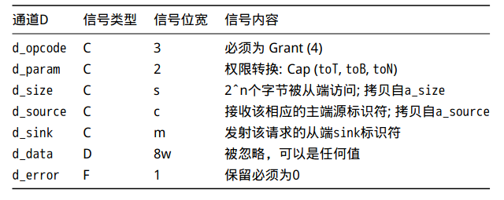

[TOC]

## TileLink介绍

由于Dcache需要用到一致性协议设计以及一致性模型设计, 这部分内容需要TileLink来完成, 这里简单介绍一下需要涉及的内容, 建议先阅读TileLink协议中文版之后再来读该部分的内容以及后续研究Dcache或者与TileLink相连接的节点.

### 架构

Tilelink 协议适用于在代理(agent)互联拓扑图中，完成消息(message)的传递。共享地址空间的代理经由点对点的通道(channel)收发消息，来完成操作(operation)，该通道被称为链路(link)。

* 操作(operation)：在特定地址范围内，改动存储数据的内容、权限或是其在多级缓存中的存储位置。
* 代理(agent)：在协议中，为完成操作负责接收、发送消息的有效参与者。
* 通道(channel)：一个用于在主(master)接口和从(slave)接口之间传递相同优先级消息的单向通信连接。
* 消息(message)：经由通道传输的控制和数据信息。
* 链路(link)：两个代理之间完成操作所需的通道组合


每个网络链路中，TileLink 协议定义了五个逻辑上相互独立的通道，代理可通过它们传递消息。为了避免死锁，TileLink 强制规定了这五个通道上传输消息的优先级。大部分通道包含控制传输的信号以及实际数据的副本。通道上消息的传递是单向的，主向从接口传送消息，或从向主接口传送消息。图 2.4 标明了五个通道的方向。

任何访存操作都需要两个最基本的通道：

* 通道 A: 传送一个请求，访问指定的地址范围或对数据进行缓存操作。
* 通道 D: 向最初的请求者传送一个数据回复响应或是应答消息。最高协议兼容层 TL-C 额外包含另外三个通道，具备管理数据缓存块权限的能力：
* 通道 B: 传输一个请求，对主代理已缓存的某个地址上的数据进行访问或是写回操作。
* 通道 C: 响应通道 B 的请求，传送一个数据或是应答消息。
* 通道 E: 传输来自最初请求者的缓存块传输的最终应答，用于序列化。

各个通道传递消息的优先级顺序是 A << B << C << D << E 。

### 信号描述

这章用表格的形式介绍了 TileLink 五个通道使用到的所有信号，汇总在表 3.3。当结合每个通道的方向，表 3.2 的信号类型决定了信号的方向。这些信号的宽度由表 3.3 描述的值进行参数化。


#### 通道A

通道 A 的传输方向是从主接口到从接口，携带请求消息发送到一个特定的地址。所有TileLink 兼容层都要强制使用这个通道。


#### 通道B

通道 B 的传输方向是从从接口到主接口，用于向保存一个特定缓存块的主代理发送请求消息。该通道被用于 TL-C 兼容层（conformance level）而对于较低层是可选的。


#### 通道C

通道 C 的传输方向是从主接口到从接口。携带对通道 B 请求作为响应的消息发送给一个特定缓存数据块。也被用于自发地（voluntarily）写回脏缓存数据（dirtied cacheddata）。 该通道被用于 TL-C 兼容层（conformance level）而对于较低层是可选的。


#### 通道D

通道 D 的传输方向是从从接口到主接口。它携带对通道 A 发送到特定地址请求作出响应的消息。它还携带了对于通道 C 自发写回（voluntary writebacks）的应答。该通道被用于所有 TileLink 兼容层并且是必选的。


#### 通道E

通道 E 的传输方向是从主接口到从接口。它携带是否收到通道 D 响应消息的应答信号，这被用作操作序列化。该通道被用于 TL-C 兼容层（conformance level）而对于较低层是可选的


#### 关于ready与valid信号

ready为低时表示接收方忙, valid为低表示发送方数据未准备好

当ready信号为低时，接收者不能处理数据并且发送者认为该拍内的数据未被处理。

当valid信号为低时，接收者应当认为该数据信号并不是一个正确的TileLink数据

valid必须与ready信号独立，如果一个发送者希望发送一拍数据，则必须使能一个valid信号，同时该valid信号是与接收者的ready信号独立的

从ready到valid信号或者任何数据或控制信号之间不能存在任何组合逻辑路径

ready与valid同时有效时生成一个fire信号, 表示数据传输有效

### 簇发

许多TileLink消息包含有效的数据负载，而根据消息和数据总线的大小，可能需要跨多个时钟周期(或beats)发送。多拍的信息则通常被称为簇发(burst)。没有数据载荷的TileLink消息总是在单拍中完成。TileLink禁止在一个通道中插入来自不同消息的任何数据。一旦一个簇发开始，发送方在簇发的最后一拍被接收方接收之前，都不得发送任何来自其他消息的任一拍数据。簇发的持续时间由通道的size字段决定。簇发分为簇发请求与簇发相应.

#### 簇发请求

图4.4描述了两个Put操作。PutFullData请求消息(操作码0)在通道A发出，它们的AccessAck回复消息(操作码0)则在通道D返回。包的大小为32字节，四拍数据。与上小节不同的是，此次通道A发起请求消息。如名字所示，PutFullData消息带有数据载荷，而AccessAck消息则没有。第一个AcessAck消息被延迟了任意的时间，但是请求者继续发送余下的请求消息。第二个AccessAck消息在PutFullData消息的第一拍的同一周期内出现。这是我们的规则所能允许的最快的回复。如果a_ready或者a_valid信号任一个在该周期内为低，那么d_valid应该也为低。我们之前讨论的主端接口ready的告诫在此处适用：主端接口必须接收此时同时发送的AccessAck，甚至在它完成发送PutFullData消息之前。即使它可能会缓冲AccessAck消息，并且将其挂起，直到它完成发送请求消息


#### 簇发响应

图4.3描述了两个Get操作。Get操作的请求消息(操作码4)从通道A发出。它们都是访问32字节，在8字节的总线上分4拍拿走数据。我们能看到4拍的AccessAckData(操作码1)回复消息到达通道D。第一个回复消息在一个任意的延迟之后到达。主端接口必须要能够无限期地等待回复消息，因此在TileLink互联网络中不存在超时设定。最终，回复消息一定会到达，这是TileLink无死锁规则所能保证的。 第二个Get操作在请求消息被接收的同一个周期内即被回复。这种重叠情况在Get第一拍的信号被接收之后是允许的。回复消息不能再提前出现：因为第二个Get首次出现时，a_ready为低，请求消息被拒绝了，所以d_valid信号也必须为低，否则就违反了第一个规则。


### 操作与消息

带有主端接口的 TileLink 代理通过执行各类操作与共享存储系统进行交互。操作会完成我们期待的对地址范围的修改，可能是数据值，可能是这段地址内数据的权限，也可能是在存储层次中的位置。操作通过在通道内传输的具体消息的交换来实现。为了支持一个操作的实现，我们需要支持组成该操作的所有消息。本章列出了所有 TileLink 的操作以及为了实现他们所需要交换的消息。我们详细叙述每个操作的具体的消息交换过程。

#### 操作分类

TileLink 操作能被分为下列三组：

* Accesses (A) 在具体的地址读或写数据。
* Hints (H) 只是提供一些信息，没有实际的影响。
* Transfers (T) 在拓扑网络中改变权限或移动缓存拷贝。


#### 消息分类

操作通过在五个 TileLink 通道内交换消息来执行。某些消息携带数据载荷，而有些则没有。如果一个 TileLink 消息携带数据载荷，那么其消息名以Data结尾。不是每一个通道都支持所有类型的消息。某些数据的到达必然会导致最终会有一个回复消息发送到请求发出者。带有回复的操作和消息分类如图5.1所示。表5.2通过兼容级别和操作对TileLink用到的消息进行分组。表5.3以通道和操作码来对消息进行排序。注意到存在不同消息类型有着相同的操作码。不同的通道对于操作码有着不同的命名空间。在任何指定的通道内，每一个可能的消息类型有着独特的操作码。不管是在哪些通道内被进行交换的，相同类型的消息有着相同的操作码。操作码空间通过消息内容的有效解码进行分配。TileLink规范保留增加操作码的权利。


所有的操作（蓝色）和他们的消息（紫色）。带点箭头表明了请求和响应的配对。TL-UL只要求支持Get和Put操作。TL-UH需要支持所有的Hint和Access操作。TL-C则需要支持所有的操作。


通过通道分类不同的消息


### TL-C介绍

TileLink中，TileLink缓存支持级(TL-C) 通过给主端代理提供缓存共享数据块副本的能力。依据实现过程中所定义的一致性协议，这些本地副本可以保证一致性。本节描述TL-C中缓存的数据副本上允许进行哪些访存操作，以及用来传输数据块的缓存的消息类型。实现中所定义的一致性协议描述了副本和权限如何通过具体的 TileLink 代理网络传输以回复所接收的存储访问操作。

操作 transfer(转换操作) 可以创建或者清除数据块的缓存副本。转换操作不会修改数据块的值，但是会改变他们的读写权限。 

在TileLink网络传输一个访存操作时，一个间质性的缓存(interstitial cache)能在其内部嵌套一个寄生转换操作。 缓存首先采用一个转换操作以取得缓存块的足够权限，并将其满足一致性的本地副本响应给存储访问操作发起者

#### 权限说明

Nothing: 当前没有缓存数据副本的节点，没有读写权限

Trunk: 主干：在尖端(Tip)和根(Root)之间的路径上拥有缓存副本的节点。具有其副本的读权限，该副本可能包含脏数据。

Tip: 顶点：具有缓存副本的节点，且可以用作内存访问序列化。对其拥有的可能包含脏数据的副本具有读写权限。

Branch: 分支：该节点由Trunk结点分出，具有只读数据缓存副本。


#### 权限修改

逻辑上，Transfer是对权限进行操作，因此组成其的消息必须指定预期的结果：升级到更高权限，降级到更低权限，或者一个保持权限不变的无操作。这些变化是根据它们对特定地址的一致性树形状的影响来指定的。我们将可能的权限转换组合分解为六个子集；可以使用不同的子集作为特定消息的参数


Prune: 权限降级，缩小一致性树。相比过去，完成操作之后具有较低的权限。

Grow: 权限升级，增大一致性树。相比过去，完成操作之后具有较高的权限。

Report: 包含权限保持不变，但报告当前权限状态。

Cap: 包含权限更改，但不指定原始权限是什么，而只指定它们应该成为什么

### TL-C Messages

#### Get

Get消息是一个代理发出的请求，目的是读取一个特定的数据块。表8.14显示了用于此消息类型的B通道字段的编码。

* b_opcode必须为Get, 编码为4.b_param现在为未来的Hint操作保留，置为0.
* b_size指示了以log2(bytes)的形式表示请求代理希望读取的数据总量。b_size表示生成的AccessAckData消息的大小，而不是当前的Get消息。
* b_address必须与b_size对齐.
* b_mask提供字节选择通道，在本例中指示读取哪些字节。b_size、b_address和b_mask需要相互对应。Get消息必须具有连续的mask。
* b_source是此请求的目标的主代理的ID。它用于路由请求
* b_data被忽略并且可以取任何值。


#### PutFullData

PutFullData消息是一个代理的请求，目的是写特定的数据块。表8.15显示了用于此消息类型的通道B字段的编码。

* b_opcode必须为PutFullData, 编码为 0.
* b_param现在为未来的hints保留，必须为0
* b_size以log2(bytes)的形式指示了请求代理想要写的数据总量。在本例中b_size代表了该请求消息的大小。
* b_address必须与b_size对齐. 从b_address到b_address+2 ~ b_size-1的整个内容都会被写。
* b_mask提供了字节选择通路，在本例中指示写入哪些字节。b_mask的一个位对应于写入的一个字节数据。b_size、b_address和*_mask需要相互对应。PutFullData必须有一个连续的mask，如果b_size大于或等于物理数据总线，那么所有b_mask都必须为高。
* b_source是该请求的目标从代理的ID。它用于路由请求消息。
* b_data为被实际写入的数据载荷


#### PutPartialData

PutPartialData消息是一个代理的请求，目的是写特定的数据块。PutPartialData可用于在字节粒度上编写任意对齐的数据。表8.16显示了用于此消息类型的通道B字段的编码。

* b_opcode必须为PutPartialData, 编码为1.b_param现在为未来的hints保留，并且必须为0.
* b_size以log2(bytes)的形式指示了请求代理想要写的数据总量。b_size也表示此请求消息数据的大小。b_address必须与b_size对齐，
* b_address到b_address+2**b_size-1 的部分字节会被写。b_mask提供字节选择通道，在本例中指示写入哪些字节。有关详细信息，请参阅第4.6节。
* b_mask的一位对应于写入的数据的一个字节。b_size、b_address和b_mask需要相互对应，但是PutPartialData写的数据可能少于b_size，这取决于b_mask的内容。b_mask的任何位的集合都必须包含在b_size的对齐区域中。
* b_source是该请求的目标的主接口的ID。它用于路由请求消息。
* b_data是实际被写入的数据载荷。未被mask的一个字节的b_data都被忽略，可以取任何值。


#### AccessAck

AccessAck向原始请求代理提供不带数据的确认消息。表8.17显示了用于此消息类型的通道C字段的编码。

* c_opcode必须为 AccessAck,编码为 0。
* c_param保留为TL-C操作码使用，并且应该指定为0。
* c_size包含被访问的数据的大小，尽管此特定消息本身不包含数据。大小和地址字段必须对齐。
* c_address必须与触发此消息的源请求消息的b_address一致。
* c_source是发出此响应消息的代理的ID。详见第5.4章。
* c_data被忽略，可以取任何值。
* c_error指示当主端尝试处理访存操作时发生错误。


#### AccessAckData

AccessAckData向原始请求代理提供带有数据的确认消息。表8.18显示了用于此消息类型的通道C字段的编码

* c_opcode必须为AccessAckData，编码为 1.
* c_param被保留为TL-C的操作码，并且必须指定为0。
* c_size包含被访问的数据的大小，对应于与此特定消息相关联的数据的大小。大小和地址字段必须对齐。
* c_address必须与触发此消息的源请求消息的b_address一致。
* c_source是发射该响应消息的代理的ID，详情可见5.4节。
* c_data包含操作访问的数据。数据可以在一个burst的AccessAckData的拍之间改变。
* c_error指示了当主端尝试处理访存操作时发生错误。


#### ArithmeticData

ArithmeticData消息是一个代理发出的请求，该代理希望访问一个特定的数据块，并使用算术操作来读-修改-写(read-modify-write)。表8.19显示了用于此消息类型的通道B字段的编码。

* b_opcode必须为ArithmeticData, 编码为2.b_param指定要执行的具体原子操作。表7.3列出了所支持的算术操作集。它由{MIN,MAX,MINU,MAXU,ADD}组成，分别表示有符号和无符号整数最小值和最打值，以及整数加法。
* b_size是算术操作数大小，它反映了请求数据和AccessAckData响应的大小b_address必须与b_size对齐。
* b_mask提供字节选择通道，在本例中指示读-修改-写哪些字节。有关详细信息，请参阅第4.6节。b_mask的一个位对应于原子操作中使用的数据的一个字节。b_size、b_address和b_mask需要相互对应(比如：mask在对齐范围内连续地全置为高)。
* b_source是该请求的目标主接口的ID，用于路由请求消息。
* b_data包含算数操作的一个源操作数(另一个在目标地址)。当某一个字节中的b_data为unmasked时，会被忽略，可为任意值。


#### LogicalData

LogicalData是一个代理发出的请求，该代理希望访问一个特定的数据块，并使用逻辑操作来读-修改-写。表8.20显示了用于此消息类型的通道B通道字段的编码。

* b_opcode必须为LogicalData,编码为 2.

* b_param指定要执行的具体原子性操作。表7.5列出了所支持的逻辑操作集。它由{XOR,OR,AND,SWAP}组成，表示按位逻辑上的异或，或，与和操作数的简单交换。

* b_size是操作数大小，它反映了此请求数据和AccessAckData响应的大小。

* b_address必须与b_size对齐，详情可见4.6节。b_mask提供字节选择通道，在本例中指示读-修改-写哪些字节。有关详细信息，可参阅第4.6节。

* b_mask的一位对应于原子性操作中使用的数据的一个字节。b_size、b_address和b_mask需要相互对应(比如：mask在对齐范围内连续地全置为高)。

* b_source是此请求消息的目标主接口的ID。它用于路由请求消息。

* b_data包含逻辑操作的一个源操作数(另一个在目标地址)。当某一个字节中的’ b_data’为unmasked时，会被忽略，可为任意值

  

#### Intent

Intent是一个代理发出的请求消息，该代理想要表明将来打算访问一个特定的数据块。表8.21显示了用于此消息类型的通道B通道字段的编码。

* b_opcode必须为Intent, 编码为 5。*
* b_param指定了此Hint操作所传递的具体意图。应注意，它的效果作用于从接口和从接口所连接的所有更外层节点。表7.7列出了所支持的intention的集合。它由{PrefetchRead,PrefetchWrite}组成，表示prefetch-data-with-intent-to-read和prefetch-data-with-intent-to-write。
* b_size该intention所需要的数据的大小b_address必须与b_size对齐.b_mask提供字节选择通道，在本例中指示想要用到的字节。有关详细信息，请参阅第4.6节。b_size、b_address和b_mask需要相互对应。
* b_source该请求消息的目标主接口的ID，用于路由请求消息。
* b_data忽略，可取任意值。


#### HintAck

HintAck 用作Hint提操作的响应消息。表8.22显示了用于此消息类型的通道C字段的编码。

* c_opcode必须为HintAck，编码为2.c_param保留且必须为0。
* c_size包含所操作的数据的大小，尽管此特定消息本身不包含数据。
* c_address只需要与c_size对齐即可。
* c_sink发出此响应消息的代理的ID，而c_source应该从请求消息中获得，现在被重用，以将此响应路由到正确的目的地。详见第5.4节。
* c_data被忽略，且可取任意值。
* c_error指示了主端在进行访存操作时出现了一个错误。


#### Acquire

Acquire消息是主代理计划在本地缓存数据块的副本时，发起的请求消息类型。主代理还可以使用这种消息类型来升级他们已缓存块上的权限(例如，获得只读副本的写权限)。与Get消息一样，Acquire消息本身不包含数据。表8.4显示了用于此消息类型的通道A字段的编码。

* a_opcode必须为Acquire, 编码值为6.
* a_param指明了主代理想要进行的权限改变的具体类型。从表8.3的类别中选择可能的转换
* a_size指明了主端想要缓存的数据的总数，以log2(bytes)的形式表示。
* a_address必须与a_size对齐.
* a_mask提供字节选择通道，在本例中指示读取哪个字节。有关详细信息，请参阅第4.6节。a_size、a_address和a_mask相互对应。Acquire必须具有自然对齐的连续mask。
* a_source发出此请求的主代理的ID，在从代理响应时，可以作为目标索引，确保回复消息被正确的路由。


#### Probe

Probe消息是从代理用来查询或修改由特定主代理存储的数据块的缓存副本的权限的请求消息。从代理由于响应另一个主代理的Acquire，或是是主动发起，可以废除主代理对一块缓存块的权限。表8.5显示了该消息类型的通道B的所有字段。

* b_opcode必须为Probe, 编码为6。
* b_param指示了从代理想要进行的权限更改的具体类型。从表8.3的Cap类别中选择可能的转换。探查主代理，将其权限覆盖在比他们已有的权限更为宽松的级别是允许的，并且不会导致权限的更改。
* b_size指示了请求代理希望探查的数据的总量，以log2(字节)的形式。如果为了响应这个探查而回写脏数据，b_size表示生成的ProbeAckData消息的大小，而不是这个特定的probe消息。
* b_address必须与b_size对齐
* b_mask提供字节选择通道，指示要探查哪些字节。有关详细信息，请参阅第4.6节。b_address与b_mask需要相互对应。Probe消息必须有连续的mask。
* b_source是此请求的目标主代理的ID。它用于将请求传输到特定的缓存。详情见第5.4节。


#### ProbeAck

ProbeAck消息是主代理用来回复Probe的消息。表8.6显示了该消息类型的通道C的所有字段。

* c_opcode必须为ProbeAck,编码为4。
* c_param.指示了主代理中由于Probe而发生的权限更改的具体类型。从表8.3的Shrink或Report类别中选择可能的转换。前者表示权限被降低，而后者则报告当前的权限是什么并继续保持不变。
* c_size指示了以log2(bytes)形式表示的，被Probe的数据总量。这个消息本身不携带数据。
* c_address用于将回复消息路由至初始的请求方，它必须与c_size对齐。c_source该回复的来源主代理的ID
* c_data被忽略，可以取任何值。
* c_error保留，但必须置为0.


#### ProbeAckData

ProbeAckData消息是主代理使用的响应消息，用于确认接收到Probe，并写回发送请求的从代理所需的脏数据。表8.7显示了该消息类型的通道C的所有字段。

* c_opcode必须为ProbeAckData, 编码为 5.
* c_param指示了主代理中由于Probe而发生的权限更改的具体类型。从表8.3的Shrink或Report类别中选择可能的转换。前者表示权限被降低，而后者则报告当前权限是什么并继续保持不变。
* c_size指示了以log2(bytes)的形式表示的被探测的数据总量，以及此消息中包含的数据量。
* c_address用来将响应消息路由到初始的请求者处。
* c_source该响应消息的源头的主端的ID, 拷贝自b_source.
* c_data包含被此消息访问的数据。在ProbeAckData的各拍之间能被改变的数据称为burst。
* c_error指示了主端进行访存操作时发生了一个错误。 在一个burst的最后一拍，错误标志可以被拉高。


#### Grant

Grant消息是一个响应也是一个请求消息，从代理使用它来确认接收到一个Acquire，并提供访问缓存块的权限给原始发送请求的主代理。表8.8显示了用于此消息类型的通道D字段的编码。

* d_opcode必须为Grant,编码为4.
* d_param指示由于Acquire请求消息，从代理允许在主代理的块的缓存副本上发生的访问的具体类型。从表8.3的Cap类别中选择可能的权限转换。增加权限而不说明初始权限。权限可能超过原始请求消息的a_param字段中所请求的。
* d_size包含正在转换权限的数据的大小，尽管此特定消息本身不包含数据。必须与原始的a_size相同。
* d_sink是发出此消息的代理，用于该消息的通道E响应消息的索引，而在原始通道A请求中，d_source应该从a_source中保存下来，现在被重新使用来将此响应路由到正确的目的地。详情见第5.4节。
* d_data被忽略，并可以指定为任意值。
* d_error被保留并且必须为0.



#### GrantData

GrantData消息既是响应也是请求消息，从代理使用它向原始请求主代理提供确认消息以及数据块副本。表8.9显示了用于此消息类型的通道D字段的编码。

* d_opcode必须为GrantData,编码为5.
* d_param作为Acquire请求的结果，指示了从代理允许在主代理中缓存副本上进行的具体访问类型，从表8.3的Cap类别中选择可能的权限转换。增加权限而不指定原始权限。权限可能超过原始请求的a_param字段中所请求的权限。
* d_size包含正在转换权限的数据块的大小，该大小对应于使用此特定消息发送的数据的大小。必须与原始的a_size相同。
* d_sink是发出此响应消息的代理的标识符，用于路由其通道E的响应，而在原始通道A请求中，a_source中保存下来，现在被重新使用以将此响应路由到正确的目的地。详情见第5.4节。
* d_data包含被此操作传输的数据，此数据会被主代理所缓存。
* d_error知识了当从端试图进行转换操作时发生了一个错误。


#### GrantAck

GrantAck响应消息被主代理用来提供事务完成的最终确认消息，同时也被从代理用来确保操作的全局序列化。表8.10显示了通道E上此消息的所有字段。e_sink应该被从前面的Grant[Data]消息中的d_sink中保存，现在正在被重用，以将此响应消息路由到正确的目的地


#### Release

Release消息是主代理用来主动降低其对一个缓存数据块的权限的请求消息。表8.11显示了该消息类型的通道C的所有字段。

* c_opcode必须为Release,编码为6.c_param指示了主代理发起的权限更改的具体类型。可能的转换是从表8.3的Shrink类别中选择的，该类别指示了权限是什么以及它们正在变成什么。
* c_size以log2(bytes)的形式表示权限将被Release的缓存数据总量。这个消息本身不携带数据。c_address用于路由响应消息去往管理该地址的从代理，必须与c_size对齐。
* c_source是作为该请求的源的主代理的ID。ID不必与最初用于Acquire该块的ID相同，尽管它必须对应于相同的主代理。
* c_data被忽略，可以取任何值。
* c_error保留，并且必须置为0。


#### ReleaseData

ReleaseData消息是主代理发起的请求消息，用于主动降低对一块缓存数据块的权限。并将脏数据写回管。表8.12显示了该消息类型的通道C的所有字段。

* c_opcode必须为ReleaseData,编码为6.
* c_param指示主代理发起的权限更改的具体类型。可能的转换是从表8.3的Shrink类别中选择的，该类别指示了权限是什么，以及它们将变成什么。
* c_size指示了以log2(bytes)的形式表示的释放权限的缓存数据的大小，以及此消息中包含的数据大小。
* c_address用于路由响应消息去往原始的请求者出，必须与c_size对齐.c_source该响应消息发起者主代理的ID
* c_data包含操作回写的脏数据。数据可以在一个burst的ReleaseData的各拍间进行改变。
* c_error指示了试图处理访存操作时发生了一个错误。此标志位可用于指示从缓存中清除数据的内存污染。错误标志应该在burst的最后一拍被拉高。


#### ReleaseAck

ReleaseAck消息是一个从代理发起的响应消息，用来响应“Release[Data]”，它反过来用于确保从代理的操作的全局序列化。表8.13显示了用于此消息类型的通道D字段的编码。GrantAck响应消息被主端用来提供事务完成的最终确认，表8.10显示了该消息在通道E上的所有字段。

* d_opcode必须为ReleaseAck,编码为 6.
* d_param被保留并且必须为0.
* d_size包含权限被转换的数据的大小，尽管此特定消息本身不包含数据。d_size可以从Release[Data]消息中的c_size中获得。
* d_source应该从前面的Release[Data]消息中的c_source中获得，现在被重用，以将响应信息路由到正确的目的地。
* d_sink被忽略，并且不需要在Release的过程中保持唯一。详情见第5.4节。
* d_data被忽略，并且可以取任何值。
* d_error指示了从端在进行内存访问操作时出现了一个错误。


### TL-Message举例

图8.3展示了一个消息流，它详细地描述了一个包含所有三个新操作的事务。在此流程中，一个主端通过acquiring目标数据块本地副本的读取或写入权限，来响应访存操作请求。在这个事务完成之后，主端已经获得了对缓存块的读写权限，以及该块数据的副本。其他的主端被probe，以迫使他们释放他们对该块的权限，并写回他们所拥有的脏数据。此外，发射’ Acquire ‘的主端也可以使用一个’ Release ’来主动释放他们对缓存块的权限。通常，当缓存必须清除包含脏数据的块，以便用重新填充到缓存中的块替换它时，就会触发这种类型的事务。在此事务完成后，主端失去了读取或写入该缓存块或该数据副本的权限。如果从端能够使用目录追踪到哪个主端拥有块的副本，那么这个元数据(metadata，附属信息)要被更新，以反映两个块的权限变化。


1.缓存主代理向从代理发送Acquire。

2.为保证给响应消息留足够空间，主代理主动发送Release，即写回操作。

3.从代理访问存储结构，以完成写操作。

4.从代理通过ReleaseAck确认写回操作已完成。

5.从代理向其他主代理发送必需的Probe。

6.从代理等待所有被Probe的主代理返回ProbeAck。

7.若有需要，从代理还需访问存储结构。

8.从代理向原请求设备发送Grant。

9.原主代理以GrantAck说明此次事务成功完成。

虽然这三个流程构成了所有涉及缓存块传输的TileLink事务的基础，但是当它们临时地重叠或分层地组合时，会出现一些边界情况。现在我们将讨论TileLink如何管理并发性，并分散到各主从代理之间。

TileLink假设消息并不完全是点到点的有序的传递。事实上，来自高优先级通道的消息必须能够在网络中先于较低优先级的消息处理，即使它们的目标是相同的代理。从端充当连接到它的所有主端的一个同步节点。由于每个事务都必须通过发送给从端的一条 Acquire 消息作为初始消息，因此从端可以轻松地对事务进行排序。一个非常安全的实现方式是一次只接受一个事务，但是这种方式对性能影响巨大，而且事实证明我们可以在继续提供正确的序列化的同时增加并发性。尽管事务有着天然的分布式属性，对代理的行为施加一些限制，仍能够保证事务间的有序性。

对TileLink代理上的并发限制在发射或阻塞请求消息方面最容易理解。所有请求消息都会引发响应消息，并且响应消息保证最终产生forward progress。但是，在某些情况下，在收到还未处理的响应消息之前，不应该发出针对同一块的递归请求消息。我们按照请求消息类型来对这些情况分类：

* Acquire: 如果在块上有一个悬而未决的Grant块，主端就不应发射一个Acquire。一旦Acquire被发出，主端不应该在该块发出进一步的Acquire，直到它收到一个Grant。
* Grant: 在块上有一个悬而不决的ProbeAck时，从端不应该发射Grant。一旦发出了一个Grant时，从端不应该在该块上发射Probe，直到它收到一个GrantAck。
* Release: 在块上有一个悬而不决的Grant时，主端不应该发射一个Release。一旦发出了一个Release后，主端不能发射ProbeAck，直到它收到来自从端确认写回操作完成的ReleaseAck。
* Probe: 在块上有一个悬而不决的GrantAck时，从端不应该发射一个Probe。一旦发射了一个Probe,从端不能进一步发射Probe，直到它收到一个ProbeAck。


1.主代理A先发送Acquire，但由于网络延迟，后到从代理。

2.主代理B后发送Acquire，但先到达从代理，被序列化在A的前面。

3.从代理向A发送Probe，即使A还在等待Grant，也必须先处理Probe。

4.从代理接收到A的ProbeAck后，向B发送Grant。

5.从代理接收到A的Acquire，但由于正等待B的GrantAck，所以现在还不能处理这个请求。

6.一旦接收到B的GrantAck，A的事务就可以正常处理了。

7.从代理向B发送Probe，但这个操作被在上一个Grant之后。

8.从代理向A发送合适类型的Grant(包括数据副本)，说明A在Acquire后被Probe过

上图展示了延迟Probe请求的场景。即使网络中有一个悬而未决的Grant，主端必须继续处理和响应Probe。从端必须在响应Acquire升级权限的Grant中包含数据的最新副本，除非他们确定自Acquire发射以来，没有对主端进行过Probe。假设从端在处理获取同一数据块的第二个事务时阻塞，那么关键问题就变成了:从端在什么时候处理一个挂起的Acquire是安全的?如果我们假设点对点有序地将消息传递给特定的代理，那么对于从端来说，仅仅将Grant消息发送给初始的主端源就足够了。从端可以在块上处理更多的事务，然后会依次向同一主服务器发送更多的Probe和Grant。由于此顺序没有得到保证，因此我们转而依赖GrantAck消息来允许从端序列化这两个事务。


1.主代理A向从代理发送Acquire。

2.与此同时，主代理B通过Release主动剔除相同的数据缓存块。

3.从代理向B发送Probe。

4.从代理等待每个发送出的Probe，但可以处理主动发起的Release。从代理发送ReleaseAck确认主动写回的操作完成。

5.B在接收到写回确认前不处理Probe。

6.在从代理接收到B的ProbeAck后，A的事务就可以正常执行了。

现在我们来看第二个关于并发限制的例子，这个例子被放在了主端上。如果一个主端在一个块上有一个未完成的Release事务，那么它就不能用ProbeAcks响应该块上的一个传入的Probe请求，直到它从从端收到一个确认写回完成的ReleaseAck。上图以消息序列图的形式展示了这个场景。这个限制序列化了主动回写相对于正在进行的产生Probes的Acquire操作的顺序。在Acquire事务完成之前，从端不能简单地阻塞主动释放的Release事务，因为事务中的ProbeAck消息可能被阻塞在自动Release后的网络中。从从代理的角度来看，它必须处理一个情况，其正在接受一个块的主动Release时，一个主端正试图Acquire该块。从端必须接受主动的Release，以及已经发送的Probe消息所产生的任何ProbeAck，然后在他们的事务被认为完成之前向每个主端提供Release和Grant消息。主动写的数据可以与Grant来响应原始请求者，但事务在从端收集到预期数量的ProbeAcks之前无法完成。这个场景是两个事务消息流被从代理合并的示例。

## 仲裁器介绍

### Arbiter

作为仲裁器基本类, 将多个输入提供给一个输出, 相当于多个生产者一个消费者, 输入有两个参数需要确定, T代表的是输入的类型, 可以是结构体也可以是基础类型, n代表的是输入的个数, 之后将会产生n个结构体输入以及n个valid跟ready信号, 输出为一个结构体以及对应的valid跟ready信号, 输入输出接口如下表所示.

| 信号         | 类型           | 个数 | 含义                                                   |
| ------------ | -------------- | ---- | ------------------------------------------------------ |
| io_in_valid  | input vec bits | n    | 输入有效信号                                           |
| io_in_ready  | bits vec bits  | n    | 需要接收输入的地方已经准备好, 这里当io_out_ready准备好 |
| io_in        | T vec bits     | n    | 输入数据                                               |
| io_out_valid | output bit     | 1    | 输出有效                                               |
| io_out_ready | output bit     | 1    | 需要接受输出的地方已经准备好接收                       |
| io_out       | output T       | 1    | 输出数据                                               |


```verilog
module Arbiter #(  //仲裁器
    n = 4,
    type T = MSHRST::LineBufferReadReqST
) (
    output logic                 io_in_ready [n],  //里面消费者准备好接收第几个数据
    input  logic                 io_in_valid [n],  //外面生产者准备好第几个数据
    input  T                     io_in       [n],  //生产者猪呢比的输入数据
    input  logic                 io_out_ready,  //数据已经被外面消费者接收
    output logic                 io_out_valid,  //数据已经被生产者准备好
    output T                     io_out,  //输出数据
    output       [$clog2(n)-1:0] io_chosen  //选择第几个生产者的数据
);

  logic grant[n];
  always_comb begin
    io_out = io_in[n-1];
    for (int i = n-2; i >=0; i = i-1) begin
      if (io_in_valid[i]) begin
        io_chosen = i;
        io_out = io_in_valid[i];  //最低位优先级最高
        break;
      end
    end

    grant[0] = 1;  //生产者的第一个数据永远准备接收

    //仲裁器控制器, 只要in_valid中出现1, 接下来grant将全为0
    //为1的表示消费者可以接收的数据, 低位全为1高位全为0表示低位的优先级高
    for (int i = 1; i < n; i++) grant[i] = (grant[i - 1] & ~io_in_valid[i - 1]);  
    for (int i = 0; i < n; i++) io_in_ready[i] = grant[i] & io_out_ready;  //out的数据已经被接收方顺利接收

    //~grant[n-1]为0表示in_valid最后一位之前有1
    //这句话相当于|io_in_valid;
    io_out_valid = ~grant[n - 1] || io_in_valid[n - 1];
  end

endmodule


```

仲裁器的代码如上所示, 17行的for循环表示当io_in_valid[i]有效则将in对应的数据赋值给out, 且从向量的高位到低位, 低位的数据将会有高的优先级.

25, 29, 30行代码表示的是仲裁器控制信号, grant的第0位设置为1, 表示永远准备好接收第0个数据位, 即第0个输入优先级最高, 接下来检查对应的io_in_valid信号, 要是发现第i位为1则接下来的grant[i+1:n-1]位全为0, 这样io_in_ready[i+1:n-1]都会设置为0, 实现了上述所说的低位优先的仲裁器, 最终的io_in_ready[i] =  grant[i] & io_out_ready是因为还需要out的输出数据被接收端顺利接收之后才能进行数据输入.

最后34行产生io_out_valid信号只需要检查仲裁器控制信号grant最后1位是否是0以及io_in_valid最后1位是否为1即可, grant最后1位为1表示至少的是倒数第2位的io_in_valid信号为1, 无法检测到最后一位io_in_valid信号是否为1. 这句话相当于`|io_in_valid;`

> 总结: 仲裁器低位输入优先级高, 为生产者消费者模型

### tag

#### tag相关仲裁器

| 名称         | 信号           | 含义                                                         |
| ------------ | -------------- | ------------------------------------------------------------ |
| metaWriteArb | L1MetaWriteReq | 写meta仲裁器, 0为MSHR refill写, 1为prober写                  |
| metaReadArb  | L1MetaReadReq  | 读meta仲裁器, 0为MSHR读, 1为prober读, 2为wb读, 3为MSHR read读, 4为pipeline读, 5为prefetcher读 |

L1MetaWriteReq以及L1MetaReadReq的数据结构

| 信号          | 位宽       | 含义            |
| ------------- | ---------- | --------------- |
| L1MetaReadReq |            |                 |
| idx           | 6          | 读meta的行地址  |
| wan_en        | 8          | 读meta的列      |
| tag           | 20         | -               |
|               |            |                 |
| L1MetaReadReq |            |                 |
| idx           | 6          | 写meta行地址    |
| wan_en        | 8          | 写meta列地址    |
| tag           | 20         | 写数据, tag     |
| data          | L1Metadata | 写数据, 权限coh |
|               |            |                 |
| L1Metadata    |            |                 |
| tag           | 20         | 地址的tag       |
| coh           | 2          | 需要写的数据    |

#### meta结构介绍-消费者

meta为一个模块, 内部有一个seq mem用于读写ClientMetaData数据类型, 读取数据的时间为需要一个周期. 在该结构中需要写入每个block的权限以及tag, 为了方便设计了两个sram用于分别保存coh与tag, 保存coh的结构是一个每个ceil为2bits sram, 表示每个block的权限. 保存tag的sram的结构为每个ceil为20bits的sram, 保存每个block的tag. 具体存储结构如下图所示. 


该模块输入数据结构为L1MetaWriteReq以及L1MetaReadReq, 他们本别为metaWriteArb以及metaReadArb仲裁器的输出, 输出结构为宽为8的的vector, 每个vector中的内容为MetaData结构体, 结构体内涵一个2bits的coh以及一个20bits的tag. 输入输出接口如下表所示. 我们将2bits的权限输出称为coh, 其中write跟read申明为DecoupledIF.in信号, 会自动在结构体的基础上加上valid跟ready, 其中valid为input, ready为output

> 在本文的叙述中, DecoupledIF接口会自动加上valid跟ready信号, 并且将结构体包装成bits类型, 该接口包含两种类型, in以及out
>
> * in将会把bits跟valid生命为input, ready为output
> * out将会把bits与valid申明成output, ready为input
>
> 在下文中DecoupledIF将与该叙述一致, 不在重复

| 信号  | 类型           | 数据结构          | 含义                  |
| ----- | -------------- | ----------------- | --------------------- |
| write | DecoupledIF.in | L1MetaWriteReq    | 需要写入的idx以及数据 |
| read  | DecoupledIF.in | L1MetaReadReq     | 需要读取的idx         |
| resp  | output         | L1Metadata vec(8) | 输出的coh以及tag      |

具体电路结构如下图所示, 其中的read_fire信号为read的valid与ready信号相与, 作为tag_array的读取信号, 地址为传入的6位idx, 一次读出sram中的一行数据. 数据的写入需要加上掩码, 掩码就是way_en表示的是写入的具体列, write.idx表示的是写入的addr, write表示的是写入有效.

将读出的数据作为输出直接输出,


> 在接下来的描述中, *_fire信号将会表示对应的结构体的ready与valid信号相与, 接下来的叙述中将不再重复, 图中也会直接使用相应的信号

端口连接如下代码所示

```Verilog
  always_comb begin
    meta_io_write.valid = metaWriteArb_io_out_fire;
    meta_io_write.bits = metaWriteArb_io_out;
    meta_io_read.valid = metaWriteArb_io_out_valid;
    meta_io_read.bits = metaWriteArb_io_out;

    metaReadArb_io_out_ready = meta_io_read.ready;
    metaWriteArb_io_out_ready = meta_io_write.valid;
  end

```

可以看出meta作为metaReadArb以及metaWriteArb的消费者, metaWriteArb产生的权限数据会写入meta, metaReadArb产生的数据将会从meta中读取相应的权限信息. 从meta读出的数据将继续给其他消费者消费, 所以当read出的数据被消费掉之后, metaReadArb的ready将会设置为1, 而metaWriteArb的数据将会直接写到meta中, 被meta直接消费掉, 因此当meta的的write.valid有效之后将会设置为1.

### data

#### data相关仲裁器

| 名称         | 信号              | 含义                                                     |
| ------------ | ----------------- | -------------------------------------------------------- |
| dataWriteArb | L1DataWriteReq    | 0 goes to pipeline, 1 goes to MSHR refills               |
| dataReadArb  | BoomL1DataReadReq | 0 goes to MSHR replays, 1 goes to wb, 2 goes to pipeline |

L1DataWriteReq以及BoomL1DataReadReq相关数据结构

| 信号              | 位宽          | 含义                                                |
| ----------------- | ------------- | --------------------------------------------------- |
| L1DataWriteReq    |               |                                                     |
| wmask             | 2b            | 一个wrod为64bits, 一行sram有两个word, 所以mask为2位 |
| data              | 128b          | 一个sram行拥有的数据                                |
|                   |               | -                                                   |
| BoomL1DataReadReq |               |                                                     |
| req               | L1DataReadReq | 结构体, 数据读取请求                                |
| valid             | 1b            | 有效位                                              |
|                   |               |                                                     |
| L1DataReadReq     |               | -                                                   |
| wan_en            | 8b            | 读取路                                              |
| addr              | 12b           | 地址, untagbits                                     |

#### data结构介绍-消费者

data是Dcache的数据存储模块, 具体实现在BoomDuplicatedDataArray中, 存储sram结构如下图所示, 组织结构为8路组相连, 每路都有一个sram单体组成, 在sram中, 每行有2个ceil, 每个ceil的大小为64bits, 这个一个sram行为128bits. 4个sram行组成一个block, 因此cache的块大小为64B, 一共有64个sets, 经过计算可得cache的总大小为32KB.


在BoomDuplicatedDataArray模块中, 输入输出接口如下所示

| 信号  | 类型              | 结构           | 含义                                 |
| ----- | ----------------- | -------------- | ------------------------------------ |
| read  | DecoupledIF.in    | L1DataReadReq  | 需要冲data_array中读取的数据地址     |
| write | DecoupledIF.in    | L1DataWriteReq | 需要向data_array中写入的数据以及地址 |
| resp  | output vec(8x128) | encRowBits     | 读取数据返回, 一次读取8个ways        |

如下图所示为data_array的电路结构, 需要注意的是这里写入以及读取的addr都是经过处理之后才传递进来的, 由于每个block为4个sram行, 所以idx需要跟随后的2位地址组合起来之后才能对sram进行读写.


在write逻辑中, way_en对8个sram单体选择进行写入, wmask对每个sram行中的连个ceil进行选择写入, 所以这里传输进来的128bits的数据data可能只是写入64bits, 也可能写入128bits, 具体需要看掩码wmask的设置.

在read逻辑中的地址行为跟write一致, 也是需要12位addr的高8位地址进行行选, 使用way_en进行列选, 需要注意的是这里的时钟周期, 首先sram的读取需要一个时钟周期, 之后打一拍才输出, 因此读取的话需要连个时钟周期才能完成.

该data_array的sram如下表所示

| 名称         | 大小          | 说明                                              |
| ------------ | ------------- | ------------------------------------------------- |
| data_array_0 | 64x4x2x64bits | 二维sram, 一共64x4行, 每行2个ceil, 每行ceil64bits |
| data_array_1 | 64x4x2x64bits | 二维sram, 一共64x4行, 每行2个ceil, 每行ceil64bits |
| data_array_2 | 64x4x2x64bits | 二维sram, 一共64x4行, 每行2个ceil, 每行ceil64bits |
| data_array_3 | 64x4x2x64bits | 二维sram, 一共64x4行, 每行2个ceil, 每行ceil64bits |
| data_array_4 | 64x4x2x64bits | 二维sram, 一共64x4行, 每行2个ceil, 每行ceil64bits |
| data_array_5 | 64x4x2x64bits | 二维sram, 一共64x4行, 每行2个ceil, 每行ceil64bits |
| data_array_6 | 64x4x2x64bits | 二维sram, 一共64x4行, 每行2个ceil, 每行ceil64bits |
| data_array_7 | 64x4x2x64bits | 二维sram, 一共64x4行, 每行2个ceil, 每行ceil64bits |

## 生产者

根据仲裁器介绍可知, 所有仲裁器加起来一共需要2+6+2+3为13个生产者以及4个消费者, 其中读取仲裁器一共需要9个生产者, 写入仲裁器需要4个生产者. 接下来将分别介绍上述介绍的4个仲裁器

### 读取生产者

一共需要9个读取生产者输入两个仲裁器

#### request-提供2个生产者

request表示一个新的数据请求, 为仲裁器提供2个生产者, 来至io_lsu_req, io_lsu_req的valid连接上仲裁器的valid, 代码如下所示

```Verilog
  always_comb begin
    io_lsu_req.ready = metaReadArb_io_in_ready[4] && dataReadArb_io_in_ready[2];
    metaReadArb_io_in_valid[4] = io_lsu_req.valid;
    dataReadArb_io_in_valid[2] = io_lsu_req.valid;

    // Tag read for new requests
    metaReadArb_io_in[4].idx = io_lsu_req.bits.addr >> `blockOffBits;
    metaReadArb_io_in[4].way_en = 0;
    metaReadArb_io_in[4].tag = 0;

    // Data read for new requests
    dataReadArb_io_in[2].valid = io_lsu_req.valid;
    dataReadArb_io_in[2].req.addr = io_lsu_req.bits.addr;
    dataReadArb_io_in[2].req.way_en = 8'hff;
  end
```

将lsu传递来的req信息作为metaReadArb[4]以及dataReadArb[2]的生产者, metaReadArb的addr就是传入地址的idx, wan_wen以及tag不考虑, 应为会把meta中一个set的所有ways读取出来

而dataReadArb的addr则需要考虑到idx的后两位, way_en每个bits的值全赋值为1表示读取一个set中对应位置所有路的值, 取出来之后进行接下来的比较

#### MSHR Replay-提供2个生产者

这里指的是之前cache miss的导致进入MSHRS的指令进行replay,  来至mshr_io_replay的数据提供相应的数据作为生产者. 具体连接代码如下所示

```Verilog
  // ------------
  // // MSHR Replays
  BoomLSUST::BoomDCacheReqST replay_req;

  always_comb begin
    replay_req = 0;
    replay_req.uop = mshr_io_replay.bits.uop;
    replay_req.addr = mshr_io_replay.bits.addr;
    replay_req.data = mshr_io_replay.bits.data;
    replay_req.is_hella = mshr_io_replay.bits.is_hella;
    mshr_io_replay.ready = metaReadArb_io_in_ready[0] && dataReadArb_io_in_ready[0];
    // Tag read for MSHR replays
    // We don't actually need to read the metadata, for replays we already know our way
    metaReadArb_io_in_valid[0] = mshr_io_replay.valid;
    metaReadArb_io_in[0].idx = mshr_io_replay.bits.addr >> `blockOffBits;
    metaReadArb_io_in[0].way_en = 0;
    metaReadArb_io_in[0].tag = 0;
    // Data read for MSHR replays
    dataReadArb_io_in_valid[0] = mshr_io_replay.valid;
    dataReadArb_io_in[0].req.addr = mshr_io_replay.bits.addr;
    dataReadArb_io_in[0].req.way_en = mshr_io_replay.bits.way_en;
    dataReadArb_io_in[0].req.valid = 0;
  end
```

将mshr_io_replay的输出数据作为生产者, 分别连接上metaReadArb[0]以及dataReadArb[0], 与取地址的处理与request一致.

需要注意的是他用了一个replay_req对相应的数据做了一个备份

#### MSHR Meta read-提供1个生产者

```Verilog
  // -----------
  // MSHR Meta read
  BoomLSUST::BoomDCacheReqST mshr_read_req;

  always_comb begin
    mshr_read_req = 0;
    mshr_read_req.uop = 0;
    mshr_read_req.addr = {mshr_io_meta_read.bits.tag, mshr_io_meta_read.bits.idx} << `blockOffBits;
    mshr_read_req.data = 0;
    mshr_read_req.is_hella = 0;

    metaReadArb_io_in_valid[3] = mshr_io_meta_read.valid;
    metaReadArb_io_in[3] = mshr_io_meta_read.bits;
    mshr_io_meta_read.ready = metaReadArb_io_in_ready[3];
  end
```

这里使用mshr_read_req保存mshr_io_meta_read相关的信息, 然后将mshr_io_meta_read作为生产者为metaReadArb[3]提供数据

#### Write backs-提供2个生产者

```Verilog
  // -----------
  // Write-backs
  logic wb_fire;
  BoomLSUST::BoomDCacheReqST wb_req;
  logic wb_io_data_req_fire;
  logic wb_io_meta_read_fire;
  always_comb begin
    wb_io_meta_read_fire = wb_io_meta_read.valid && wb_io_meta_read.ready;
    wb_io_data_req_fire = wb_io_data_req.valid && wb_io_data_req.ready;
    wb_fire = wb_io_meta_read_fire && wb_io_data_req_fire;
    wb_req = 0;
    wb_req.uop = 0;
    wb_req.addr = {wb_io_meta_read.bits.tag, wb_io_data_req.bits.addr};
    wb_req.data = 0;
    wb_req.is_hella = 0;
    // Couple the two decoupled interfaces of the WBUnit's meta_read and data_read
    // Tag read for write-back
    metaReadArb_io_in_valid[2] = wb_io_meta_read.valid;
    metaReadArb_io_in.req = wb_io_meta_read.bits;
    wb_io_meta_read.ready = metaReadArb_io_in_ready[2] && dataReadArb_io_in_ready[2];
    // Data read for write-back
    dataReadArb_io_in_valid[1] = wb_io_data_req.valid;
    dataReadArb_io_in[1].req = wb_io_data_req.bits;
    dataReadArb_io_in[1].valid = 0;
    wb_io_data_req.ready = metaReadArb_io_in_ready[2] && dataReadArb_io_in_ready[1];
  end
```

wb_io_data_req为metaReadArb[2]以及dataReadArb[1]提供数据作为生产者, 使用wb_req保存wb_io_data_req相关信息.

#### prober-提供1个生产者

```Verilog
  // -------
  // Prober
  logic prober_io_meta_read_fire;
  logic prober_fire;

  BoomLSUST::BoomDCacheReqST prober_req;

  always_comb begin
    prober_io_meta_read_fire = prober_io_meta_read.valid && prober_io_meta_read.ready;
    prober_fire = prober_io_meta_read_fire;

    prober_req = 0;
    prober_req.uop = 0;
    prober_req.addr = {prober_io_meta_read.bits.tag, prober_io_meta_read.bits.idx} << `blockOffBits;
    prober_req.data = 0;
    prober_req.is_hella = 0;
    // Tag read for prober
    metaReadArb_io_in_valid[1] = prober_io_meta_read.valid;
    metaReadArb_io_in[1] = prober_io_meta_read.bits;
    prober_io_meta_read.ready = metaReadArb_io_in_ready[1];
  end
```

prober_io_meta_read作为生产者为metaReadArb[1]提供数据, 同时是用一个prober_req的wire保存prober_io_meta_read的相关信息.

#### prefectcher-提供1个生产者

```Verilog
  // -------
  // Prefetcher
  logic mshr_io_prefetch_fire;
  logic prefetch_fire;
  BoomLSUST::BoomDCacheReqST prefetch_req;
  always_comb begin
    mshr_io_prefetch_fire = mshr_io_prefetch.valid && mshr_io_prefetch.ready;
    prefetch_fire = mshr_io_prefetch_fire;

    prefetch_req = mshr_io_prefetch.bits;

    // Tag read for prefetch
    metaReadArb_io_in_valid[5] = mshr_io_prefetch.valid;
    metaReadArb_io_in[5].idx = mshr_io_prefetch.bits.addr >> `blockOffBits;
    metaReadArb_io_in[5].way_en = 0;
    metaReadArb_io_in[5].tag = 0;
    mshr_io_prefetch.ready = metaReadArb_io_in[5].ready;
    // Prefetch does not need to read data array

  end
```

mshr_io_prefetch作为生产者为metaReadArb[5]提供数据, 同时是用一个prefetch_req的wire保存mshr_io_prefetch的相关信息.

#### 读取生产者总结

综上所述, 如下图所示, 为读取仲裁器提供数据的生产者有io_lsu_req, mshr_io_meta_read, wb_io_data_req, prober_io_meta_read, mshr_io_replay, mshr_io_prefetch分别作为两个仲裁器的9个输入.


### 写入生产者

一共需要4个写入生产者写入两个写入仲裁器

#### metaWriteArb

mshr_io_meta_write作为生产者对metaWriteArb[0]提供数据

prober_io_meta_write作为生产者对metaWriteArb[1]提供数据

```Verilog
    metaWriteArb_io_in[0] = mshr_io_meta_write.bits;
    metaWriteArb_io_in_valid[0] = mshr_io_meta_write.valid;
    mshr_io_meta_write.ready = metaWriteArb_io_in_ready[0];


    metaWriteArb_io_in[1] = prober_io_meta_write.bits;
    metaWriteArb_io_in_valid[1] = prober_io_meta_write.valid;
    prober_io_meta_write.ready = metaWriteArb_io_in_ready[1];

```

#### dataWriteArb

s3阶段的数据作为生产者为dataWriteArb[0]提供数据.

mshr_io_refill作为生产者为dataWriteArb[1]提供数据.

```Verilog
    dataWriteArb_io_in_valid[0] = s3_valid;
    dataWriteArb_io_in[0].addr = s3_req.addr;
    
    dataWriteArb_io_in[0].wmask = s3_req.addr[3] == 1? 2'b01:2'b00;
    dataWriteArb_io_in[0].data[63:0] = s3_req.data;
    dataWriteArb_io_in[0].data[127:63] = s3_req.data;     


    dataWriteArb_io_in[1] = mshr_io_refill.bits;
    dataWriteArb_io_in_valid[1] = mshr_io_refill.valid;
    mshr_io_refill.ready = dataWriteArb_io_in_ready[1];
```

#### 写入生产者总结

相对于读取生产者有9个, 写入生产者只有4个, 相对来说比较简单, 主要是将数据写入存储器对应的位置中, 其输入主要有mshr_io_meta_write, prober_io_meta_write, s3_req, mshr_io_refill四个输入, 其电路图如下所示


### pipeline仲裁器总体结构

根据上述关于仲裁器生产者消费者的介绍可知, 仲裁器模块中包括4个仲裁器, 13个生产者作为输入, 消费者为data与meta, 主要是将写入数据通过仲裁器写入data或者meta, 以及从data或者meta中读取数据, 具体电路结构如下图所示


输入输出接口列表如下所示

| 信号                 | 输入输出类型   | 结构                  | 含义                      |
| -------------------- | -------------- | --------------------- | ------------------------- |
| prober_io_meta_read  | DecoupledIF.in | L1MetaReadReq         | prober权限读取            |
| wb_io_data_req       | DecoupledIF.in | WritebackReq          | 写回数据权限读取          |
| mshr_io_replay       | DecoupledIF.in | BoomDCacheReqInternal | mshr replay时数据权限读取 |
| io_lsu_req           | DecoupledIF.in | BoomDCacheReq         | lsu请求数据权限读取       |
| mshr_io_prefetch     | DecoupledIF.in | BoomDCacheReq         | prefetch权限写入          |
| mshr_io_meta_read    | DecoupledIF.in | L1MetaReadReq         | mshr权限读取              |
| mshr_io_meta_write   | DecoupledIF.in | L1MetaWriteReq        | mshr权限写入              |
| prober_io_meta_write | DecoupledIF.in | L1MetaWriteReq        | prober权限写入            |
| s3_req               | DecoupledIF.in | BoomDCacheReq         | 写入数据                  |
| mshr_io_refill       | DecoupledIF.in | L1DataWriteReq        | 回填数据                  |
| meta_resp            | output (2x8)   | bits                  | 输出权限                  |
| data_resp            | output (128x8) | bits                  | 输出数据                  |

上述列表中很多结构都有在相应的模块介绍, 这里在做过多的展开.

### writeback仲裁器介绍

writeback仲裁器有两个生产者, 一个来至prober模块的wb_req, 一个来至mshr模块的wb_req, 仲裁器的输出接入wb模块, 代码如下所示

```Verilog
  //--------
  // writebacks
  logic [1:0] wbArb_io_in_valid;
  logic [1:0] wbArb_io_in_ready;
  NBDcacheST::WriteBackReqST wbArb_io_in[1];

  logic wbArb_io_out_ready;
  logic wbArb_io_out_valid;
  NBDcacheST::WriteBackReqST wbArb_io_out;

  logic wbArb_io_chosen;
  logic wbArb_io_out_fire;
  Arbiter #(
      .n(2),
      .T(NBDcacheST::WriteBackReqST)
  ) wbArb (
      .io_in_ready(wbArb_io_out_ready),
      .io_in_valid(wbArb_io_in_valid),
      .io_in      (wbArb_io_in),

      .io_out_ready(wbArb_io_out_ready),
      .io_out_valid(wbArb_io_out_valid),
      .io_out      (wbArb_io_out),

      .io_chosen(wbArb_io_chosen)
  );
  assign wbArb_io_out_fire = wbArb_io_out_valid && wbArb_io_in_valid;

  always_comb begin
    // 0 goes to prober, 1 goes to MSHR evictions
    wbArb_io_in[0] = prober_io_wb_req.bits;
    wbArb_io_in_valid[0] = prober_io_wb_req.valid;
    prober_io_wb_req.ready = wbArb_io_in_ready[0];

    wbArb_io_in[1] = mshr_io_wb_req.bits;
    wbArb_io_in_valid[1] = mshr_io_wb_req.valid;
    mshr_io_wb_req.ready = wbArb_io_in_ready[1];

    wb_io_req.bits = wbArb_io_out;
    wb_io_req.valid = wbArb_io_out_valid;
    wbArb_io_out_ready = wb_io_req.ready;

    wb_io_data_resp = s2_data_muxed;
    mshr_io_wb_resp = wb_io_resp;
    wb_io_mem_grant = io_auto_d_fire && io_auto_d.bits.source == DCacheParams::nMSHRs;

  end
```

### lsu_release仲裁器

lsu仲裁器的生产者一个为wb的lus_releas, 一个为prober的lus_release, 为TLBundleC类型, 消费者为core的lsu的release端口, 具体代码如下所示

```Verilog
 //lsu_release仲裁器
  Arbiter #(
      .n(2),
      .T(BundleST::TLBundleCST)
  ) lsu_release_arb (
      .io_in_ready(lsu_release_arb_io_out_ready),
      .io_in_valid(lsu_release_arb_io_in_valid),
      .io_in      (lsu_release_arb_io_in),

      .io_out_ready(lsu_release_arb_io_out_ready),
      .io_out_valid(lsu_release_arb_io_out_valid),
      .io_out      (lsu_release_arb_io_out),

      .io_chosen(lsu_release_arb_io_chosen)
  );
  assign lsu_release_arb_io_out_fire = lsu_release_arb_io_out_valid && lsu_release_arb_io_in_valid;


  always_comb begin
    //仲裁器输出io_lsu
    io_lsu_release.bits = lsu_release_arb_io_out;
    io_lsu_release.valid = lsu_release_arb_io_out_valid;
    lsu_release_arb_io_out_ready = io_lsu_release.ready;

    //仲裁器第一个输入为wb的lsu_release
    lsu_release_arb_io_in[0] = wb_io_lsu_release.bits;
    lsu_release_arb_io_in_valid[0] = wb_io_lsu_release.valid;
    wb_io_lsu_release.ready = lsu_release_arb_io_in_ready[0];

    //仲裁器的第二个输入为prober的lsu_release
    lsu_release_arb_io_in[1] = prober_io_lsu_release.bits;
    lsu_release_arb_io_in_valid[1] = prober_io_lsu_release.valid;
    prober_io_lsu_release.ready = lsu_release_arb_io_in_ready[1];
  end
```

## writeback模块介绍

writeback模块的输入输出如下表所示

| 信号        | 类型            | 结构          | 含义                  |
| ----------- | --------------- | ------------- | --------------------- |
| req         | DecoupledIF.in  | WritebackReq  | 写回请求              |
| meta_read   | DecoupledIF.out | L1MetaReadReq | 向meta请求权限        |
| resp        | output          | 1 bit         | 是否写回成功          |
| idx         | ValidIF.out     | 6             | idx                   |
| data_req    | DecoupledIF.out | L1DataReadReq | 向data请求写回数据    |
| data_resp   | input           | 128 bits      | 数据请求返回          |
| mem_grant   | input           | 1 bit         | grant权限返回         |
| release     | DecoupledIF.out | TLBundleC     | 返回release信号给总线 |
| lsu_release | DecoupledIF.out | TLBundleC     | 返回release信号给lsu  |

WriteBack模块图如下所示


图中req的输入为wbArb仲裁器, meta & data Arb为上述所说的pipeline仲裁器, lsuArb为lsu仲裁器, Bus为总线, mshr为mshr模块, 因为req的一个生产者来自mshr单元, 这个resp相当于给他的答复. top_logic为dcache逻辑.

### WriteBack状态机以及说明

writeback的状态机有5个状态, 分别为s_invalid, s_fill_buffer, s_lsu_release, s_active, s_grant. 状态转移图如下所示.


**s_invalid**

初始状态, 当req的fire信号有效时, 启动状态机, 跳转到s_fill_buffer, 同时初始化一个data_req_cnt的计数器为0, acked设为0

**s_fill_buffer**

在该状态下, 将req地址指向的快读入wb_buffer中, wb_buffer为一个4x128 bits的寄存器, 因为在sram中数据存储为128bits为一行, 4行为一个block. meta权限数据的读取地址直接为req.idx, 但需要注意的data的读取地址为{req.idx, data_req_cnt[1:0]}.

可以看到如下Verilog代码

```verilog
wb_io_meta_read.ready = metaReadArb_io_in_ready[2] && dataReadArb_io_in_ready[2];
wb_io_data_req.ready = metaReadArb_io_in_ready[2] && dataReadArb_io_in_ready[1];
```

当对应的仲裁器的ready信号拉高时, wb_io_data_req的ready信号才会有效, 根据对仲裁器的介绍我们知道, 当仲裁器的ready信号为1时表示的是相应的数据已经被接收, 即数据已经被成功从存储器中读取, 此时将data_req_cnt的值+1表示读取data的下一行数据. 

需要注意的是wb_buffer赋值的时候需要打两拍, 这是因为在data结构介绍的时候可以知道, 从读取地址进入存储器到数据到输出端需要两个时钟周期的时间, 因此此处需要等到r2_data_req_fire的时候写入wb_buffer[r2_data_cnt]为io_data_resp的数据, 当wb_buffer完全缓存完毕之后, 进入s_lsu_release状态, 同时将data_req_cnt赋值为0.

**s_lsu_release**

在该状态下, wb_buffer的数据已经缓存好为req的数据, 此时通过ProbeAck_data函数将数据转化为一个TLBundleC的结构体, 交给输出io_lsu_release. ProbeAck_data函数将在本节的最后进行介绍.

当io_lsu_release的数据被正确接收之后, 进入s_active状态

**s_active**

该状态下将数据传输给总线, 根据自动还是被动分别选择Release_data或者ProbeAck_data函数将数据转换成TLBundleC类型数据传输到总线中, 此时开始的时候data_req_cnt的值为0, 每当总线成功接收一个数据, data_req_cnt的值+1. 当传输完毕之后, 根据是否为主动写回分别进入s_grant状态或者s_invalid状态.

注意在该状态之下也可以接收mem_grant信号, 当收到该信号之后设置acked为1, 表示可以直接结束.

**s_grant**

该状态下等待io_mem_grant信号, 当收到grant信号之后, 将acked设置为1, 当acked为1之后结束

### ProbeAck_data以及Release_data

根据TileLink介绍可知, 写回有两种模式, 一种是接收到prober消息强制将副本块从主端移动到发起请求的从端, 一种是通过主动发起release信号主动写回提高效率, 这两个函数分别对应这两种模式将需要写回的数据封装成C通道需要的数据, 在结构上相同, 唯一不同的就是opcode会根据不同的情况给出不同的响应, prober_ack响应prober相关信息, release响应release相关的信息, 他们的具体代码如下所示

```Verilog
//prober  
function BundleST::TLBundleCST ProbeAck_data(logic [BundleParam::sourceBits-1:0] fromSource,
                                          logic [BundleParam::addressBits-1:0] toAddress,
                                          logic [BundleParam::sizeBits-1:0] lgSize,
                                          logic [BundleParam::cwidth-1:0] reportPermissions,
                                          logic [BundleParam::dataBits-1:0] data = 128'b0,
                                          logic corrupt = 0);
    BundleST::TLBundleCST c;
    c.opcode = TLMessages::ProbeAckData;  //返回prober相关
    c.param = reportPermissions;
    c.size = lgSize;
    c.source = fromSource;
    c.address = toAddress;
    c.data = data;
    c.corrupt = corrupt;
    return c;  //返回C通道需要的数据样式
  endfunction


//release
  function BundleST::TLBundleCST Release_data(logic [BundleParam::sourceBits-1:0] fromSource,
                                         logic [BundleParam::addressBits-1:0] toAddress,
                                         logic [BundleParam::sizeBits-1:0] lgSize,
                                         logic [BundleParam::cwidth-1:0] shrinkPermissions,
                                         logic [BundleParam::dataBits-1:0] data,
                                         logic corrupt = 0);
    BundleST::TLBundleCST c;
    c.opcode = TLMessages::ReleaseData;  //返回release相关信息
    c.param = shrinkPermissions;
    c.size = lgSize;
    c.source = fromSource;
    c.address = toAddress;
    c.data = data;
    c.corrupt = corrupt;
    return c;  //返回c通道需要的数据

  endfunction
```

## prober模块介绍

prober模块将完成B通道传输来的probe请求, prober模块将请求的block强制写回从端, 模块的输入输出接口如下所示.

| 信号        | 类型            | 结构           | 含义                                               |
| ----------- | --------------- | -------------- | -------------------------------------------------- |
| req         | DecoupledIF.in  | TLBundleB      | 输入信息, 根据协议可知probe的信息将会通过B通道传入 |
| rep         | DecoupledIF.out | TLBundleC      | probeAck信息与wb模块的release一样传输给C通道.      |
| meta_read   | DecoupledIF.out | L1MetaReadReq  | 权限信息读取, 作为metaReadArb的一个生产者          |
| meta_write  | DecoupledIF.out | L1MetaWriteReq | 权限信息修改, 作为metaWriteArb的一个生产者         |
| wb_req      | DecoupledIF.out | WritebackReq   | 发送给wb模块的写回请求, wbArb的一个生产者          |
| way_en      | input           | 8bits          | 需要释放的是一个set中的那个block                   |
| wb_rdy      | input           | 1bit           | wb模块是否繁忙, 如果是的话需要重新读取数据         |
| mshr_rdy    | input           | 1bit           | mshr是否准备好, mshr模块直接传输                   |
| mshr_wb_rdy | output          | 1bit           | mshr写回数据准备好, 直接传输给mshr                 |
| block_state | input           | 2bit           | 权限                                               |
| lsu_release | DecoupledIF.out | TLBundleC      | 与writeback模块lsu_release输出一样                 |
| state       | ValidIF.out     | 39bits         | 直接传输给mshr模块                                 |

prober模块图如下所示


图中与Bus相连的有req与rep, 其中他们分别一个是输入, 一个是输出, req从B通道输入probe请求, rep从C通道输出proberAck等相关的信息.这是根据TileLink协议规定, 详见TileLink probe相关信号介绍.

Top_logic模块主要连接的是way_en以及meta相关信息, 因为需要判断需要probe请求的block是否在该Dcache中, 所以需要这样的一个命中判断逻辑

writeback的模块连接wb_rdy信号, 指示wb模块是否繁忙, 要是繁忙需要重新执行meta信息读取流程.

meta & data Arb module接收meta_read以及meta_write信息, 读取相应的权限以及权限的写入. 

wbArb仲裁器, wb_req为该模块的一个生产者.

mshr_rdy, mshr_wb_rdy, state为与mshr模块交互的状态信号

最后lsu_release将会给lsuArb仲裁器提供一个生产者, 将会与wb_lsu_release共同组成lsuArb的生产者输入.

### prober状态机说明

prober模块有11个状态, 分别是s_invalid, s_meta_read, s_meta_resp, s_mshr_req, s_mshr_resp, s_lsu_release, s_release, s_writeback_req, s_writeback_resp, s_meta_write, s_meta_write_resp, 他们的状态转移图如下所示


**s_invalid**

初始状态, 当B通道请求probe, state跳转到s_meta_read状态

**s_meta_read**

此时将输出端口meta_read的valid信号拉高, 将req请求的地址消息赋值给meta_read结构, 等到metaReadArb仲裁器处理该请求, 当请求处理完毕反馈ready信号拉高时, state跳转到meta_resp状态

**s_meta_resp**

由于meta读取需要一个周期的时间, 该状态为等待状态, 一个周期之后直接跳转到s_mshr_req状态

**s_mshr_req**

该状态需要请求mshr模块以及wb模块, 若这两个模块没有准备好, 需要跳转到s_meta_read状态重新读取meta的权限信息, 直到mshr跟wb模块空闲为止. 否者的话跳转到s_mshr_resp模块.

**s_mshr_resp**

在这个状态跟节拍, old_coh寄存器中已经更新数据为请求的数据的meta权限, , 同时way_en寄存器有效, 且通过按位异或可以判断出请求的probe的块是否在cache中, 即得到tag_matches信号的有效值, 通过tag_matches是否为1选择old_coh与Nothing状态来更新原来的状态, 即通过onProbe函数根据req的请求以及原来的状态得到新的状态new_coh以及是否为dirty位以及需要返回的param参数, onProbe函数将会在一下介绍, 该状态下的电路图如下所示.


需要注意的是param的位宽为2, 为权限转换说明, 具体有三个转换, 分别为toB, toN, toT对应编码为0, 1, 2.

当数据块在cache中且数据dirty时, state转换到s_writeback_req中, 否则转到state中.

**s_lsu_release**

通过ProbeAck函数将数据转换为BundleC结构体, 交给输出lsu_release, 当数据成功被lsu端接收之后, 跳转到s_release状态, 且只有在当前状态, io_lsu_release.valid才会有效

ProbeAck数据转换如下所示, 与之前介绍的ProbeAck_data的区别在于这里BundleC结构体没有携带数据, 只携带了消息

```Verilog
io_rep.bits = Edge::ProbeAckST(req, report_param);
```

**s_release**

只有在当前状态rep.valid才会有效.与s_lsu_release一样, 通过ProbeAck将数据转换为BundleC结构体交给rep, 当数据成功被Bus接收之后, 根据当前需要probe的数据是否在cache中, 即tag_matches是否有效, 分别跳转到s_meta_write跟s_invalid状态. 

**s_writeback_req**

若数据存在cache中, 需要将对应的block写回, 该状态下就是将writeback req的信息提交给writeback的仲裁器且被writeback模块接收之后, 进入s_writeback_resp状态.

**s_writeback_resp**

需要等待io_wb_req.ready为1时跳转到s_meta_write状态, io_wb_req.ready信号跟wbArb仲裁器相连, 最终连接到writeback模块的req接口, writeback的req接口的ready信号只有在s_invalid信号才为1, 由于上一个状态s_writeback_rep将会导致writeback模块跳出s_invalid状态, 这里需要等待ready信号为1相当于等待writeback模块回到s_invalid状态, 即writeback完成.

因此该状态的作用是等待writeback写回模块完成一次写回操作

**s_meta_write**

将req的信息以及new_coh更新到io_meta_write端口, 等待meta写入模块接收数据之后, 进入s_meta_write_resp, 这里不直接进入s_invalid状态是因为写入需要一个周期的时间, 为了保证数据顺利写入加入了s_meta_write_resp

**s_meta_write_resp**

直接转跳s_invalid. 加入该状态是为了保准数据完全写入.

### MetaData.sv介绍

MetaData.sv文件内包含了MetaData的package, 里面是关于meta权限转换的函数, 包括上面介绍的onProb函数等. 在该模块定义了3个操作以及4个权限, 分别如下表所示

**操作**

| 操作名 | 编码 | 含义                                         |
| ------ | ---- | -------------------------------------------- |
| wr     | 11   | 对数据进行写入                               |
| wi     | 01   | 将来可能对数据进行写入, 但是现在实际上没有写 |
| rd     | 00   | 对数据进行读取                               |

在操作中可以看到, 对数据进行写操作将会使得编码的高位为1, 否则高位为0

**状态**

| 状态名  | 编码 | 含义                                  |
| ------- | ---- | ------------------------------------- |
| Nothing | 00   | 不存在数据                            |
| Branch  | 01   | 数据权限为Branch, 只读                |
| Trunk   | 10   | 数据权限为Trunk, 读写, 但数据不脏     |
| Dirty   | 11   | 数据权限为读写, 相当于TileLink中的Tip |

与TileLink一致, 还定义了4组权限转换操作, 如下表所示

| 类别             | 内容   |
| ---------------- | ------ |
| toT, ToB, ToN    | Cap    |
| NtoB, NtoT, BtoT | Grow   |
| TtoB, TtoN, BtoN | Prune  |
| TtoT, BtoB, NtoN | Report |

下面分别对使用的函数进行介绍

#### onProb

该函数接收一个当前数据块的状态信息以及一个总线发送来的param操作消息

函数如下所示

```Verilog
  function automatic logic [5:0] onProb(logic [TLPermissions_width-1:0] state,
                                        logic [BundleParam::bdwidth-1:0] param);
    return shrinkHelper(state, param);
  endfunction
```

在probe模块调用的函数, 接收到总线probe信息, 检测当前cache中是否存在指定的块, 要是存在且为dirty的话需要在s_mshr_resp状态转跳到s_writeback_req模块将该块进行写回. 同时再修改相应的权限. probe函数会去调用shrinkHelper函数将权限转换为需要的权限. 权限转换如下诉代码所示

```Verilog
  function logic [5:0] shrinkHelper(logic [TLPermissions_width-1:0] state,
                                    logic [BundleParam::bdwidth-1:0] param);
    logic [3:0] params;
    logic [5:0] result;

    params = {param, state};
    result = {toT, Dirty}     == params    ?   {True,  TtoT, Trunk}        :
             {toT, Trunk}     == params    ?   {False, TtoT, Trunk}        :
             {toT, Branch}    == params    ?   {False, BtoB, Branch}       :
             {toT, Nothing}   == params    ?   {False, NtoN, Nothing}      :
             {toB, Dirty}     == params    ?   {True,  TtoB, Branch}       :
             {toB, Trunk}     == params    ?   {False, TtoB, Branch}       :
             {toB, Branch}    == params    ?   {False, BtoB, Branch}       :
             {toB, Nothing}   == params    ?   {False, NtoN, Nothing}      :
             {toN, Dirty}     == params    ?   {True,  TtoT, Nothing}      :
             {toN, Trunk}     == params    ?   {False, TtoN, Nothing}      :
             {toN, Branch}    == params    ?   {False, BtoN, Nothing}      :
             {toN, Nothing}   == params    ?   {False, NtoN, Nothing}      : 0;
           
    return result;
  endfunction
```

根据old_coh以及probe传输来的权限装换消息, 如第2行代码所示, 在cache中原来数据的权限为Dirty且probe传输来的权限操作为toT, 该数据的权限将会转变为Trunk且指示脏位为1, 同时返回给总线的param为TtoT. result为5位的返回值, 具体含义如下表所示

| 4        | 3-2                              | 1-0                           |
| -------- | -------------------------------- | ----------------------------- |
| 脏位标识 | report param 返回给BundleC结构体 | 将Cache中的数据权限转换为什么 |

probe函数调用可以如下所示

```Verilog
  assign {is_dirty, report_param, new_coh} = MetaData::onProb(reply_coh, req.param);
```

#### onCacheControl

该函数会传入当前块的状态信息以及一个cache控制电路的操作, 函数如下所示

```Verilog
  function logic [5:0] onCacheControl(logic [TLPermissions_width-1:0] state,
                                      logic [M_SZ-1:0] cmd);
    logic [5:0] result;
    result = shrinkHelper(state, cmdToPermCap(cmd));
    return result;
  endfunction
```

他首先使用cmdToPermCap函数将传入的内存操作转换为权限转换操作, 在调用shrinkHelper函数将对应数据块的权限转换

cmdToPermCap函数如下所示

```Verilog
  function logic [bdwidth-1:0] cmdToPermCap(logic [M_SZ-1:0] cmd);
    logic [bdwidth-1:0] result;
    result = cmd == M_FLUSH ? toN : cmd == M_PRODUCE ? toB : cmd == M_CLEAN ? toT : toN;
    return result;

  endfunction
```

#### onAccess

函数会传入当前块的状态信息以及一个cache控制电路的操作, 函数如下所示

```Verilog
  function logic [2:0] onAccess(logic [TLPermissions_width-1:0] state, logic [M_SZ-1:0] cmd);
    return growStarter(state, cmd);
  endfunction
```

函数首先会调用growStarter函数, 该函数将会判断当前操作时候命中, 以及命中之后的下一个状态是什么, 函数如下所示

```Verilog
  /** Determine whether this cmd misses, and the new state (on hit) or param to be sent (on miss) */
  function logic [2:0] growStarter(logic [TLPermissions_width-1:0] state, logic [M_SZ-1:0] cmd);
    logic [3:0] param;
    logic [2:0] result;
    param = {categorize(cmd), state};
    result ={rd, Dirty}     == param?    {True, Dirty}   : 
            {rd, Trunk}     == param?    {True, Trunk}   : 
            {rd, Branch}    == param?    {True, Branch}  : 
            {wi, Dirty}     == param?    {True, Dirty}   : 
            {wi, Trunk}     == param?    {True, Trunk}   : 
            {wr, Dirty}     == param?    {True, Dirty}   : 
            {wr, Trunk}     == param?    {True, Dirty}   : 
            {rd, Nothing}   == param?    {False, NtoB}   : 
            {wi, Branch}    == param?    {False, BtoN}   : 
            {wi, Nothing}   == param?    {False, NtoT}   : 
            {wr, Branch}    == param?    {False, BtoT}   : 
            {wr, Nothing}   == param?    {False, NtoT}   : 0;
    return result;
  endfunction
```

上述函数中, `categorize` 函数将会把内存命令转换为wr, wi等编码, 如第10行所示, 传入的最终编码是要是与{wi, Trunk}相等的话, 得到的结果为{True, Trunk}表示的是命中, 该块的下一个状态为Trunk. 可以看到写命中的情况下是没有Branch状态的, 这也说明当块的状态为Branch以及Nothing时无法对数据进行写, 只能对数据进行读取.

#### onGrant

函数传入一个cache控制电路的内存操作以及param参数, 具体如下代码所示

```verilog
 /** Metadata change on a returned Grant */
  function logic [TLPermissions_width-1:0] onGrant(logic [M_SZ-1:0] cmd, logic [1:0] param);
    return growFinisher(cmd, param);
  endfunction
```

上述函数中, growFinisher函数将会根据对内存的操作依稀需求的param参数给出返回给master端的状态信息, 如下代码所示

```Verilog
  /** Determine what state to go to after miss based on Grant param
    * For now, doesn't depend on state (which may have been Probed).
    */
  function logic [TLPermissions_width-1:0] growFinisher(logic [M_SZ-1:0] cmd,
                                                          logic [1:0] param);
    logic [3:0] c;
    logic [TLPermissions_width-1:0] result;
    c = {categorize(cmd), param};
    result = {rd, toB} == c? Branch :
             {rd, toT} == c? Trunk  :
             {wi, toT} == c? Trunk  :
             {wr, toT} == c? Dirty  : 0;
    return result;
  endfunction
```

如要是对内存为rd且param为toB的话, 返回的状态将会是Branch, 其他情况以此类推

## pipeline介绍

首先先介绍Dcache的接口如下表所示

| 信号        | 类型            | 结构           | 含义                                                         |
| ----------- | --------------- | -------------- | ------------------------------------------------------------ |
| auto_a      | DecoupledIF.out | BundleA        | 对Bus A通道的输出, 用于Acquire消息等                         |
| auto_b      | DecoupledIF.in  | BundleB        | Bus B通道对Dcahce的输入, 用于probe消息等                     |
| auto_c      | DecoupledIF.out | BundleC        | 对Bus C通道的输出, 用于probeAck, release消息等               |
| auto_d      | DecoupledIF.int | BundleD        | Bus D通道读Dcache的输入, 用与grant消息等                     |
| auto_e      | DecoupledIF.out | BundleE        | 对Bus E通道的输出, 用于grantAck消息传输                      |
| req         | DecoupledIF.in  | BoomDCacheReq  | 在LSU阶段对Dmen发出的数据请求                                |
| s1_kill     | input           | 1 bit          | 乱序出错, 比如发现了store之后load跟的是相同的地址, 直接前递数据 |
| resp        | ValidSTIF.out   | BoomDCacheResp | Dcache对LSU的应答                                            |
| nack        | ValidSTIF.out   | BoomDcacheReq  | 当产生了nack信号, 需要对指令进行重新执行                     |
| brupdate    | input           | BrUpdateInfo   | 分支预测的结果, 与lsu的请求的掩码相与, 只要有1位为1就清除该次访存操作 |
| exception   | input           | 1 bit          | 异常                                                         |
| release     | DecoupledIF.out | TLBundleC      | 通知LSU数据已经不在cache                                     |
| force_order | input           | 1 bit          | Ifence信号                                                   |
| ordered     | output          | 1 bit          | 对一致性的应答                                               |

Dcache的顶层连接图如下所示, 两个互联的模块主要为Bus以及LSU


Dcache中有6个数据流, 分别是lsu_req, writeback, prober, prefetch, mshr_read, replay, 总体的结构图如下所示


* s0阶段主要是数据路径选择, 然后将需要读取数据的地址仲裁器模块, 通过仲裁器判断最后将地址交给meta权限数据存存取模块以及data数据存取模块
* meta模块会将权限跟tag信息在s1阶段给出, 该阶段可以根据请求地址跟meta信息比较, 得住select_way_en等信息.
* s2阶段是数据返回阶段, 若数据命中, 则在该阶段返回lsu, 若数据缺失, 则将缺失数据交给mshr模块, 由mshr通过A通道向Bus请求缺失数据, 通过refill逻辑回填到cache中.
  * s3-s5阶段是原子操作阶段, 当在s2阶段判断sc有效时, 会将s3阶段的寄存器打开, 存储s2_req相关的数据, 之后根据指令的顺序, 相关的原子操作可以在后1, 2, 3拍执行, 应该从s3阶段到s5阶段有3个寄存器用于延时. 他们的bypass就是用于判断是否与s2_req指令匹配组合成原子操作, 操作完成之后根据需要交给写回模块.

### s0介绍

在s0阶段, 首先将从6个数据流中选择一个进入流水线, 得到的信号为s0_valid, s0_req, s0_type分别指示数据是否有效, 具体的结构体数据, 进入的是哪一个数据流, 具体如下代码所示

```Verilog
  always_comb begin
    s0_valid_1 <= io_lsu_req.valid;
    s0_valid_0 <= (mshr_io_replay_fire || wb_fire || prober_fire || mshr_io_meta_read_fire) ? 1 : 0;

    s0_valid <= io_lsu_req_fire ? s0_valid_1 : s0_valid_0;

    s0_req <= io_lsu_req_fire         ?   io_lsu_req.bits     :
              wb_fire                 ?   wb_req              :
              prober_fire             ?   prober_req          :
              prefetch_fire           ?   prefetch_req        :
              mshr_io_meta_read_fire  ?   mshr_read_req       : replay_req;

    
    s0_type <=  io_lsu_req_fire             ?   t_lsu:
                  wb_fire                   ?   t_wb:
                  prober_fire               ?   t_probe:
                  prefetch_fire             ?   t_prefetch:
                  mshr_io_meta_read_fire    ?   t_mshr_meta_read: t_replay; 
    
    // Does this request need to send a response or nack
    s0_send_resp_or_nack <=
        mshr_io_replay_fire && isRead(mshr_io_replay.bits.uop.mem_cmd) ? 1 : 0;
      
  end
```


同时将需要读取的数据输入到对应的仲裁器中, 因为数据读取需要时钟周期数不通, meta权限数据读取需要一个周期, 他将会在s1阶段读取出, data数据读取需要两个周期, 他将会在s2阶段将数据读取出

如上图所示, 上图中上半部分为输入仲裁器逻辑, 下半部分为数据路径选择逻辑. 图中的s3_req为s3阶段的反馈信号, 具体意义将在s3介绍中说明.

还需要注意的是在s0阶段产生了一个s0_send_resp_or_nack的信号, 该信号的含义是如果是lsu传递的内存操作指令, 需要对lsu进行回复, 若是mshr单元之前缺失的数据准备妥当, 通知lsu对指令重新执行, 即nack操作.

### s1介绍

s1阶段主要的功能为检查需要需要的数据是否在cache中命中, 以及是否分支预测错误,

lsu模块会在他那边的第2周期也就是我这的s1阶段得到分支预测的结果, 若分支预测错误将会在这阶段进行更新. 异常与load指令不能同时进行, s2周期进行数据存储以及store指令不能同时进行. 第1阶段的有效位更新如下所示

```Verilog
      s1_valid <=     s0_valid                                            &&
                      !isKilledByBranchST(io_lsu_brupdate, s0_req.uop)    &&
                      !(io_lsu_exception && io_lsu_req.uop.uses_ldq)      &&
                      !(s2_store_failed && io_lsu_req_fire && s0_req.uop.uses_stq);
      
```

isKilledByBranchST函数将会检查io_lsu_brupdate与req的掩码结果来判断分支预测是否正确, 要是发生错误将指令无效.

同时请求指令的meta模块读取也将会在该周期得到结果, 结果包含coh权限信息以及tag信息, 将req中的tag与读取cache中的8个tag比较将会得到命中信息. 具体如下代码所示

```Verilog
  always_comb 
  begin
    s1_tag_eq_way = 0;
    for (int i = 0; i < HasL1CacheParameters::nWays; i++) begin
      if (meta_io_resp.tag == (s1_addr >> HasL1CacheParameters::untagBits)) 
        s1_tag_eq_way[i] = 1;  //检查tag是否命中
      else 
        s1_tag_eq_way[i] = 0;

      s1_tag_match_way_1[i] = s1_tag_eq_way[i] && (meta_io_resp[i].coh > 0);
    end
  end
```

同时由于t_replay, t_wb, t_mshr_meta_read也会涉及到命中判断, 最终way_en将会冲根据当前数据路径选择合适的结果, 具体如下代码所示

```Verilog
    //选取合适的数据路径
    s1_tag_match_way = s1_type == t_replay          ?   s1_replay_way_en:
                       s1_type == t_wb              ?   s1_wb_way_en:
                       s1_type == t_mshr_meta_read  ?   s1_mshr_meta_read_way_en: s1_tag_match_way_1;

```

若是写回数据周期, 还需要检查具体的数据地址是否命中, 如下代码所示

```Verilog
    s1_wb_idx_matches = (s1_addr[HasL1CacheParameters::untagBits - 1:`blockOffBits] ==wb_io_idx.bits) && 							wb_io_idx.valid;
```

还需要注意的是s1_nack信号, 该信号表示lsu需要重新执行当前指令, 如下代码所示, 若是当前请求的地址与probe的地址冲突, 需要等写完毕之后在重新执行, probe的具有更高的优先级

```Verilog
    s1_nack = (s1_addr[HasL1HellaCacheParameters::idxMSB:HasL1HellaCacheParameters::idxLSB] ==
               prober_io_meta_write.bits.idx) && !prober_io_req.ready;
```


s1_tag_eq_way为hit logic模块生成的8位one-hot信号, hit logic模块将req的tag与meta中读取出的tag比较, 当coh为有效时, s1_tag_eq_way对应的位变为1.

s1_tag_eq_way, s1_replay_way_en, s1_wb_way_en, s1_meta_read_way_en都是one-hot信号, way_en select模块将会根据s1_type的类型从中选择一个作为s1_match_way

s1周期的逻辑如下图所示, s1_match_way为最终选定的one-hot信号, s1_nack判断是否需要重新执行, s1_type, s1_valid, s1_req直接传递到下一周期. 

### s2介绍

#### 基本信号生成

s2_req,  s2_type信号直接通过s1_req以及s1_type信号打1拍生成 

s2_valid信号跟s1_valid信号一致, 需要首先判断分支预测是否错误, 指令是否顺序有问题, 异常跟load指令不能同时进行等得到, 同时还需要更新mask的值, 方便当valid无效的时候处理其他逻辑. 具体信号生值如下诉码所示. 

```Verilog
      s2_valid <= s1_valid && 
                  !io_lsu_s1_kill &&
                  !isKilledByBranchST(io_lsu_brupdate, s1_req.uop) &&
                  !(io_lsu_exception && s1_req.uop.uses_ldq) &&
                  !(s2_store_failed && (s1_type == t_lsu) && s1_req.uop.uses_stq);
      s2_req.uop.br_mask <= getNewBrMaskST(io_lsu_brupdate, s1_req.uop);
```

#### hit逻辑

将s1阶段得到的meta的coh权限传到s2, 使用之前介绍的onAccess函数得到s2_has_permission信号指示的是需要的mem_cmd是否可以在cache中命中, 以及s2_new_hit_state表示的是操作命中之后的权限.

s2_hit的逻辑如下所示

```Verilog
    s2_hit =  s2_tag_match                      &&   //数据在cache中
              s2_has_permission                 &&   //mem_cmd的操作判断命中
              s2_hit_state == s2_new_hit_state  &&   //不是wr, 直接写操作将会交给mshr完成
              !mshr_io_block_hit                ||   //需要操作的block不在mshr中命中
              s2_type inside {t_replay, t_wb};       //replay流程以及writeback流程总是会命中

```

可以看到, 这里的s2_hit仅仅表示的是在读取预写的情况会有效, 要是需要直接写数据块应该交给mshr来完成.

如下图所示, 当s2_type为t_lsu时, 其他信号必须满足规则才算在cache中命中, state的值必须是00或者01, 表示不对cache block进行直接写操作


当s2type为t_replay与t_wb时, 总是会在cache中命中

#### lr/sc过程

LR(Load-Reserved)为互斥读指令, 指令将会用于从存储器(堵住为rs1寄存器的值指定)中读取成出一个32(在译码的过程中, LR_W与LR_D译码成相同的指令, W表示4B对齐, D表示8B对齐)位的数据, 存放在rsd寄存器中.

SC(Load-Reserved)为互斥写指令, 用于想存储器(地址为rs1寄存器的值指定)中写入一个32位的数据(在译码过程中SC_W与SC_D译码成相同的指令, W表示4B对齐, D表示8B对齐), 数据的值来至于rs2寄存器中的值. SC指令不一定能执行成功, 只有满足以下条件, SC指令才能执行成功

* LR与SC指令成对的访问相同的地址
* LR与SC指令之间没有任何其他操作访问过同样的地址
* LR与SC指令之间没有任何中断异常发生
* LR与SC指令之间没有执行MRET指令

具体的执行步骤如下所示

1. 使用LR指令将锁中的值读出
2. 对读取的值进行判断, 如果发现锁中的值为1, 意味着当前锁正在被其他的核占用, 继续返回步骤1重复在读, 如果发现锁中的值为0, 意味着当前锁中的值已经为空, 进入步骤3
3. 使用SC向锁中写入值1, 试图对其上锁, 然后对指令结果返回进行判断, 如果返回结果表示互斥写指令执行成功, 意味着上锁成功, 否则意味着上锁失败

由于第一次读跟第二次写之间没有将总线锁定, 因此其他的核也可能访问锁, 并且其他的核可能发现锁中的值为0, 并向锁中写入数值1试图上锁, 但系统中的监测会保证先进行互斥写的核才能成功, 后进行互斥写的核会失败, 从而保证每一次智能有一个核上锁成功.

在实现中, 有两个常量参数需要说明

| 信号        | 值   | 含义                       |
| ----------- | ---- | -------------------------- |
| lrscCycles  | 80   | 总线要求的值, 返回时间约束 |
| lrscBackoff | 3    | lrsc有效count的最小值      |

首先是LR跟SC指令的判断, 如下代码所示, 在代码中, 在指令编码正确的情况下, 还需要reg_s1_nack或者s2_type是t_replay, 其中reg_s1_nack是s1_nack经过一个寄存器之后的信号, 表示的是他的type是t_lsu. 因为之后在一定的数据流中才会进行LR/SC指令, 在t_wb这样的数据流中是不存在lr_sc指令的.

```Verilog
    s2_lr = s2_req.uop.mem_cmd == MemoryOpConstants::M_XLR && (!reg_s1_nack || s2_type == t_replay);
    s2_sc = s2_req.uop.mem_cmd == MemoryOpConstants::M_XSC && (!reg_s1_nack || s2_type == t_replay);
```

lrsc_valid信号表示的是在请求LR指令已经执行当前正在SC的过程中, 他的产生如下代码所示, 大于3就是之前说的lrscBackoff, lrsc_count是一个计数器, 在LR指令有效时初始化, 表示的是请求等待的时间. 在count在[80:3]这样的一个区间, 会等代码LR指令取回一个有效的锁, 否则的话需要从新开始

```Verilog
    lrsc_valid = lrsc_count > 3;
```

s2_lrsc_addr_match信号表示的之前说的LR SC指令需要访问同样的地址, 当访问地址相同时该信号才有会有, 信号产生如下代码所示, lsrc_addr为寄存器, 保存lr指令的地址, s2_sc_fail指令表示sc失败, 当地址不匹配时该信号拉高.

```Verilog
    s2_lrsc_addr_match = (lrsc_valid && lrsc_addr == (s2_req.addr >> `blockOffBits));  //访问相同的地址 lrsc才会有效
    s2_sc_fail = s2_sc && !s2_lrsc_addr_match;
```

接下来是lrsc_cout寄存器的更新, 之前说过他是lr指令之后获取锁允许等待的最大时间. 同时指示LR SC这样指令对是否有效, 如下代码所示, 每行都添加了注释, 其实就是上述说的SC有效规则.

```Verilog
  always_ff @(posedge clock or posedge reset) begin
    if (reset) begin
      lrsc_count <= 0;
    end else begin
      if (lrsc_count > 0) lrsc_count <= lrsc_count - 1;  //计数

      if (s2_valid && //s2的数据有效
         ((s2_type == t_lsu && s2_hit && !s2_nack) ||   //是t_lsu流程 且操作在cache中命中 且不为nack
              (s2_type == t_replay && s2_req.uop.mem_cmd != MemoryOpConstants::M_FLUSH_ALL))  //是replay流程 且操作是不刷新Dcache的整个内存
          )
      begin
        if (s2_lr) begin    //lr指令
          lrsc_count = HasL1HellaCacheParameters::lrscCycles - 1;  //初始化寄存器
          lrsc_addr = s2_req.addr >> `blockOffBits;  //保存lr的地址
        end

        if (lrsc_count > 0) lrsc_count <= 0;  //在lr过程中还出现其他指令, lr无效掉
      end

      if (s2_valid                              &&  //数据有效
          s2_type == t_lsu                      &&  //是lsu数据路径
          !s2_hit                               &&  //不命中
          !(s2_has_permission && s2_tag_match)  &&  //数据不在cache中 且tag不匹配
          s2_lrsc_addr_match                    &&  //地址匹配
          !s2_nack                                  //!nack
      )begin
        lrsc_count <= 0;  //计数器设置为0 lr无效
      end
    end
  end
```

LR SC需要给接下来数据流用到的值为**s2_sc_fail**这个信号, 为LSU提供服务的流水线在s2结束, s3之后将会是原子操作等数据流.

#### 替换算法

替换算法在源程序中使用的是**随机替换策略**, 与ICache中的实现方式一致, 当cache miss时生成一个随机替换数作为需要替换的路, 当refill的使用来进行替换, 代码如下所示

```Verilog
  // replacement policy
  logic [15:0] LFSR16_out;
  LFSR16 lfsr16_dcache (
      .clock    (clock),
      .reset    (reset),
      .increment(mshr_io_req_fire),  
      .data_out (LFSR16_out)
  );
  assign repl_way = LFSR16_out[$clog2(nWays) - 1:0];

  logic [HasL1CacheParameters::nWays-1:0] s1_replaced_way_en;
logic [HasL1CacheParameters::nWays-1:0] s2_replaced_way_en;//用于锁存

  logic [BundleParam::TLPermissions_width-1:0] s2_repl_meta;


  generate
    for (genvar i = 0; i < HasL1CacheParameters::nWays - 1; i++) begin
      assign s1_replaced_way_en = repl_way == i ? 1'b1 : 1'b0;  //转为one-hot信号
    end

  endgenerate

  always_ff @(posedge clock or posedge clock) begin
    if (reset) begin
      s2_replaced_way_en <= 0;
    end else begin
      s2_replaced_way_en <= s1_replaced_way_en;
    end

  end

  always_comb begin
    s2_repl_meta = 0;
    for (int i = 0; i < HasL1CacheParameters::nWays; i++) begin
      if (s2_replaced_way_en[i] == 1) s2_repl_meta = reg_meta_io_resp[i];
    end
  end
```


当发生缺失时替换算法模块产生1个替换路, 根据此时写入s2_replaced_way_en供miss logic在需要的时候写入, s2_replace_way_en寄存器的作用是用来锁存.

#### 判断nack与resp

s2_nack信号由s2_nack_miss, s2_nack_hit, s2_nack_victim, s2_nack_data, s2_nack_wb相或且s2_type不是t_replay决定, 因为replay必须给LSU应答, 所以nack信号必须为0. 接下来分别介绍每个或有效信号.

**s2_nack_hit**

该信号直接由s1_nack信号打一拍得到, 表示prober有效

**s2_nack_victim**

当前需要访问的block刚好被替换, 因为替换存在延时, 该信号表示的是需要访问的block刚好上一拍被替换掉, 因此在s2周期会hit但是实际数据并不在cache中.

**s2_nack_miss**

不命中但是mshr没有准备好接收当前miss消息, 需要将该指令重新执行, 发送nack

**s2_nack_data**

在多bank的Dcache中才有效, 本cache的设计为单bank设计, 该信号永远设计为false

**s2_nack_wb**

由于正在写回与mshr替换block相同的set, 所以当前指令需要重新执行.

最终nack信号以及每个信号的产生如下代码所示

```Verilog
  always_comb begin
    // Nack when we hit something currently being evicted
    s2_nack_victim = s2_valid && s2_hit && mshr_io_secondary_miss;
    // MSHRs not ready for request
    s2_nack_miss = s2_valid && !s2_hit && !mshr_io_req.ready;
    // Bank conflict on data arrays
    s2_nack_data = data_io_nack;
    // Can't allocate MSHR for same set currently being written back
    s2_nack_wb = s2_valid && !s2_hit && s2_wb_idx_matches;
    s2_nack = (s2_nack_miss || s2_nack_hit || s2_nack_victim || s2_nack_data || s2_nack_wb) &&
        s2_type != t_replay;
  end
```

最后, 若s2_nack为有效且s1_send_nack_or_resp有效, 信号需要重新执行, 向lsu返回nack. 相反, 若s1_send_resp_or_nack有效且s2_nack无效, 且当前指令是写指令不是读指令, 向lsu返回resp有效表示写入成功. 如下代码所示

```Verilog
    s2_send_resp = s2_send_resp_or_nack && !s2_nack && (
        s2_hit || mshr_io_req_fire && isWrite(s2_req.uop.mem_cmd) && isRead(s2_req.uop.mem_cmd));
    s2_send_nack = s2_send_resp_or_nack && s2_nack;
```


如上图所示的波形图中, 在s2_send_resp_or_nack为1, s2_nack为0的情况下只有s2_hit为1级需要向LSU返回消息, 因为hit命中表示的load指令有效, 需要向LSU返回需要的数据


上图显示的是在s2_hit值不确定, 或者说当他为0的时刻, 指令需要是写指令, 同时读指令判断为无效, 才需要给LSU返回消息.

最后, 需要说明是的s2_store_failed信号, 该信号表示存储失败, 当s2_valid有效且需要发送s2_nack有效并且当前是一个存储指令时, 可以说存储失败, 该指令需要重新执行.

```Verilog
    s2_store_failed = s2_valid && s2_nack && s2_send_nack && s2_req.uop.uses_ldq;
```

#### miss逻辑

只有哎t_lsu以及t_prefetcher数据流中才会存在miss操作, miss将会导致mshr模块的req.valid信号有效, mshr模块将会进行缺失处理. 有效信号如下代码所示, 关键地方都添加了注释非常好理解.

```Verilog
    mshr_io_req.valid = s2_valid  && //s2指令访问有效
                        !s2_hit   &&  //没有命中
                        !s2_nack_hit &&  //probe没有打断
                        !s2_nack_victim &&  //数据没有出现victim情况
                        !s2_nack_data &&  //在该设计中恒为false
                        !s2_nack_wb &&  //写回模块空闲
                        (s2_type inside {t_lsu, t_prefetch}) &&  //只有这两个数据流可以miss
                        !isKilledByBranchST(io_lsu_brupdate, s2_req.uop) &&  //没有没分支预测设置为失效
                        !(io_lsu_exception && s2_req.uop.uses_ldq)  &&  //load指令跟异常不能同时发生
                        (isPrefetch(s2_req.uop.mem_cmd)) || //预期指令
                        isRead(s2_req.uop.mem_cmd) ||  //load指令
                        isWrite(s2_req.uop.mem_cmd);  //write指令
    
```

发现了miss之后将需要的信息传递给mshr, 需要传入的信息如下代码所示

```Verilog
    mshr_io_req.bits = 0;
    mshr_io_req.bits.uop = s2_req.uop;  //uop赋值
    mshr_io_req.bits.uop.br_mask = getNewBrMaskST(io_lsu_brupdate, s2_req.uop); //掩码更新
    mshr_io_req_bits.addr = s2_req.addr; //地址赋值
    mshr_io_req.bits.tag_match = s2_tag_match; //是否命中
    mshr_io_req.bits.old_coh = s2_tag_match ? s2_hit_state : s2_repl_meta; //命中的话传入命中后应该更新的meta, 否者就是缺失的meta
    mshr_io_req.bits.way_en = s2_tag_match ? s2_tag_match_way : s2_replaced_way_en;//命中传入hit way 否则传入替换way

    mshr_io_req.bits.data = s2_req.data; //数据赋值
    mshr_io_req.bits.is_hella = s2_req.is_hella; //是否hella
    mshr_io_req_is_probe = s2_type == t_probe && s2_valid;//若为probe就不是缺失逻辑

    mshr_io_meta_resp.valid = !s2_nack_hit || prober_io_mshr_wb_rdy; //probe数据流处理

    for (int i = 0; i < HasL1CacheParameters::nWays; i++) begin
      if (s2_tag_match_way[i]) mshr_io_meta_resp.bits.coh = reg_meta_io_resp[i]; //probe命中block权限
    end
```

最后若需要数据读取进入Dcache需要向bus发送数据请求, 具体跟ICache一样, 从A通道发送数据请求等待D通道返回相应的数据

```Verilog
  always_comb begin
    mshr_io_mem_acquire.ready = io_auto_a.ready;
    io_auto_a.valid = mshr_io_mem_acquire.valid;
    io_auto_a.bits = mshr_io_mem_acquire.bits;
  end
```

#### prober数据流

prober需要收到B通道的probe请求, 

LR/SC的优先级高于probe, 若lrsc_valid有效, 则不接受probe请求, 同时B通道的ready信号设置为无效.

```Verilog
  // -----
  // probes and releases
  //probe是将数据写回

  always_comb begin
    prober_io_req.valid = io_auto_b.valid && !lrsc_valid; //lrsc的优先级更高
    io_auto_b.ready = prober_io_req.ready && !lrsc_valid;  //prober模块不忙且lrsc无效时可以接收probe请求
    prober_io_req.bits = io_auto_b.bits;
    prober_io_way_en = s2_tag_match_way; //这是检查probe是否在当前cache命中的信号
    prober_io_block_state = s2_hit_state; //读取命中block权限

    metaWriteArb_io_in[1] = prober_io_meta_write.bits; //probe之后需要更改相应的权限
    metaWriteArb_io_in_valid[1] = prober_io_meta_write.valid;
    prober_io_meta_write.ready = metaWriteArb_io_in_ready[1];

    prober_io_mshr_rdy = mshr_io_prober_rdy;  //mshr模块是否准备好
    prober_io_wb_rdy = (prober_io_meta_write.bits.idx != wb_io_idx.bits); //是否与当前写回模块正在执行的冲突

    mshr_io_prober_state.bits = prober_io_state.bits; //39位虚地址
    mshr_io_prober_state.valid = prober_io_state.valid;


  end
```

#### refill数据流

D通道不仅仅会收到refill数据消息, 还会收到releaseAck消息, 如是releaseAck的话直接忽略, 若为需要refill的数据的话, 将数据传输到mshr模块, mshr的refill以及meta_write接口会接到data写入仲裁器以及meta写入仲裁器, 对数据以及权限进行写入操作.

当接收完毕之后还需要通过E通道回一个GrantAck命令

```Verilog
 //--------
  // refills
  always_comb begin
    if (io_auto_d.bits.source == DCacheParams::nMSHRs) begin
      // This should be ReleaseAck 直接忽略
      io_auto_d.ready = 1;
      mshr_io_mem_grant.valid = 0;
      mshr_io_mem_grant.bits = 0;
    end else begin
      // This should be GrantData, 将数据写如mshr模块
      mshr_io_mem_grant.valid = io_auto_d.valid;
      mshr_io_mem_grant.bits = io_auto_d.bits;
      io_auto_d.ready = mshr_io_mem_grant.ready;
    end

    //回填数据以及权限接入仲裁器
    dataWriteArb_io_in[1] = mshr_io_refill.bits; 
    dataWriteArb_io_in_valid[1] = mshr_io_refill.valid;
    mshr_io_refill.ready = dataWriteArb_io_in_ready[1];

    metaWriteArb_io_in[0] = mshr_io_meta_write.bits;
    metaWriteArb_io_in_valid[0] = mshr_io_meta_write.valid;
    mshr_io_meta_write.ready = metaWriteArb_io_in_ready[0];

  end


  always_comb begin
    //回复一个grantAck消息
    io_auto_e.valid = mshr_io_mem_finish.valid;
    io_auto_e.bits = mshr_io_mem_finish.bits;

    mshr_io_mem_finish.ready = io_auto_e.ready;
  end
```

#### writeback数据流

跟之前介绍的writeback模块类似, wb_req输入为wbArb.out的值, wbArb有两个生产者分别为prober模块的写回请求以及mshr模块的写回请求.

需要注意的是mem_grant是在主动释放的时候需要收到的确实, 与writeback的grant状态相关, 还需要注意的是s2_data_muxed, 他是根据way_en在读出数据中选择的一路128bits数据

```Verilog
  //--------
  // writebacks
  logic [1:0] wbArb_io_in_valid;
  logic [1:0] wbArb_io_in_ready;
  NBDcacheST::WriteBackReqST wbArb_io_in[1];

  logic wbArb_io_out_ready;
  logic wbArb_io_out_valid;
  NBDcacheST::WriteBackReqST wbArb_io_out;

  logic wbArb_io_chosen;
  logic wbArb_io_out_fire;
  //仲裁器
  Arbiter #(
      .n(2),
      .T(NBDcacheST::WriteBackReqST)
  ) wbArb (
      .io_in_ready(wbArb_io_out_ready),
      .io_in_valid(wbArb_io_in_valid),
      .io_in      (wbArb_io_in),

      .io_out_ready(wbArb_io_out_ready),
      .io_out_valid(wbArb_io_out_valid),
      .io_out      (wbArb_io_out),

      .io_chosen(wbArb_io_chosen)
  );
  assign wbArb_io_out_fire = wbArb_io_out_valid && wbArb_io_in_valid;

  always_comb begin
    // 0 goes to prober, 1 goes to MSHR evictions
    wbArb_io_in[0] = prober_io_wb_req.bits; //prober输入
    wbArb_io_in_valid[0] = prober_io_wb_req.valid;
    prober_io_wb_req.ready = wbArb_io_in_ready[0];

    wbArb_io_in[1] = mshr_io_wb_req.bits; //mshr输入
    wbArb_io_in_valid[1] = mshr_io_wb_req.valid;
    mshr_io_wb_req.ready = wbArb_io_in_ready[1];

    wb_io_req.bits = wbArb_io_out; //输入wb模块
    wb_io_req.valid = wbArb_io_out_valid;
    wbArb_io_out_ready = wb_io_req.ready;

    wb_io_data_resp = s2_data_muxed;  //根据way_en选出的数据
    mshr_io_wb_resp = wb_io_resp;

    //主动释放的需要接收到一个grant确认
    wb_io_mem_grant = io_auto_d_fire && io_auto_d.bits.source == DCacheParams::nMSHRs;  //grant响应

  end
```

#### resp数据流

选择数据返回给LSU端, 有两周类型的数据, 一种是cache_resp, 另一种是uncache_resp, cache_resp的数据来至之前说的s2_data_word, uncache_resp的数据来至mshr的resp输出, 最后根据s2_send_resp是否有效选择一个到输出端, 最终在s2阶段得到lsu的输出.

```Verilog
  logic [63:0] s2_data_word;

  // Mux between cache responses and uncache responses
  BoomLSUST::ValidBoomDacaheRespST cache_resp;
  always_comb begin    
    cache_resp.valid = s2_valid && s2_send_resp; //resp有效
    cache_resp.bits.uop = s2_req.uop;
    cache_resp.bits.is_hella = s2_req.is_hella;
    cache_resp.bits.data = loadgen.data | s2_sc_fail; //若sc失败则数据全为1
  end

  BoomLSUST::ValidBoomDacaheRespST uncache_resp;
  BoomLSUST::ValidBoomDacaheRespST resp;


  logic uncache_responding;
  logic uncache_respond;
  always_comb begin
    uncache_resp.bits = mshr_io_resp.bits;
    uncache_resp.valid = mshr_io_resp.valid;
    mshr_io_resp.ready = !cache_resp.valid; // We can backpressure the MSHRs, but not cache hits

    resp.valid = cache_resp.valid;
    resp.bits = cache_resp.bits;
    uncache_responding = 0;
    uncache_respond = !cache_resp.valid && !uncache_responding;
    if (uncache_respond)begin
      resp.valid = uncache_resp.valid;
      resp.bits = uncache_resp.bits;
    end
    uncache_responding = uncache_responding || uncache_respond;

  end

  always_comb begin
    io_lsu_resp.valid = resp.valid && 
                        !(io_lsu_exception && resp.bits.uop.uses_ldq) &&
                        !isKilledByBranchST(io_lsu_brupdate, resp.bits.uop);
                      
    io_lsu_resp.bits = resp.bits;
    io_lsu_resp.bits.uop.br_mask = UpdateBrMask(io_lsu_brupdate, resp.bits);
    
    io_lsu_nack.valid = s2_valid && 
                        s2_send_nack &&
                        !isKilledByBranchST(io_lsu_brupdate, s2_req.uop);//nack信号是否有效
    io_lsu_nack.bits = s2_req;
    io_lsu_nack.bits.uop.br_mask = GetNewBrMask(io_brupdate, s2_req.uop.br_mask);
  end
```

#### s2阶段概况

由于s2阶段过于复杂, 这里仅仅画出简易图, 内部模块的信号都将不花出, 这里只画出反馈信号以及输入输出相关的信息号, 很多模块也需要lsu_io_brupdata, 也将不会在图中画出


### s3~s5介绍

s3到s5阶段都是原子操作指令执行的流水先, 需要与之前的LR SC配合起来完成一致性模型. s3_valid是在SC指令成功执行之后有效. s3_req为s2_req打一拍, s4, s5都为之前数据打一拍得到.

接下来是bypass信号生成, 该信号表示的是sc得到的地址跟流水线中的指令地址相同, 表示获得了锁之后对内存进行操作. 

```Verilog
  always_comb begin
    s3_bypass = s3_valid && ((s2_req.addr >> wordOffBits) == (s3_req.addr >> wordOffBits));
    s4_bypass = s4_valid && ((s2_req.addr >> wordOffBits) == (s4_req.addr >> wordOffBits));
    s5_bypass = s5_valid && ((s2_req.addr >> wordOffBits) == (s5_req.addr >> wordOffBits));
  end
```

通过bypass信号选择rs1的数据, 如下所示, s2_data_word表示的是最终选择的rs1, 其中s2_data_word_prebypass是之前s2阶段选择的数据

```Verilog
    s2_data_word =  s3_bypass? s3_req.data:
                    s4_bypass? s4_req.data:
                    s5_bypass? s5_req.data: s2_data_word_prebypass;
```

之后再将s2阶段需要进行原子操作的数据作为rs2输入的AMOALU, 得到原子操作的结果之后送到写入仲裁器, 由写入仲裁器写回存储器

最终结构图大致可以由下图表示


#### AMOALU介绍

模块的输入如下所示

| 信号         | 类型   | 位宽 | 含义             |
| ------------ | ------ | ---- | ---------------- |
| mask         | input  | 8    | 掩码, 字节为单位 |
| cmd          | input  | 5    | AMO命令          |
| lhs          | input  | 64   | rs1              |
| rhs          | input  | 64   | rs2              |
| out          | output | 64   | rd 带掩码        |
| out_unmasked | output | 64   | 不带掩码的out    |

该模块能处理6类原子操作命令, 分别为MAX, MIN, ADD, OR, XOR, AND, 每个命令的含义由指令集定义,  需要注意的是他定义的逻辑操作如下所示

```scala
  val logic_and = io.cmd === M_XA_OR || io.cmd === M_XA_AND
  val logic_xor = io.cmd === M_XA_XOR || io.cmd === M_XA_OR

  val logic =
    Mux(logic_and, io.lhs & io.rhs, 0.U) |
    Mux(logic_xor, io.lhs ^ io.rhs, 0.U)
```

可以抽象成

* or: (AB) + (A^B) 可以化简为A + B
* and: (AB) + 0可以化简为AB
* xor: 0+(A^B)可以化简为 A^B

最后执行完操作的两个数将返回给out或者out_unmask