[TOC]

## Icache层次结构


上图为boom中Icache的层次结构，以HasCoreParameters与HasL1CacheParameters为分界线，其上的层次为`rocket chip`中继承而来，其下的层次为boom中写的层次。

在rocket chip中继承的模块，申明了基础模块的默认参数，保证系统可以正确运行，以及cache 的基础算法与参数。

* 在rocket chip模块之中，HasNonDiplomaticTileParameters特质定义了架构的基础功能，所有继承该模块的类或者特质都需要对其进行实现。其内部调用了TileParams，该特质定义了所有逻辑模块的基础参数，包括core、cache、tlb等模块的默认参数申明等。
* L1CacheParams则是定义了L1Cache（同时包括ICache与Dache）中都需要实现的基础方法；HasTileParameters则是定义了paddr与vaddr之间的关系

在boom中ICache重写了相关的实现，使用了两个bank结构对其进行优化。

* 除了ICacheModule模块之外，其他的模块主要是进行一些参数的传递，以及接口的申明，带有`bundle`的模块都是相关的IO接口的申明。
* ICacheModule是ICache中主要的电路实现部分，其中实现了替换算法（随机替换），cache命中逻辑，cache缺失逻辑等。

Icache顶层模块如下图所示

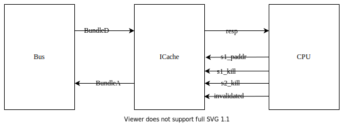

 Icache将会与Bus以及CPU交互, 信号含义如下表所示

| 信号        | 位宽   | 含义                                     |
| ----------- | ------ | ---------------------------------------- |
| BundleD     | struct | 下层存储结构传输到Icache需要refill的数据 |
| BundleA     | struct | 当Icache miss时发出的数据请求            |
| resp        | struct | 返回给CPU的指令数据                      |
| s1_paddr    | 32     | 经过TLB转换由cpu发出的实地址             |
| s1_kill     | 1      | TLB miss或者分支预测错误信号             |
| s2_kill     | 1      | 缺页等 异常                              |
| invalidated | 1      | cache重置请求                            |

在icache中, 主要包含两级流水设置, 包括三个阶段, 具体如下图所示, 粉色为输入信号


第0阶段主要是根据CPU发出的ICache Req请求得到指令的地址, 以及根据Bus来到的BundleD的请求得到数据是否需要refill, 分别进入refill逻辑以及hit逻辑.

第1阶段根据从tag_array, vb_array, 中读出的数据与CPU请求指令比较, 看是否cache hit, 命中则在第2阶段根据bankid返回相应的指令, 如果不命中则在第1阶段根据生成refill_paddr向总线请求数据


Icache的详细结构图如上所示, 包括了黑色部分为cache hit逻辑, 蓝色部分为cache miss逻辑, 红色部分为cache refill逻辑, Icache分为两级流水线, 即需要2个周期才能对数据进行取回, 图中浅色为输入输出, 其中第0阶段的时序逻辑中, count为计数其, 剩下一个为寄存器, 其作用为锁存.

## Icache的存储结构


蓝色的部分为实际的存储结构，在实际的存储设备中，每一行为128bit，16byte。一个block为64byte，所以四行可以作为cache的一个block。

cache结构为8路组相连，每个set中有8个block，而总的cache又有64个set，所以cache的数据存储空间为8 x 64 x 64 = 32768byte。

寻址空间为32位，寻址按照字节进行，块内偏移位$64byte = 2^6$，因此块内偏移地址需要使用6位，ceche中一共包含64个组，因此同样idx也需要6位，最后剩下的20位tag。

因此地址空间的划分具体如下表所示。

| tagoffset | idxoffset | blockOffBits |
| :-------: | :-------: | :----------: |
|   31-20   |   11-6    |     5-0      |

但是在largeboomconfig中，使用了两个bank，即又将上述的cache结构每四个block划分为一个bank，划分bank的好处是为了进行双端口的读写。每个bank的结构如图中最下部分所示，每个bank中有8个way，但是每个way的大小减半了，为32byte，一个way中的一行有4个unit，每个ubit的大小为64bit，由于它将cache的前后两个部分又划分成了两个bank，对应地址的逻辑索引应该有所改变，tag的位数不变，主要是idx的部分需要进行相应的划分，具体如下所示。

| tagoffset | idxoffset | Bankoffset | Wichbank | Unitoffset |
| :-------: | :-------: | :--------: | :------: | :--------: |
|   31-12   |   11-6    |    5-4     |    3     |    2-0     |

每个bank的一个way中有四个小的unit，故可以用11-4位来索引具体是哪个unit，每个unit有8byte，最后的8位表示每个unit的偏移，两个bank各自贡献8B的数据构成16B的数据输出。

## largeboomconfig中确定的参数

HasL1CacheParameters参数确定

|       name       |    value    |                    description                    |
| :--------------: | :---------: | :-----------------------------------------------: |
|      paddr       |   32 bits   |                     实际地址                      |
|      vaddr       |   39 bits   |                     虚拟地址                      |
|      nSets       |   64 bits   |                       组数                        |
|   blockOffBits   |   6 bits    |                    块内偏移量                     |
|     idxBits      |   6 bits    |                     组偏移量                      |
|    untagBits     |   12 bits   |                   非tag的偏移量                   |
|     tagBits      |   20 bits   |                     tag偏移量                     |
|      nWays       |      8      |                       路数                        |
|     wayBits      |   3 bits    |           每路需要多少bit表示，way取log           |
|       isDM       |    false    |                   是否只有一路                    |
|     rowBits      |  128 bits   |    实际一行存储单元bit数, 也是一次存取的bits数    |
|     rowBytes     |   16 byte   |                    一行byte数                     |
|    rowOffBits    |   4 bits    |       实际每行需要多少bit表示，rowByte取log       |
|  cacheDatabits   |  128 bits   | 一次取的bit数, 即两个bank一个sram行组合起来的大小 |
|  cacheDataBeats  |      4      |                       Beats                       |
|   refillCycles   |      4      |                   需要多少周期                    |
| refillsToOneBank |    false    |              是否只填充到一个bank中               |
|    fetchBytes    |  16 bytes   |                每次获取的数据大小                 |
|    bankBytes     |   8 bytes   |                每个bank unit的大小                |
|     wordBits     | 16 x 8 bits |           fetchBytes x 8每次获取的bit位           |

## ICache Hit逻辑

ICache的hit逻辑主要包括的输入输出为io_invalidated, ICacheReq, TLBundleD, io_s1_paddr, 输出ICacheResp,输入输出的含义如下表所示.

ICacheReq为CPU发出的指令请求信号, 当需要取指的时有有效

TLBundleD信号为cache miss时从下级存储单元传回数据的结构体

io_invalidated为无效信号,使得ICache中所有的数据无效.

io_s1_paddr为TLB或者下层存储结构传输回来的实地址

ICacheResp为返回给CPU的指令信号

|    信号     | 位宽 | 类型   |              含义              |
| :---------: | :--: | ------ | :----------------------------: |
|  ICacheReq  |      | input  |                                |
|    valid    |  1   |        |        当需要取指时有效        |
|    vaddr    |  39  |        | pc值, 虚地址, 需要取指令的单元 |
|  TLBundleD  |      | input  |                                |
|    valid    |  1   |        |        当写入数据时有效        |
|    data     | 128  |        |            写入数据            |
|   opcode    |  3   |        |             操作码             |
|             |      |        |                                |
| invalidated |  1   | input  |   使得cache中所有的数据无效    |
|  s1_paddr   |  32  | input  |             实地址             |
| ICacheResp  |      | output |                                |
|    valid    |  1   |        |       当返回值准备好为1        |
|    data     | 128  |        |        返回给CPU的数据         |

如图所示是ICache的hit逻辑其中红色单元为输入,蓝色单元为输出,图中只给出了需要用到的输入输出,miss逻辑以及数据refill逻辑的输入输出暂未画出.


ICache大致上划分为三个流水级别, 中间包含两个流水寄存器, 如图中的蓝色虚线指示. 图中的存储模块包括tag_array保存的是每个在ICache中的指令对应地址的tag, vb_array保存的是每个cache block的有效位置, two_bank_data_array为双bank的数据存储sram

### 第0周期

#### 第0周期基本介绍

cache中用到的存储大单元如下表所示, 其中所有的输入输出的fire信号都为他们valid与ready相与

| 名称          | 大小        | 含义                                  |
| ------------- | ----------- | ------------------------------------- |
| vb_array      | 64*8        | 有效位                                |
| tag_array     | 64 * 8 * 20 | 数据tag, 维度为64x8, 每个ceil20bit    |
| data_array0_0 | 64 * 4 * 64 | 1维sram, row有64x4行, 每个ceil 64bits |
| data_array0_1 | 64 * 4 * 64 | 1维sram, row有64x4行, 每个ceil 64bits |
| data_array0_2 | 64 * 4 * 64 | 1维sram, row有64x4行, 每个ceil 64bits |
| data_array0_3 | 64 * 4 * 64 | 1维sram, row有64x4行, 每个ceil 64bits |
| data_array0_4 | 64 * 4 * 64 | 1维sram, row有64x4行, 每个ceil 64bits |
| data_array0_5 | 64 * 4 * 64 | 1维sram, row有64x4行, 每个ceil 64bits |
| data_array0_6 | 64 * 4 * 64 | 1维sram, row有64x4行, 每个ceil 64bits |
| data_array0_7 | 64 * 4 * 64 | 1维sram, row有64x4行, 每个ceil 64bits |
| data_array1_0 | 64 * 4 * 64 | 1维sram, row有64x4行, 每个ceil 64bits |
| data_array1_1 | 64 * 4 * 64 | 1维sram, row有64x4行, 每个ceil 64bits |
| data_array1_2 | 64 * 4 * 64 | 1维sram, row有64x4行, 每个ceil 64bits |
| data_array1_3 | 64 * 4 * 64 | 1维sram, row有64x4行, 每个ceil 64bits |
| data_array1_4 | 64 * 4 * 64 | 1维sram, row有64x4行, 每个ceil 64bits |
| data_array1_5 | 64 * 4 * 64 | 1维sram, row有64x4行, 每个ceil 64bits |
| data_array1_6 | 64 * 4 * 64 | 1维sram, row有64x4行, 每个ceil 64bits |
| data_array1_7 | 64 * 4 * 64 | 1维sram, row有64x4行, 每个ceil 64bits |


首先我们看到ICacheReq表示的是CPU的指令请求, 当其有效时, 即fire信号为1, cache开始命中判断工作, refill_done信号表示的是当前需要进行cache block的数据填充, 当其无效的时候,表示可以进入命中逻辑判断, 此时的tag_array的ren有效, 读取的地址为CPU请求的虚拟地址的idx. 此时bank_data_array中应该也读出相应的数据, 读取的地址与上述一致, 但是由于, 读有效信号为当前fire信号与!wen信号相与.tag_array与data_array都为sram, 需要下一个周期的时间才能将数据读出.

refill_done信号根据BundleD得来, 当BundleD数据信号有效并通过has_data以及count模块判断当前信号有数据传输并且已经传输完成时, refill_done信号拉高. count模块为传输计数模块, 一个block块为64bytes, 而总线每次只能传输128bit, 因此需要四个时钟周期才能完成一个块的传输, refill_cnt表示的是传输到了块中的第几次, 最大计数为4. has_data模判断的是本次传输的信号是否有数据传输, 当信号来时, 要是有数据需要进行传输, 则refill_one_beat信号有效, 表示该次传输有数据 . has_data与count的输入为BundleD信号, 对BundleD信号进行相应的判断, 这两个是TileLink中的模块.

io_invalidated信号表示的是使得当前整个ICache无效, Cache内部有个!invalidated信号, 当io_invalidated信号有效时为低电平, 只要有数据传入之后即refill_valid之后, !invalidated将会拉高. 表示Cache开始正常工作.

wen信号为写使能信号, 当BundleD传输进来的信号有数据并且!invalidated为1同时得到Cache需要替换的路时, wen拉高有效.

s0_bankid表示的是bank的读取顺序, 因为data_array为双bank, 存在这样的情况, bank1读取的数据为上行, bank0的数据为下一行, 这种情况下输出的顺序为{bank0, bank1}, 而正常的情况下为{bank1, bank0}, s0_bankid为addr中的第4位, 即addr[3]. 因为由cache的存储结构可知, L1 Cache 为8路组相连的结构, 最后的三位地址可以理解成是8路的编码, 第四位可以表示具体的哪个bank, 要是其为1需要输出{bank0, bank1}这样的组合数据, 否则输出{bank1, bank0}这样的数据, 每个bank输出64位的数据, 组合起来为128位的数据

总的来说, 第0周期为CPU请求指令, ICache进行相应的控制信号生成以及读取sram中的数据为接下来的判断准备

自此我们已经得到第一阶段需要的所有关键控制信号, 总结如下表所示

| 信号            | 位宽 | 意义                                            |
| --------------- | ---- | ----------------------------------------------- |
| tag_array_addr  | 6    | 读取tag的地址                                   |
| tag_array_ren   | 1    | tag_array的读使能                               |
| data_array_addr | 8    | data_array读取地址, idx跟紧接着的后两位组合起来 |
| data_array_ren  | 1    | data_array读使能                                |
|                 |      |                                                 |
| refill_one_beat | 1    | BundleD传输的信号为数据信号,需要进行写入        |
| d_done          | 1    | BundleD传输的cache block传输完成64btyes         |
| refill_cnt      | 2    | BundleD输出传输到了第几次,最多需要传输4次       |
| refill_done     | 1    | 最有一个数据信号传输完成                        |
|                 |      |                                                 |
| repl_way        | 8    | 表示需要替换的cache way                         |
| !invalidated    | 1    | 表示cache是否有效                               |

#### bank array详细介绍


如图所示, 两个bank组成的data_array, 每个bank中都有8 ways, 每路都是由一个sram组成, sram大小为64x4x64表示的是sram中每行的大小为64bits且有4x64行, 两个bank中对应的sram中的对应的4行为一个cache block的大小64bytes.

相当于说每个bank都是由8块sram组成, 整个dcache_array由16个sram组成

block offset数据位划分 

| 跟idx组合起来表示sram中的第几行 | which bank | sram offset |
| :-----------------------------: | :--------: | :---------: |
|               5-4               |     3      |     2-0     |

每个sram line的大小为64bits = 8x8, 按字节编码, 这样块偏移的6位中的后3位表示的是sram line偏移,若需要读取128bits的数据的话, 第4位表示开始读取的是那个sram的数据, 为1时开始读取的数据为bank1的数据, 这样bank0的数据读取将会在下一行, 最终输出的数据形式为{bank0, bank1}, 即bank0的数据输出在高位. 若为sram的第4位为0的话, 则先读取bank0的数据, 则最终输出的顺序为{bank1, bank0}, 即bank1的数据输出在高位.

#### bank_addr_logic详细介绍

若读取数据的地址是从bank1开始, 则bank0需要读取cache的下一个行, 若是从bank0开始, 则bank1与bank0 在同一行, 两个bank的数据拼接在一起形成完整的数据.

```Verilog
  assign mem_idx0 =
      refill_one_beat ? (refill_idx << $clog2(refillCycles)) | refill_cnt : b0Row(s0_vaddr);
  assign mem_idx1 =
      refill_one_beat ? (refill_idx << $clog2(refillCycles)) | refill_cnt : b1Row(s0_vaddr);
```

mem_idx同时作为写入数据与输入数据的地址, 要是需要对data_array进行数据写入, 则refill_one_beat为1, 写入地址计算为`refill_idx << $clog2(refillCycles)) | refill_cnt`即idx又移动两位之后确定每4个sram line确定的行组, 最后确定在这4行中的具体哪一行由refill_cnt确定, refill_cnt根据第0周期基本介绍可知意义为传输数据为第几次, 可以确定具体为sram中的哪一行.

若refill_one_beat为0时, 则mem_idx则为读取逻辑, 根据函数b0row与函数b1row确定bank0与bank1的数据读取行. 

```Verilog
 function logic [idxBits + $clog2(refillCycles)-1:0] b0Row(logic [`paddrBits-1:0] addr);
    return addr[untagBits - 1:`blockOffBits - $clog2(refillCycles)] + addr[$clog2(`bankBytes)];
  endfunction

  function logic [idxBits + $clog2(refillCycles)-1:0] b1Row(logic [`paddrBits-1:0] addr);

    return addr[untagBits - 1:`blockOffBits - $clog2(refillCycles)];
  endfunction
```

根据地址的[11:4]位, 确定bank1的行数, 若addr的第4位为1则开始读取的128位数据为bank1, bank0需要到sram的下一行. 则可以确定最终bank0与bank1的行号. 这里传输的addr为vaddr

#### tag_array详细介绍

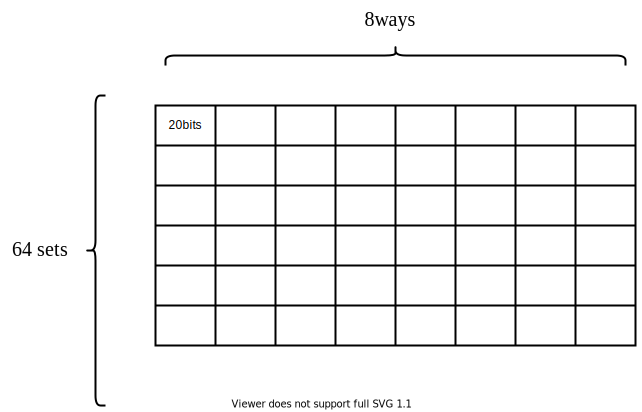

tag_array相对于data_array来说简单很多, 只有一块sram组成, 可以看看做是一个二维的数组, 由于sram一次只能读出一行的数据, 所以该设计一次将会读出20x8的数据, 具体数据为基础中tag_rdata

#### count详细介绍

因为tilelink中每一帧只能传输128bits的数据, 要是对多个帧组成的数据包进行传输, 则需要多个周期, 这里是对传输的数据进行计数, 通过firstlastHelp函数判断数据传输是否到了最后一位, 以及具体到了第几位. 这里直接使用翻译的Verilog代码.

最后输出的是是否传输完成以及当前传送的是第几帧数据

#### has_data详细介绍

has_data判断传输的信号是否存在数据传送. 这里传输的数据是BundleD, 即D通道的数据, 根据协议描述规范可知, D通道只有在响应GrantData信号的时候有数据传输. D通道可以进行的操作有Grant, GrantData, ReleaseACK, 他们的操作码分别为4, 5, 6, 所以这里可以根据opcode的最后1位是否为1判断是否存在数据传送.Text

因此refill_one_beta信号可由下代码得到

```Verilog
wire  refill_one_beat = io_auto_d.valid & refill_one_beat_opdata;
```

### 第1周期

#### 第1周期基本介绍

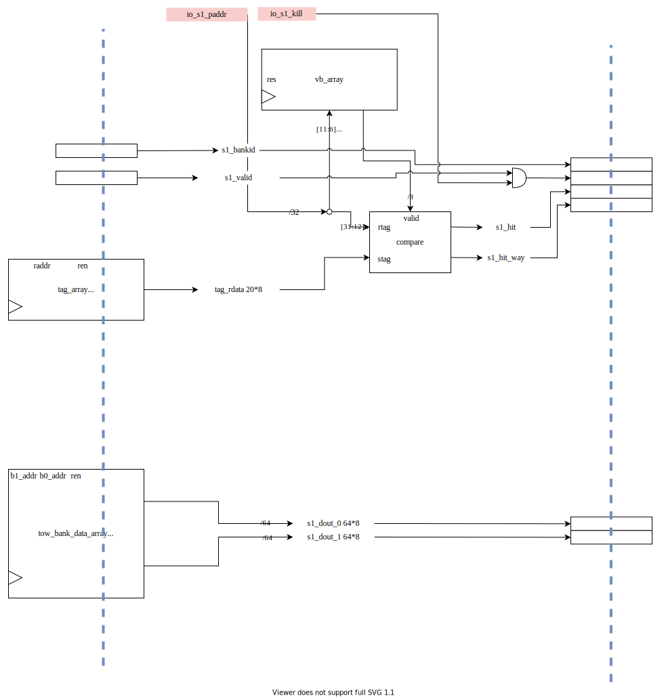

在第一周期中, 有两个输入到该周期才进行, 也就是io_s1_paddr, 这是经过TLB翻译的实地址或者是从下层存储结构传入的实地址, 与vaddr39位不同, 只有32位, 第0周期使用虚地址将整行数据从sram中读出到本地寄存器, 第一周期判断数据命中, 这样能加快命中逻辑. 

还有一个输入为io_s1_kill, 由于流水线分支预测错误为一个周期, 第0周期将会进行数据的预读取, 若分支预测错误则结束接下来的流程, 不进行第二周期的指令返回以及cache miss数据取回.

vb_array为有效位数组, 其中每个block都会有效位标志, 当其为1时表示的是该block中的数据有效, 可以为CPU提供数据.

compare逻辑为比较逻辑, 输入上一周期读取出的tag_array信息即tag_rdata, rdata 并与io_s1_paddr的tag进行比较, 若相等则命中, s1_hit拉高. 否则的的话为miss, 进入cache miss的数据路径. tag_rdata是从tag_array中读出的数据.s1_hit_array为8位的one-hot信号

关键数据汇总如下表所示

| 信号         | 位宽  | 含义                      |
| ------------ | ----- | ------------------------- |
| vb_array     | 64*8b | 有效位标志, 64组, 每组8位 |
| io_s1_paddr  | 32b   | 实地址                    |
| tag_rdata    | 20*8b | cache中保存的tag          |
| io_s1_kill   | 1b    | 流水线预测错误, tlb miss  |
| s1_hit_array | 8b    | tag-hit的one-hot信号      |

#### vb_array详细介绍

vb_array可以完全用寄存器来实现, 因为其只需要8*64bits, 数据量比较小

#### compare logic详细介绍

比较逻辑的关键代码如下所示

```verilog
  //第1个周期判断哪路命中
  logic [tagBits-1:0] s1_tag;
  logic [idxBits-1:0] s1_idx;
  assign s1_idx = io_s1_paddr[untagBits - 1:`blockOffBits];
  assign s1_tag = io_s1_paddr[tagBits + untagBits - 1:untagBits];
  generate
    for (genvar i = 0; i < nWays; i++) begin
      assign s1_tag_hit[i] = (vb_array[{i, s1_idx}] && tag_rdata[i] == s1_tag);
    end
  endgenerate
```

根据读出的tag_rdata以及当前转换过后实地址的tag比较, 判断是否命中以及哪一路命中

### 第2周期

#### 第2周期基本介绍

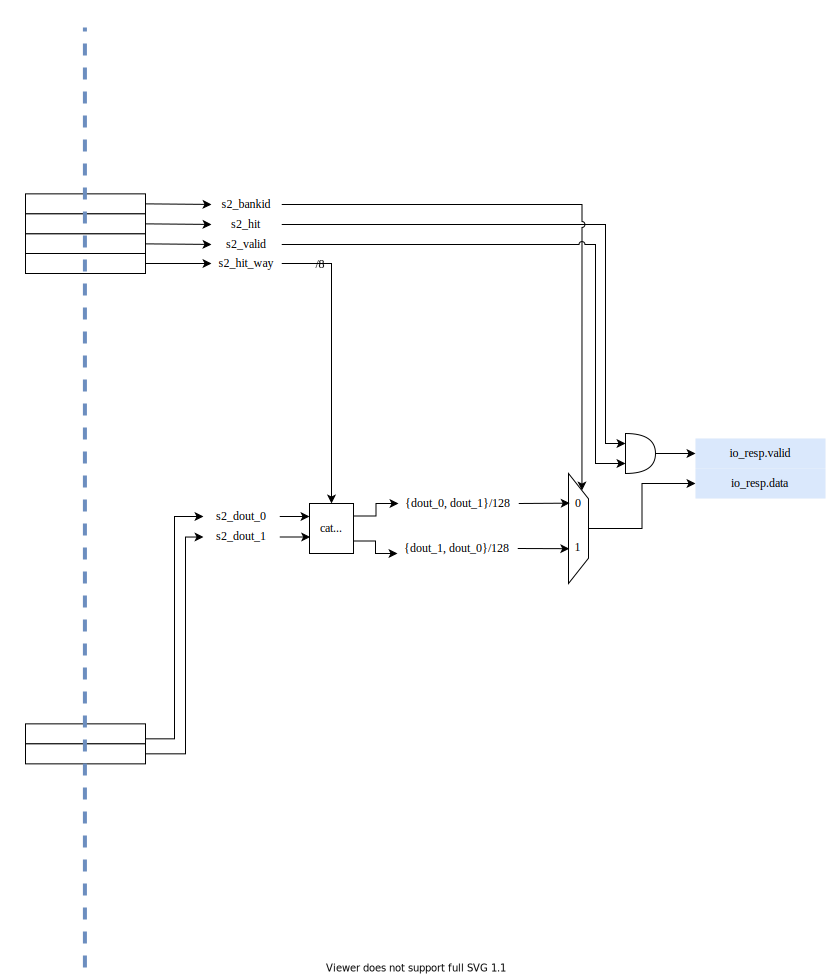

该阶段主要是将数据输出, cat&select模块得到需要的输出的数据,之后根据s2_bankid选择数据输出的形式, 根据第一阶段的描述确定. 最后链接到io_resp.data, valid信号为当s2_hit与s2_valid同时有效时为有效. 蓝色标识框为输出数据

该阶段用到的数据以及含义如下所示

| 信号       | 位宽 | 含义                         |
| ---------- | ---- | ---------------------------- |
| s2_bankid  | 1    | 选择数据输出的格式           |
| s2_hit     | 1    | 命中标识, s1_hit打一拍得来   |
| s2_valid   | 1    | 有效标识, s1_valid打一拍得来 |
| s2_hit_way | 8    | 命中路径选择                 |
| s2_dout_0  | 64*8 | bank0读出数据                |
| s2_dout_1  | 64*8 | bank1读出数据                |

输出数据介绍

| 信号          | 位宽 | 含义                                              |
| ------------- | ---- | ------------------------------------------------- |
| io_resp.data  | 128  | 输出数据, 刚好总线一个周期可以输出                |
| io_resp.valid | 1    | 输出数据有效, 当CPU收到这个标识时表示可以输出数据 |

#### cat&select

输入为s2_dout_0与s2_dout_1的数据以及s2_hit_way, 作用是将s2_dout_0与s2_dout_1拼接起来, 根据s2_hit_way的数据选择一路进行输出

## ICache Miss逻辑

缺失处理需要执行的数据路径在hit的基础上, **由蓝色的线标出**, 如上图所示, 蓝色线条标出的是在cache_miss时需要执行的数据路径.


当cache_miss时, 需要向总线发出缺失请求, 缺失请求由BundleA发出, 需要得到BundleA中的valid以及addr信息, valid有效之后将会把addr的信息推送到总线.

### refill_valid信号说明

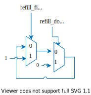

首先我们需要说明清楚refill_valid信号的含义, 其更新如上图所示, refill_fire信号就是当发现缺失后, 向总线发送数据回填请求时有效, refill_done信号表示数据回填完成.

只有cache缺失或者数据回填的时候才更新该信号, 该信号为1表示存在缺失, 需要将数据回填到cache, 为0表示缺失处理完毕. 且该信号为reg类型数据, 当上一次周期访问有缺失时, 当且周期为1, 并且持续到缺失处理完成为止. 波形如下图所示

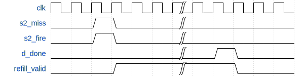

### BundlA valid信号说明

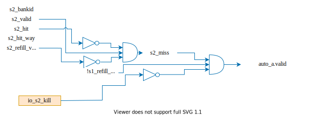

miss信号将会在第cache中的第二阶段生成, 如上图所示, s2_miss信号表示的是缺失, 该信号由CPU请求valid信号以及!s2_hit相以及refill_valid打一周期得到, 打一周期是因为当数据回填到cache之后, 由于hit逻辑可知需要一个周期的读取时间, 因此这里需要打一拍才能再次判断miss. s2_miss表示的是数据不在cache中.

io_s2_kill为输入信号, 表示tlb异常或者core的发射队列满.

auto_a_valid表示的是当s2_miss且当前不需要数据回填, 且当前没有发生缺页等情况, 可以向总线发送数据请求.

| 信号         | 位宽 | 含义                    |
| ------------ | ---- | ----------------------- |
| s2_miss      | 1    | 数据不在cache中         |
| io_s2_kill   | 1    | 数据未发生tlb缺失等异常 |
| auto_a_valid | 1    | 是否向总线发送数据请求  |

### BundleA addr信号说明

可以看到addr信号其实就是refill_paddr信号, 我们这里需要搞清楚如何更新refill_paddr这个信号即可.

refill_paddr这个信号比较复杂, 来源主要是经过TLB转换或者下层存储结构传输回来的实地址io_s1_paddr,  去向主要有两个, 第一个是io_auto_a.addr, 第二个就是tag_array, data_array, vb_array, 作为写cache sram的地址, 这将在下一节refill中介绍.

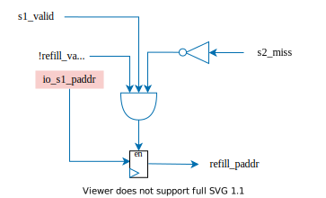


refill_addr作为一个寄存器类型, 在cache的阶段一进行更新, 相当于在对与阶段二同步, 当前CPU的数据请求valid有效且当前没有refill_请求以及s2_miss时, refill_valid可以进行更新, 更新代码如下所示

```Verilog
      if (s1_valid && !(refill_valid || s2_miss))begin
        refill_paddr <= io_s1_paddr;
      end
```

有三个问题需要回答

* 为什么在第一阶段进行跟新

  作为寄存器类型, 在第一阶段进行更新的话, 刚好可以在第二阶段拿到数据, 这样的话可以在第二阶段向总线发出数据请求

* 为什么当前refill_valid为1时不能更新

  此时该寄存器保存的是需要获取的数据地址, 要是更新的话该地址丢失, 对接下来的数据写入会造成影响

* 为什么s2_miss的时候无法更新

  与refill_valid一样, 由于没有队列保存这个地址信息, 若更新将会导致信息丢失

refill_paddr的波形图如下所示

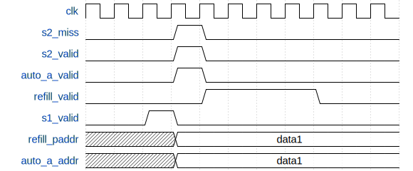

### cache miss信号汇总

| 信号         | 位宽 | 含义                                |
| ------------ | ---- | ----------------------------------- |
| s2_miss      | 1    | 数据不在cache中                     |
| io_s2_kill   | 1    | 数据未发生tlb缺失等异常             |
| auto_a_valid | 1    | 是否向总线发送数据请求              |
| refill_fire  | 1    | Icache数据缺失请求                  |
| refill_done  | 1    | Icache数据回填完毕                  |
| refill_valid | 1    | 数据存在缺失                        |
| refill_paddr | 32   | 实地址, TLP或者下层存储器传回的数据 |
| io_s2_kill   | 1    | TLB异常等异常信号                   |

## ICache Refill逻辑

refill主要负责将之前A通道请求从总线D通道传输回来的数据写到Cache的存储器中, 主要包括写tag_array, data_array以及写vb_array. 总体架构图如下图所示, 红色的部分为cache refill的数据路径.


### repl_way获取

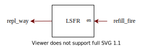

根据cache_miss小节可知, 当发现cache miss的时候, refill_fire将跳转为1, 该信号作为使能信号传输给LSFR随机数发生器, 生成一个随机数, 用这个随机数作为cache的替换路, 替换策略为随机替换策略.

### refill_addr获取

根据refill_paddr信号说明可知, refill_paddr信号为cache miss时缺失的地址, 因此D通道送回的数据此时存在refill_paddr中. 可以将refill_paddr的高20位作为tag, 接下来的6位作为refill的addr.

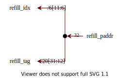

具体数据划分如下表所示

| tag   | idx  | offset |
| ----- | ---- | ------ |
| 31-20 | 11-6 | 5-0    |

### vb_array写

由于Icache不需要将数据写回, 所以不存在说有效的的数据变成无效, 除非整个cache reset, 所以这里只需要考虑何时将vb_array设置为1即可

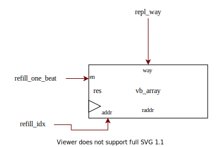


如上图所示, refill_one_beat表示D通道来了一个数据, 此时vb_array的使能打开, 可以进行写数据, 将repl_way与refill_idx合并起来即可表示需要写入的是具体的哪一. 

### tag_array写

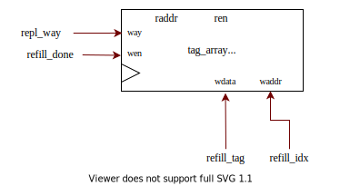

根据tag_array详细介绍可知, tag_arrya可以看做是一个二维数组, 拥有64行以及8列, 因此可以直接使用refill_idx作为行选择器, 同时使用repl_way作为列选信号, 这样就可以确定二维数组中唯一的一个单元, 此时将refill_tag写入tag_array中.

写入使能为refill_done信号, 因为tag_array中每一个单元代表的是一个cache block, 而refill_done信号指示的是一个block传输完成, 此时可以进行相应的写入逻辑.

### data_array写

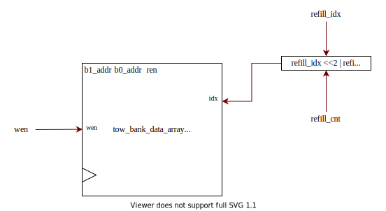

数据写入需要输入写使能, 写入行, 根据bank_array详细介绍可知, bank都是由8块sram组成, 整个dcache_array由16个sram组成, 写使能的作用是确定是否需要写入以及写入每个bank中的具体哪一路, 即需要确定的是8个sram具体写哪一个, 因此wen为one-hot信号.

由于每次传输的数据只有128bits, 分成两部分每部分分别为64bits写入两个bank, 高位64位数据写入bank1, 低位数据写入bank0. sram行由refill_idx左移两位与refill_cnt按位或, refill_idx左移两位是确定了写入行的开始, refill_cnt为2位计数器, 确定写接下来四行中的哪一行, 比如为0时写{refill_idx, 00}, 为1时写{refill_idx, 01}这样以此类推.

两个bank的行为在写入时是相同的, 但是写入的数据不同

### refill行为小结

refill最重要的是refill_paddr以及D通道来的数据这两个信号, refill_paddr确定写入的地址, D通道数据确定的是使能信号以及写入数据, 通过这两个信号形成控制逻辑.

| 信号            | 位宽   | 含义                                       |
| --------------- | ------ | ------------------------------------------ |
| BundleD         | struct | refill数据传输通道                         |
| refill_paddr    | 32     | 写入数据地址确定                           |
| refill_cnt      | 2      | 确定数据传输到了第几帧                     |
| refill_one_beat | 1      | 有数据传输                                 |
| repl_way        | 3      | 需要替换的是哪一路                         |
| refill_fire     | 1      | 在cache miss时拉高一个时钟周期得到repl_way |

