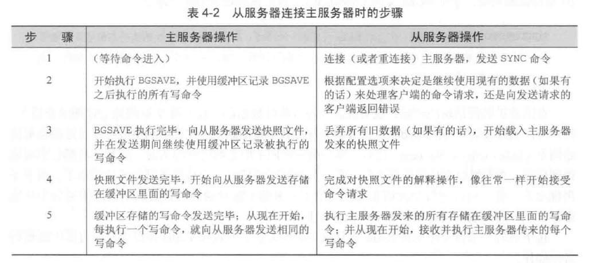

# 常见问题

## Redis

### 快照持久化
    save 60 100 : 60秒之内有100次更新就会发生一次快照创建
    stop-writes-on-bgsave-error no/yes: 创建快照失败后是否仍然继续执行写命令
    rdbcompression yes/no : 是否对快照文件进行压缩
    dbfilename xx.rdb : 快照文件名
    redis-check-dump

    BGSAVE : 
        1. 客户端通过向Redis发送该命令来创建一个快照。Redis会调用fork命令来创建一个子进程，然后子进程负责将快照写入磁盘，父进程会继续处理命令请求。
        2. save配置条件满足时就会触发该命令。
    SAVE : 客户端通过向Redis发送该命令来创建一个快照。接到该命令的Redis服务器在创建快照完毕之前将不再响应任何其他命令。

### AOF持久化
    appendonly yes/no : 是否开启AOF持久化
    appendfsync everysec : 将写入的内容同步到磁盘的频率
    no-appendfsync-on-rewrite no/yes : 在对AOF文件进行重写压缩的时候能否执行同步操作
    auto-aof-rewrite-precentage : 体积比上一次重写时大了多少时自动重写
    auto-aof-rewrite-min-size : 当AOF文件大于多少时自动重写
    redis-check-aof

### 复制（主从服务器）

## C++

### 1. 引用和指针的区别？
    1）指针是一个实体，引用只是变量的别名
    2）引用在定义的时候必须初始化
    3）有多级指针但是没有多级引用
    4）sizeof

### 2. 模板类和模板函数的区别是什么？
    函数模板 的 实例化 是由编译程序在处理函数调用时 自动完成的 ，而类模板的实例化必须由程序员在程 序中显式地指定。即函数模板允许隐式调用和显式 调用而类模板只能显示调用.在使用时 类模板必须加 <T>，而函数模板不必

### 3. emplace_back & push_back
    

### 4. RBT 红黑树
    1. 每个节点都有红色或者黑色
    2. 树的根始终都是黑色的
    3. 没有两个相邻的红色节点（红色节点不能有红色父节点或红色子节点，并没有说不能出现连续的黑色节点）
    4. 从节点（包括根）到其任何后代NULL节点(叶子结点下方挂的两个空节点，并且认为他们是黑色的)的每条路径都具有相同数量的黑色节点
    begin:
    1.插入节点设置为红色
    2.如果父节点为黑色则不管
    3.如果父节点为红色
        3.1 如果叔叔节点为红色 Go To recolor
        3.2 如果叔叔节点为黑色 Go To rotate
    recolor:
        1. 叔父全标黑，插入节点设置成黑
    rotate：
        1. 左左
        2. 左右
        3. 右右
        4. 右左

### 5. 容器知识

**vector成员函数**

    -Iterator
        begin() \ rbegin() \ end() \ rend() 以及对应的const版本
    -Capacity
        size() \ max_size() \ resize() \ reserve() \ capacity()
    -Access Element
        operator[] \ at \ front \ back \ data(返回指向第一个元素的指针)
    -Modifiers
        assign \ push_back \ pop_back \ insert \ erase(参数为iterator,不能为值) \ swap \ clear \ emplace_back \ emplace

**list成员函数**

    -Iterator
        同vector
    -Capacity
        empty \ size \ max_size
    -Access Element
        front \ back
    -Modifiers
        相较vector 多了emplace_front \ push_front \ pop_front
    -Operations
        splice \ remove(值删除,区分于erase) \ removeif \ unique(会直接删除相邻重复元素) \ merge \ sort \ reverse

**queue成员函数**

    -Iterator
        无
    empty \ size \ front \ back \ push \ pop \ emplace \ swap

**priority_queue成员函数**

    -Iterator
        无
    empty \ size \ top \ push \ emplace \ pop \ swap

**map \ multimap \ set \ multiset**

    -Iterator
        八大迭代器
    -Capacity
        empty \ size \ max_size
    -Access Element
        [] \ at(参数为key值,返回值为对应value的引用)
    -Modifiers
        insert \ erase(同时支持值和迭代器) \ swap \ clear \ emplace
    -Operations
        find \ count \ lower_bound \ upper_bound \ equal_range
        --pair<Iterator,Iterator> equal_range(key_val) : 返回key值等于key_val的迭代器范围
    -Observes
        key_comp \ value_comp

***

## 操作系统

### 1. 进程、线程和协程
    1）线程是程序执行的最小单位，而进程是操作系统分配资源的最小单位；
    2）一个进程由一个或多个线程组成，线程是一个进程中代码的不同执行路线；
    3）进程之间相互独立，但同一进程下的各个线程之间共享程序的内存空间(包括代码段、数据段、堆等)及一些进程级的资源(如打开文件和信号)，某进程内的线程在其它进程不可见；
    4）调度和切换：线程上下文切换比进程上下文切换要快得多。
    5）协程在子程序内部是可中断的，然后转而执行别的子程序，在适当的时候再返回来接着执行。
    6）极高的执行效率：因为子程序切换不是线程切换，而是由程序自身控制，因此，没有线程切换的开销，和多线程比，线程数量越多，协程的性能优势就越明显；
    7）不需要多线程的锁机制：因为只有一个线程，也不存在同时写变量冲突，在协程中控制共享资源不加锁，只需要判断状态就好了，所以执行效率比多线程高很多。

### 2. 孤儿进程、僵尸进程以及守护进程

### 3. 守护进程的实现
    1) 在父进程中执行 fork 并 exit 推出；
    2) 在子进程中调用 setsid 函数创建新的会话；
    3) 在子进程中调用 chdir 函数，让根目录 ”/” 成为子进程的工作目录；
    4) 在子进程中调用 umask 函数，设置进程的 umask 为 0
    5) 在子进程中关闭任何不需要的文件描述符

### 4. 用户态到内核态的转化原理
    1）系统调用
    这是用户态进程主动要求切换到内核态的一种方式，用户态进程通过系统调用申请使用操作系统提供的服务程序完成工作。
    2）异常
    当 CPU 在执行运行在 用户态下的程序时 ，发生了某些事先不可知的异常，这时会触发由当前运行进程切换到 处理此异常的内核相关程序中 ，也就转到了内核态，比如缺页异常。
    3）外围设备的中断
    当外围设备完成用户请求的操作后，会向 CPU 发出相应的中断信号，这时 CPU 会暂停执行下一条即将要执行的指令转而去执行与中断信号对应的处理程序，如果先前执行的指令是用户态下的程序，那么这个转换的过程自然也就发生了由用户态到内核态的切换。比如硬盘读写操作完成，系统会切换到硬盘读写的中断处理程序中执行后续操作等。

## 数据库

### 1. 数据库索引与B+树