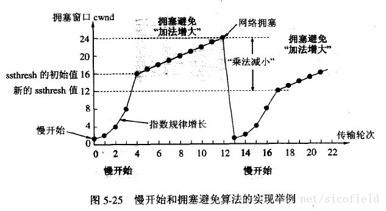
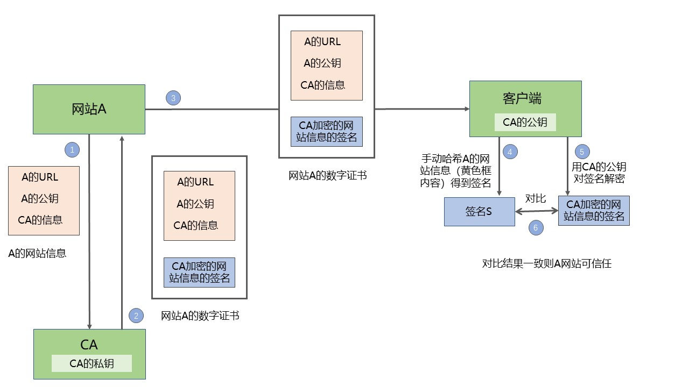
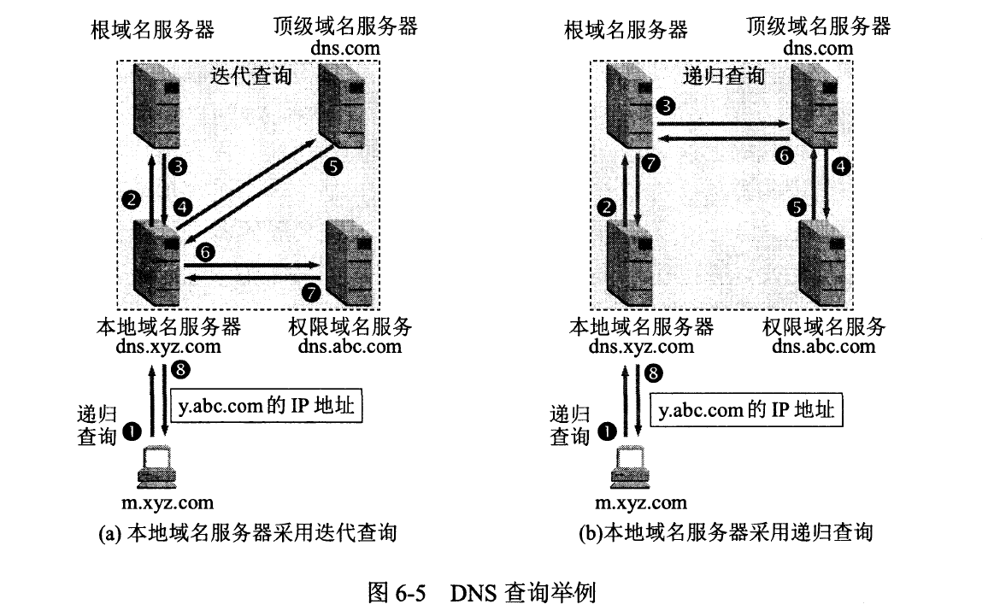
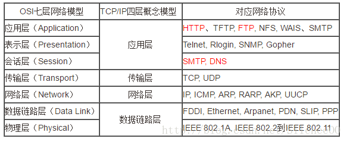

#  计网相关

应用层, 传输层, 网络层, 数据链路层, 物理层

#### （1） 建立TCP服务器的各个系统调用

建立TCP服务器连接的过程中主要通过以下系统调用序列来获取某些函数，这些系统调用主要包括：socket（），bind（），listen（），accept（），send（）和recv（）。
详见：[建立TCP 服务器的系统调用](https://blog.csdn.net/qq_37964547/article/details/81429627)

#### （2） 继上一题，说明socket网络编程有哪些系统调用？其中close是一次就能直接关闭的吗，半关闭状态是怎么产生的？

    socket()    创建套接字   
    bind()      绑定本机端口    
    connect()   建立连接     （TCP三次握手在调用这个函数时进行）
    listen()    监听端口
    accept()    接受连接
    recv(), read(), recvfrom()  数据接收
    send(), write(), sendto()   数据发送
    close(), shutdown() 关闭套接字

使用close()时，只有当套接字的引用计数为0的时候才会终止连接，而用shutdown()就可以直接关闭连接

详见：[网络编程Socket之TCP之close/shutdown详解](https://blog.csdn.net/junjun150013652/article/details/37994907)

TCP连接与断开详解： https://www.cnblogs.com/felixzh/p/8359066.html

#### （3） 对路由协议的了解与介绍。内部网关协议IGP包括RIP，OSPF，和外部网关协议EGP和BGP.

* RIP“路由信息协议(Route Information Protocol)”的简写，主要传递路由信息，通过每隔30秒广播一次路由表，维护相邻路由器的位置关系，同时根据收到的路由表信息使用动态规划的方式计算自己的路由表信息。RIP是一个距离矢量路由协议,最大跳数为16跳,16跳以及超过16跳的网络则认为目标网络不可达。

* OSPF：详见：https://zhuanlan.zhihu.com/p/41341540

#### （4） UDP如何实现可靠传输

因为UDP是无连接的协议，所以在传输层上无法保证可靠传输，要想实现可靠传输，只能从应用层实现。需要实现seq/ack机制，重传机制和窗口确认机制。

就要接收方收到UDP之后回复个确认包，发送方有个机制，收不到确认包就要重新发送，每个包有递增的序号，接收方发现中间丢了包就要发重传请求，当网络太差时候频繁丢包，防止越丢包越重传的恶性循环，要有个发送窗口的限制，发送窗口的大小根据网络传输情况调整，调整算法要有一定自适应性。

#### （5） TCP和UDP的区别

* TCP是面向连接的协议，提供的是可靠传输，在收发数据前需要通过三次握手建立连接，使用ACK对收发的数据进行正确性检验。而UDP是无连接的协议，不管对方有没有收到或者收到的数据是否正确。
* TCP提供流量控制和拥塞控制，而UDP没有。
* TCP对系统资源的要求高于UDP，所以速度也比UDP慢。
* TCP数据包是没有边界的，会出现粘包的问题，UDP包是独立的，不会出现粘包问题。
* 所以在应用方面，如果强调数据的完整性和正确性用TCP，当要求性能和速度的时候，使用UDP更加合适。

注：单凭TCP是不能保证完整性的，要是有黑客伪造TCP包，是无法识别的。

#### （6） TCP和UDP相关的协议与端口号

TCP族的协议有HTTP，HTTPS，SMTP，TelNet，FTP等，UDP族的协议有DNS，DHCP等等。
详见：https://blog.csdn.net/qq_22080999/article/details/81105051

#### （7） TCP（UDP，IP）等首部的认识（http请求报文构成）

TCP的头部大致包括：源端口，目的端口，序号，确认号，偏移位，标志位，校验和等等

UDP的头部则包括：源端口，目的端口，长度，校验和。

IP数据包的头部包括：源IP地址，目的IP地址，协议，校验和，总长度等等

详见：https://blog.csdn.net/zhangliangzi/article/details/52554439

#### （8） 网页解析的过程与实现方法

这里仅展示浏览器解析服务器响应的过程，URL解析和交互的完整过程在(9)

* 首先是html文档解析，浏览器会将html文档生成解析树，也就是DOM树，它由dom元素以及属性节点组成。
* 然后浏览器加载过程中如果遇到了外部css文件或者图片资源，还会另外发送请求来获取css文件和资源，**这个请求通常是异步的，不会影响html文档的加载。**
* 不过如果浏览器在加载时遇到了js文件，则会挂起渲染的线程，等待js文件加载解析完毕才恢复html的渲染线程。
* 然后是css解析，将css文件解析为样式表对象来渲染DOM树。

#### （9）    在浏览器中输入URL后执行的全部过程（如www.baidu.com）

1. 首先是域名解析，客户端使用DNS协议将URL解析为对应的IP地址；
2. 然后建立TCP连接，客户端与服务器通过三次握手建立TCP连接；
3. 接着是http连接，客户端向服务器发送http连接请求； （http连接无需额外连接，直接通过已经建立的TCP连接发送）
4. 服务器对客户端发来的http请求进行处理，并返回响应；
5. 客户端接收到http响应，将结果渲染展示给用户。

#### （10） 网络层分片的原因与具体实现

因为在链路层中帧的大小通常都有限制，比如在以太网中帧的最大大小（MTU）就是1500字节。如果IP数据包加上头部后大小超过1500字节，就需要分片。

IP分片和完整IP报文差不多拥有相同的IP头，16位ID域对于每个分片都是一致的，这样才能在重新组装的时候识别出来自同一个IP报文的分片。在IP头里面，16位识别号唯一记录了一个IP包的ID，具有同一个ID的IP分片将会重新组装；而13位片偏移则记录了某IP片相对整个包的位置；而这两个表中间的3位标志则标志着该分片后面是否还有新的分片。这三个标志就组成了IP分片的所有信息(将在后面介绍)，接受方就可以利用这些信息对IP数据进行重新组织。
详见：https://blog.csdn.net/gettogetto/article/details/72851734

#### （11） TCP的三次握手与四次挥手的详细介绍（TCP连接建立与断开是热门问题）

* 三次握手

第一次握手：首先client给server发送连接请求报文，在这个报文中，包含了SYN=1，client_seq=任意值i，发送之后处于SYN-SENT状态，这是第一次握手

第二次握手：server端接收到了这个请求，并分配资源，同时给client返回一个ACK报文，这个报文中呢包含了这些字段，标志位SYN和ACK都为1，而小ack为i+1，此时位于SYN-RCVD状态，这是第二次握手

第三次握手：client收到server发来的ACK信息后呢，他会看到server发过来的小ack是i+1，这时他知道了server收到了消息，也给server回一个ACK报文，报文中同样包含了ACK=1这样的消息，同时呢，还包括了client_ack=k+1这样的字段，这样呢三次握手之后，连接就建立了，client进入established（已建立连接）状态

* 四次挥手断开连接：

TCP断开连接通常是由一方主动，一方被动的，这里我们假设client主动，server被动
第一次挥手：当client没有数据要发送给server了，他会给server发送一个FIN报文，告诉server：“我已经没有数据要发给你了，但是你要是还想给我发数据的话，你就接着发，但是你得告诉我你收到我的关闭信息了”，这是第一次挥手，挥手之后client进入FIN_WAIT_1的第一阶段

第二次挥手：当server收到client发来的FIN报文后，告诉client：“我收到你的FIN消息了，但是你等我发完的”此时给client返回一个ACK信息，并且呢ack=seq+1，这是第二次挥手，挥手之后呢server进入CLOSE_WAIT阶段，而client收到之后处于FIN_WAIT_2第二阶段

第三次挥手：当server发完所有数据时，他会给client发送一个FIN报文，告诉client说“我传完数据了，现在要关闭连接了”，然后呢server变成LAST_ACK状态，等着client最后的ACK信息，这是第三次挥手

第四次挥手：当client收到这个FIN报文时，他会对这个消息进行确认，即给server发ACK信息，但是它不相信网络，怕server收不到信息，它会进入TIME_WAIT状态，万一server没收到ACK消息它可以可以重传，而当server收到这个ACK信息后，就正式关闭了tcp连接，处于CLOSED状态，而client等待了2MSL这样长时间后还没等到消息，它知道server已经关闭连接了，于是乎他自己也断开了，这是第四次挥手，这样tcp连接就断开了

#### （12） TCP握手以及每一次握手客户端和服务器端处于哪个状态

见上

#### （13） 为什么使用三次握手，两次握手可不可以？

如果使用两次握手的话，三次握手中的最后一次缺失，服务器不能确认客户端的接收能力。

举两个例子，第一种是黑客会伪造大量SYN请求发送给服务器，服务器立即确认并建立连接，分配资源，但是这一系列连接并不是真实存在的，这大大浪费了服务器的资源并且阻塞了正常用户的连接，这种也叫SYN洪泛攻击。第二种是服务器返回给客户端的ACK数据包可能会在传输的过程中丢失，而客户端没有收到该ACK数据包而拒绝接收服务器接下来发送的数据，于是服务器一直在发送，客户端一直在拒绝，形成死锁。

#### （14） TIME_WAIT的意义（为什么要等于2MSL）

TIME_WAIT是指四次挥手中客户端接收了服务端的FIN报文并发送ACK报文给服务器后，仍然需要等待2MSL时间的过程。虽然按道理，四个报文都发送完毕，我们可以直接进入CLOSE状态了，但是我们必须假象网络是不可靠的，有可以最后一个ACK丢失。如果客户端发送的ACK发生丢失，服务器会再次发送FIN报文给客户端，所以TIME_WAIT状态就是用来重发可能丢失的ACK报文。

#### （15） 超时重传机制（不太高频）

#### （16） TCP怎么保证可靠性？

**（校序重流拥）**

* 校验和
  发送的数据包的二进制相加然后取反，目的是检测数据在传输过程中的任何变化。如果收到段的检验和有差错，TCP将丢弃这个报文段和不确认收到此报文段。 

* 确认应答+序列号
  TCP给发送的每一个包进行编号，接收方对数据包进行排序，把有序数据传送给应用层。 

* 超时重传
  当TCP发出一个段后，它启动一个定时器，等待目的端确认收到这个报文段。如果不能及时收到一个确认，将重发这个报文段。 

* 流量控制
  TCP连接的每一方都有固定大小的缓冲空间，TCP的接收端只允许发送端发送接收端缓冲区能接纳的数据。当接收方来不及处理发送方的数据，能提示发送方降低发送的速率，防止包丢失。TCP使用的流量控制协议是可变大小的滑动窗口协议。
  **接收方有即时窗口（滑动窗口）**，随ACK报文发送

* 拥塞控制
  当网络拥塞时，减少数据的发送。
  发送方有拥塞窗口，发送数据前比对接收方发过来的即使窗口，取小

慢启动、拥塞避免、快速重传、快速恢复 

#### (17） 流量控制的介绍，采用滑动窗口会有什么问题（死锁可能，糊涂窗口综合征）？

所谓流量控制就是让发送方发送速率不要过快，让接收方来得及接收。利用TCP报文段中的窗口大小字段来控制发送方的发送窗口不大于接收方发回的窗口大小就可以实施流量控制。

考虑一种特殊的情况，就是接收方若没有缓存足够使用，就会发送零窗口大小的报文，此时发送放将发送窗口设置为0，停止发送数据。之后接收方有足够的缓存，发送了非零窗口大小的报文，但是这个报文在中途丢失的，那么发送方的发送窗口就一直为零导致死锁。

解决这个问题，TCP为每一个连接设置一个持续计时器（persistence timer）。只要TCP的一方收到对方的零窗口通知，就启动该计时器，周期性的发送一个零窗口探测报文段。对方就在确认这个报文的时候给出现在的窗口大小（注意：TCP规定，即使设置为零窗口，也必须接收以下几种报文段：零窗口探测报文段、确认报文段和携带紧急数据的报文段）。

#### （18） tcp滑动窗口协议

详见 [TCP-IP详解：滑动窗口SlidingWindow](https://blog.csdn.net/wdscq1234/article/details/52444277)和[TCP滑动窗口](https://www.cnblogs.com/alifpga/p/7675850.html)

TCP的滑动窗口用来控制接收方和发送方的发送速率，避免拥塞的发生。滑动窗口其实就是接收端的缓冲区大小，用来告诉发送方对它发送的数据有多大的缓冲空间。在接收方的滑动窗口已知的情况下，当接收方确认了连续的数据序列之后，发送方的滑动窗口向后滑动，发送下一个数据序列。

接收方会在每个ACK数据包中附带自己当前的接受窗口（滑动窗口）的大小，方便发送方进行控制。

#### （19） 拥塞控制和流量控制的区别

拥塞控制是防止过多的数据注入到网络中，导致网络发生拥塞；而流量控制是防止发送方一下子发送过多的数据到接收方，导致接收方缓存放不下。两种算法都是对发送方的行为进行控制的。

#### （20） TCP拥塞控制，算法名字？（极其重要）

防止过多的数据注入到网络中，这样可以使网络中的路由器或链路不致过载，拥塞控制自然也是控制发送者的流量，拥塞控制有四种算法，**慢启动、拥塞避免，快速重传和快速恢复**

发送方维持一个拥塞窗口 cwnd \( congestion window \)的状态变量。拥塞窗口的大小取决于网络的拥塞程度，并且动态地在变化。发送方让自己的发送窗口等于拥塞窗口和接受窗口的较小值。

（1）**慢启动**。慢启动算法的思路是当主机开始发送数据时，先以比较小的拥塞窗口进行发送，然后每次翻倍，也就是说，由小到大逐渐增加拥塞窗口的大小，而这个大小是指数增长的，即1、2、4、8、16
*为了防止拥塞窗口cwnd增长过大引起网络拥塞，还要另外设置一个慢启动阈值ssthresh状态变量，当拥塞窗口的大小超过慢启动阈值的时候（ cwnd > ssthresh 时），停止使用慢开始算法而改用拥塞避免算法

（2）**拥塞避免**。拥塞避免算法的思路是让拥塞窗口cwnd缓慢地增大，即每经过一个往返时间RTT就把发送方的拥塞窗口cwnd加1，而不是加倍。

（3）**快速重传**。当发送端连续收到三个重复的ack时，表示该数据段已经丢失，需要重发。此时慢启动阈值ssth变为原来一半，拥塞窗口cwnd变为ssth+3，然后+1+1的发（每一轮rtt+1）

（4）**快速恢复**。当超过设定的时间没有收到某个报文段的ack时，表示网络拥塞，慢启动阈值ssth变为原来一半，拥塞窗口cwnd=1，进入慢启动阶段

#### （21） http协议与TCP的区别与联系

联系：Http协议是建立在TCP协议基础之上的，当浏览器需要从服务器获取网页数据的时候，会发出一次Http请求。Http会通过TCP建立起一个到服务器的连接通道，当本次请求需要的数据传输完毕后，Http会立即将TCP连接断开，这个过程是很短的。

区别：HTTP和TCP位于不同的网络分层。TCP是传输层的协议，定义的是数据传输和连接的规范，而HTTP是应用层的，定义的是数据的内容的规范。
建立一个TCP请求需要进行三次握手，而由于http是建立在tcp连接之上的，建立一个http请求通常包含请求和响应两个步骤。

#### （22） http/1.0和http/1.1的区别

HTTP 协议老的标准是 HTTP/1.0 ，目前最通用的标准是 HTTP/1.1 。
HTTP1.0 只保持短暂的连接，浏览器的每次请求都需要与服务器建立一个 TCP 连接，但是最新的http/1.0加入了长连接，只需要在客户端给服务器发送的http报文头部加入Connection:keep-alive
HTTP 1.1 支持持久连接，默认进行持久连接，在一个 TCP 连接上可以传送多个 HTTP 请求和响应，减少了建立和关闭连接的消耗和延迟。

#### （23） http的请求方法有哪些？get和post的区别。

HTTP的请求方法包括GET，POST，PUT，DELETE四种基本方法。（四种方法中只有POST不是操作幂等性的）

get和post的区别：

1. get方法不会修改服务器上的资源，它的查询是没有副作用的，而post有可能会修改服务器上的资源
2. get可以保存为书签，可以用缓存来优化，而post不可以
3. get把请求附在url上，而post把参数附在http包的包体中
4. 浏览器和服务器一般对get方法所提交的url长度有限制，一般是1k或者2k，而对post方法所传输的参数大小限制为80k到4M不等
5. post可以传输二进制编码的信息，get的参数一般只支持ASCII

#### （24） http的状态码 403 201等等是什么意思

详见 [HTTP状态码的含义](https://blog.csdn.net/u011630575/article/details/46636535)

常见的状态码有：

>* 200 - 请求成功
>* 301 - 资源（网页等）被永久转移到其它URL
>* 404 - 请求的资源（网页等）不存在
>* 500 - 内部服务器错误
>* 400 - 请求无效 
>* 403 - 禁止访问 

#### （25） http和https的区别，由http升级为https需要做哪些操作

http 是超文本传输协议，信息是明文传输， https 则是具有安全性的 ssl 加密传输协议
http 和 https 使用的是完全不同的连接方式，用的端口也不一样，前者是 80 ，后者是 443
http 的连接很简单，是无状态的； HTTPS 协议是由 SSL+HTTP 协议构建的可进行加密传输、身份认证的网络协议，比http 协议安全。
https 协议需要到 ca 申请证书，一般免费证书较少，因而需要一定费用
https://www.cnblogs.com/wqhwe/p/5407468.html

#### （26） https的具体实现，怎么确保安全性

**SSL是传输层的协议**

https包括非对称加密和对称加密两个阶段，在客户端与服务器建立连接的时候使用非对称加密，连接建立以后使用的是对称加密。

1. 客户使用https的URL访问Web服务器，要求与Web服务器建立SSL连接
2. Web服务器收到客户端请求后，会将网站的公钥传送一份给客户端，私钥自己保存。
3. 客户端的浏览器根据双方同意的安全等级，生成对称加密使用的密钥，称为会话密钥，然后利用网站的公钥将会话密钥加密，并传送给网站
4. Web服务器利用自己的私钥解密出会话密钥。
5. Web服务器利用会话密钥加密与客户端之间的通信，这个过程是对称加密的过程。

服务器第一次传给客户端的公钥其实是CA对网站信息进行加密的数字证书

客户端的对称加密密钥其实是三个随机数的哈希（1. 客户端第一次给服务端发送请求时附带的随机数 2. 服务器返回时的随机数 3. 客户端收到返回时的随机数）

#### （27） TCP三次握手时的第一次的seq序号是怎样产生的

第一次的序号是随机序号，但也不是完全随机，它是使用一个ISN算法得到的。

seq = C + H (源IP地址，目的IP地址，源端口，目的端口)。其中，C是一个计时器，每隔一段时间值就会变大，H是消息摘要算法，输入是一个四元组（源IP地址，目的IP地址，源端口，目的端口）。

#### （28） 一个机器能够使用的端口号上限是多少，为什么？可以改变吗？那如果想要用的端口超过这个限制怎么办？

65536.因为TCP的报文头部中源端口号和目的端口号的长度是16位，也就是可以表示2^16=65536个不同端口号，因此TCP可供识别的端口号最多只有65536个。但是由于0到1023是知名服务端口，所以实际上还要少1024个端口号。

而对于服务器来说，可以开的端口号与65536无关，其实是受限于Linux可以打开的文件数量，并且可以通过MaxUserPort来进行配置。

#### （29） 对称密码和非对称密码体系

https://blog.csdn.net/qq_29689487/article/details/81634057

* 对称加密：加密和解密使用的密钥是同一个
  * 优点：计算量小，算法速度快，加密效率高  缺点：密钥容易泄漏。不同的会话需要不同的密钥，管理起来很费劲
  * 常用算法：DES，3DES，IDEA，CR4，CR5，CR6，AES
* 非对称加密：需要公钥和私钥，公钥用来加密，私钥用来解密
  * 优点：安全，不怕泄漏  缺点：速度慢
  * 常用算法：RSA，ECC，DSA

#### （30） 数字证书的了解（高频）

权威CA使用私钥将网站A的信息和消息摘要（签名S）进行加密打包形成数字证书。公钥给客户端。

网站A将自己的信息和数字证书发给客户端，客户端用CA的公钥对数字证书进行解密，得到签名S，与手动将网站的信息进行消息摘要得到的结果S\*进行对比，如果签名一致就证明网站A可以信任。

#### （31） 服务器出现大量close_wait的连接的原因以及解决方法

close_wait状态是在TCP四次挥手的时候收到FIN但是没有发送自己的FIN时出现的，服务器出现大量close_wait状态的原因有两种：

* 服务器内部业务处理占用了过多时间，都没能处理完业务；或者还有数据需要发送；或者服务器的业务逻辑有问题，没有执行close()方法
* 服务器的父进程派生出子进程，子进程继承了socket，收到FIN的时候子进程处理但父进程没有处理该信号，导致socket的引用不为0无法回收

处理方法：

* 停止应用程序
* 修改程序里的bug

#### （32） 消息摘要算法列举一下，介绍MD5算法，为什么MD5是不可逆的，有什么办法可以加强消息摘要算法的安全性让它不那么容易被破解呢？（百度安全一面）

* 消息摘要算法有MD家族（MD2，MD4，MD5），SHA家族（SHA-1,SHA-256）和CRC家族（CRC8,CRC16,CRC32）等等

* MD5算法介绍：
  MD5以512位分组来处理输入的信息，且每一分组又被划分为若干个小分组（16个32位子分组），经过一些列的处理后，算法输出由四个散列值（32位分组组成的128位散列值。）

1. MD5首先将输入的信息分成若干个512字节长度的分组，如果不够就填充1和若干个0。
2. 对每个512字节的分组进行循环运算。使用四个幻数对第一个分组的数据进行四轮变换，得到四个变量。
3. 接下来对其中三个使用线性函数进行计算，与剩下一个相加，并赋值给其中某个变量，得到新的四个变量，重复16次这个过程，得到的四个变量作为幻数，与下一个分组进行相似的计算。
4. 遍历所有分组后得到的四个变量即为结果。

详见：https://blog.csdn.net/weixin_39640298/article/details/84555814

* 为什么不可逆：因为MD5在进行消息摘要的过程中，数据与原始数据相比发生了丢失，所以不能由结果进行恢复。

* 加强安全性：加盐（加随机数）

#### （33） 单条记录高并发访问的优化

服务器端：

* 使用缓存，如redis等
* 使用分布式架构进行处理
* 将静态页面和静态资源存储在静态资源服务器，需要处理的数据使用服务器进行计算后返回
* 将静态资源尽可能在客户端进行缓存
* 采用ngnix进行负载均衡 （nginx读作恩静埃克斯 = Engine X）

数据库端：

* 数据库采用主从赋值，读写分离措施
* 建立适当的索引
* 分库分表

#### （34） 介绍一下ping的过程，分别用到了哪些协议

详见：[Ping原理与ICMP协议](https://www.cnblogs.com/Akagi201/archive/2012/03/26/2418475.html)

ping是使用ICMP协议来进行工作的。 ICMP:网络控制报文协议

* 首先，ping命令会构建一个ICMP请求数据包，然后由ICMP协议将这个数据包连同目的IP地址源IP地址一起交给IP协议。
* 然后IP协议就会构建一个IP数据报，并且在映射表中查找目的IP对应的mac地址，将其交给数据链路层。
* 然后数据链路层就会构建一个数据帧，附上源mac地址和目的mac地址发送出去。

目的主机接收到数据帧后，就会检查包上的mac地址与本机mac是否相符，如果相符，就接收并把其中的信息提取出来交给IP协议，IP协议就会将其中的信息提取出来交给ICMP协议。然后构建一个ICMP应答包，用相同的过程发送回去。

#### （35） TCP/IP的粘包与避免介绍一下

因为TCP为了减少额外开销，采取的是流式传输，所以接收端在一次接收的时候有可能一次接收多个包。而TCP粘包就是发送方的若干个数据包到达接收方的时候粘成了一个包。多个包首尾相接，无法区分。

导致TCP粘包的原因有三方面：

* 发送端等待缓冲区满才进行发送，造成粘包
* 接收方来不及接收缓冲区内的数据，造成粘包
* 由于TCP协议在发送较小的数据包的时候，会将几个包合成一个包后发送

避免粘包的措施：

* 通过编程，强制使TCP发生数据传送，不必等到缓冲区满
* 优化接收方接收数据的过程，使其来得及接收数据包，包括提高接收进程优先级等
* 设置固定长度的报文或者设置报文头部指示报文的长度。

#### （36） 说一下TCP的封包和拆包

因为TCP是无边界的流传输，所以需要对TCP进行封包和拆包，确保发送和接收的数据不粘连。

* 封包：封包就是在发送数据报的时候为每个TCP数据包加上一个包头，将数据报分为包头和包体两个部分。包头是一个固定长度的结构体，里面包含该数据包的总长度。
* 拆包：接收方在接收到报文后提取包头中的长度信息进行截取。

#### （37） 一个ip配置多个域名，靠什么识别？

* 靠host主机名区分
* 靠端口号区分

#### （38） 服务器攻击（DDos攻击）

#### （39）DNS的工作过程和原理

DNS解析有两种方式：递归查询和迭代查询

* 递归查询 用户先向本地域名服务器查询，如果本地域名服务器的缓存没有IP地址映射记录，就向根域名服务器查询，根域名服务器就会向顶级域名服务器查询，顶级域名服务器向权限域名服务器查询，查到结果后依次返回。
* 迭代查询 用户向本地域名服务器查询，如果没有缓存，本地域名服务器会向根域名服务器查询，根域名服务器返回顶级域名服务器的地址，本地域名服务器再向顶级域名服务器查询，得到权限域名服务器的地址，本地域名服务器再向权限域名服务器查询得到结果

#### （41）OSA七层协议和五层协议，分别有哪些

OSI七层协议模型主要是：应用层（Application）、表示层（Presentation）、会话层（Session）、传输层（Transport）、网络层（Network）、数据链路层（Data Link）、物理层（Physical）。

五层体系结构包括：应用层、传输层、网络层、数据链路层和物理层。

#### （42）IP寻址和MAC寻址有什么不同，怎么实现的

通过MAC地址寻找主机是MAC地址寻址，通过IP地址寻找主机叫IP地址寻址。它们适用于不同的协议层，IP寻址是网络层，Mac寻址是数据链路层。

http://c.biancheng.net/view/6388.html

https://blog.csdn.net/wxy_nick/article/details/9190693

IP寻址的过程（ARP协议）：主机A想通过IP地址寻找到目标主机，首先分析IP地址确定目标主机与自己是否为同一网段。如果是则查看ARP缓存，或者使用ARP协议发送广播。如果不是，则寻找网关发送ARP数据包