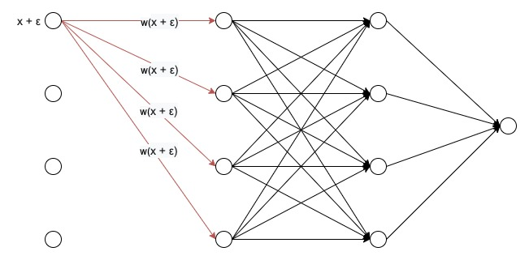
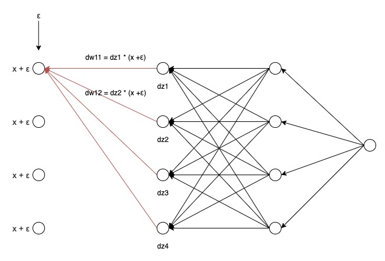
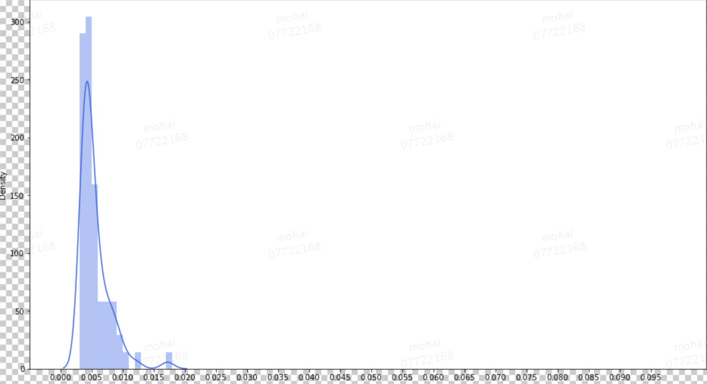
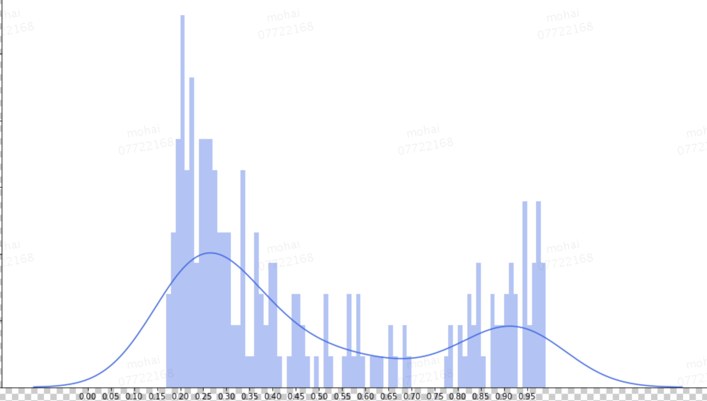
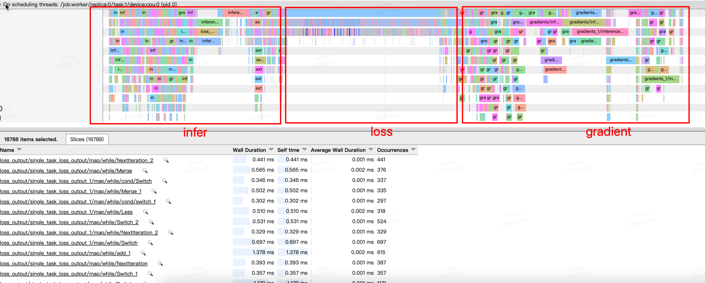
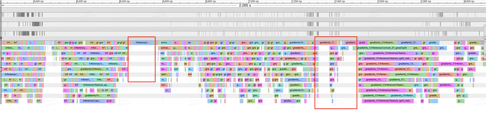

## 特征工程

#### 问题背景

随着模型的不断迭代, 为了提高业务效果以及用户体验, 会不断的往模型中添加入新的特征, 日益臃肿的 CTR 模型不仅给工程实现带来艰巨的挑战, 也开始制约算法创新的迭代效率. 单套模型所依赖的存储和计算资源开销不菲, 考虑到多人迭代的实验场景, 多套并行对系统压力更大. 另外, 真实的迭代环境是存量算力逐渐耗尽, 增量算力又显著放缓. 因此, 我们不得不重新审视算法迭代的资源利用率问题, 开始重视投入产出比对模型迭代效率的影响. 为了在有效资源的约束下, 模型仍然高效迭代支撑业务的快速发展, 不得不走上模型的瘦身之路. 

#### 方法原理

###### dropRank

在需要进行权重排序的特征之后加上一层Variational Dropout, 起特点是Dropout rate可学习, 训练得到Dropout rate来对重要性进行排序, Dropout rte越大, 表明被Dropout的概率越大, 越不重要

经过Variational Dropout后的输入为$\boldsymbol{x}_{i} \odot \boldsymbol{z}_{\boldsymbol{i}}$, 即将$\boldsymbol{x}_{i}$通过$ \boldsymbol{z}_{\boldsymbol{i}}$进行mask, 其中$z_i$为Concrete relaxation, 计算公式如下所示
$$
\tilde{z}=\operatorname{sigmoid}\left(\frac{1}{t}(\log \theta-\log (1-\theta)+\log u-\log (1-u))\right)
$$
其中$\theta$为dropout的概率, u为[0, 1]之间的均匀分布, 文章中t=0.1, 函数的特性为以$\theta$的概率输出接近1的值, 以$1- \theta$的概率输出0

得到mask之后的输入之后, 正常计算主网络的loss, 同时为了使得dropout rate尽可能的大, 需要在loss中加入正则, 修改后的损失如下所示.
$$
L(\theta)=-\frac{1}{M} \sum_{i=1}^{M} \log p_{\mathcal{M}}\left(\boldsymbol{y}_{\boldsymbol{i}} \mid f\left(\boldsymbol{x}_{i} \odot \boldsymbol{z}_{\boldsymbol{i}}\right)\right)+\frac{\lambda}{M} \sum_{i=1}^{M} \sum_{j=1}^{D} z_{i j}
$$
其中$\lambda$在实验中取0.001我们得到了较好的实验效果.

###### weightRank

简单的来说就是weight越大的特征相对来说越重要



如上图所示, 一个简单的4曾MLP为例, 当输入产生了一个比较小的增量$\epsilon$, 通过其权重特征, 将会影响到下一层的输入, 最终影响到输出. 若其权重特征较大, 将较大程度的影响到下一层的输入, 导致输出会产生比较大的波动, 若权重特征较小, 将不会对输出产生影响, 因此可以通过对特征的权重分析各个特征的重要性

###### gradientRank

通过上述分析可知, 通过权重大小可以初步判断特征的重要性, 权重根据梯度更新得来, 我们是否可以通过对梯度进行分析从而得到特征的重要性呢



如上图所示, 可以看到dw的结果依赖于上一层的梯度以及本层的输入, 但输入一致的情况下, 本层梯度的更新主要取决于上一层梯度的累计值, 因此可以通过上一层梯度的累计值来来判断权重更新的程度, 假设学习率为1
$$
w_{new} = w_{old} - dw, dw = dz (x + \epsilon)
$$
若$dz$越大, 对权重更新的影响相对来说也就越大, 通过对最后一层开始进行反向分析, 要想$dz$相对大的结果是输入尽可能的大


如上图所示, 上一层的neural是如何对下一层的输入造成影响, 假设每个neural的分布都保持一致, 下一层的某一个输入将会由连接该neural的权重共同决定, 因此对梯度的分析, 可以得到对连接到该neural所有权重以及输入的的分析, 该权重对应的梯度值越大, 这对应的输入越大或者返回的上一层返回的梯度累计越大. 若对该neural对应的所有梯度进行求和后比较, 则可以摒除回传梯度造成的影响, 得到输入对梯度造成的影响.

#### 实验结果

具体实验过程见链接所示

|      | weight                                                       | gradient                                                     |
| ---- | ------------------------------------------------------------ | ------------------------------------------------------------ |
|      |  |  |

根据上表可知, droprank得到的结果区分度比较高, 其他两种方法由于权重值相对较小, 导致区分度相对来说较低

删除43%的离散特征以及26%的连续特征得到的离线实验结果如下所示, 最终结果相对于baseline在万分位有所下降

| name                             | result                                                       |
| -------------------------------- | ------------------------------------------------------------ |
| 对照组                           | 41 epoch, cal_type:cal_business_type_auc, business_type: 0, pay_auc: 0.8790868710445968, click_auc: 0.760810057276804, ctr_auc: 0.7925818732673704, cvr_auc: 0.7430139368312707 <br />41 epoch, cal_type:cal_business_type_auc, business_type: 1, pay_auc: 0.8796536658019445, click_auc: 0.7592378563805084, ctr_auc: 0.7900874797354801, cvr_auc: 0.7408037526988192 <br />41 epoch, cal_type:cal_business_type_gauc, business_type: 0, pay_auc: 0.7263694939270943, click_auc: 0.7176531591986819, ctr_auc: 0.7276966788704231, cvr_auc: 0.8730193628789511 <br />41 epoch, cal_type:cal_business_type_gauc, business_type: 1, pay_auc: 0.7877135067063961, click_auc: 0.7555426858275217, ctr_auc: 0.7655857002892575, cvr_auc: 0.886429458217695 <br />**41 epoch, cal_type:cal_gauc, business_type: all, pay_auc: 0.7701005139384531, click_auc: 0.74401503746489, ctr_auc: 0.7540582056335688, cvr_auc: 0.8825791735441363** <br />41 epoch, cal_type:cal_rule_gauc, business_type: all, pay_auc: 0.7611549130089162, click_auc: 0.7361697944538741, ctr_auc: --, cvr_auc: -- <br />41 epoch, cal_type:cal_sample_auc, business_type: all, pay_auc: 0.8795224591312322, click_auc: 0.7613145388088296, ctr_auc: 0.7916098384366579, cvr_auc: 0.7391250654853798 <br />41 epoch, cal_type:cal_sample_rule_auc, business_type: all, pay_auc: 0.855498454214669, click_auc: 0.7323840382614912, ctr_auc: --, cvr_auc: -- |
| d30_c57(d_p <=0.25, c_p <= 0.24) | 45 epoch, cal_type:cal_business_type_auc, business_type: 0, pay_auc: 0.8828338654117491, click_auc: 0.765318184426522, ctr_auc: 0.7959209198485259, cvr_auc: 0.7448335118284536<br />45 epoch, cal_type:cal_business_type_auc, business_type: 1, pay_auc: 0.8805385195792179, click_auc: 0.7620648438225833, ctr_auc: 0.7900420357471167, cvr_auc: 0.7377747936718819 <br />45 epoch, cal_type:cal_business_type_gauc, business_type: 0, pay_auc: 0.7255325580459278, click_auc: 0.7148930845199281, ctr_auc: 0.7259459047059861, cvr_auc: 0.8722974040280342 <br />45 epoch, cal_type:cal_business_type_gauc, business_type: 1, pay_auc: 0.7866213793116197, click_auc: 0.7534339358673633, ctr_auc: 0.7642552676380504, cvr_auc: 0.8867261528390303 <br />**45 epoch, cal_type:cal_gauc, business_type: all, pay_auc: 0.7690816567143101, click_auc: 0.7417081260866857, ctr_auc: 0.7525998867407567, cvr_auc: 0.8825833940440877** <br />45 epoch, cal_type:cal_rule_gauc, business_type: all, pay_auc: 0.7608986581950653, click_auc: 0.7351241966667544, ctr_auc: --, cvr_auc: -- <br />45 epoch, cal_type:cal_sample_auc, business_type: all, pay_auc: 0.8778063996894081, click_auc: 0.7621337873943501, ctr_auc: 0.7914345352715608, cvr_auc: 0.7367238502199822 <br />45 epoch, cal_type:cal_sample_rule_auc, business_type: all, pay_auc: 0.8555052670059595, click_auc: 0.734113200607514, ctr_auc: --, cvr_auc: -- |

#### 使用方法

1. 将需要比较的特征组成list传入`dropoutRank`函数
2. 从训练模型或者使用迁移学习的模式训练模型
3. 启动一个rank任务获取结果

##### 举例说明

**修改网络结构**

```python
from model_zoos.tools.rank_dropout import dropoutRank
from model_zoos.tools.rank_dropout import sgvloss

c_sample = tf.split(c_sample, c_feature_num, axis=1)  #将需要排序的特征按照tensor加入tensor
for temp_tensor in c_sample:
  feature_list.append(temp_tensor)
  
noised_feature_list, keep_list = dropoutRank(feature_list) #noised_feature_list 为新的feature_list, keep_list需要加入到loss中正则

sample = generate_matrix_concat(noised_feature_list, False)

#
#网络结构
#

total_loss = sgvloss(total_loss, keep_list)

```

**使用已经训练好的checkpoint训练**

修改配置

```python
TRANSFER=1 #是否需要固定其他参数
TRAINABLE_SCOPE=esmm_dnn_base_imp/dropout_layer/ #只训练droprank相关参数
WARMSTART=viewfs://hadoop-meituan/user/hadoop-shangou-search/mohai/search_rank_models/search_spu_rank_esmm_use_starship_pipeline/model/41 #warm start地址
```

**获取排序结果**

公共配置

```python
RANK_FEATURE_JSON=model_zoos/conf/shangou_search_conf/shangou_search.json #设置特征
RANK_DIR=${HDFS_PATH}/rank #排序结果存储的位置
```

dropRank配置修改

```python
DROP_RANK_SCOPE="esmm_dnn_base_imp/dropout_layer/" #设置droprank所在的scope
DROPOUT_RANK=1 #获取droprank的结果
```

weightRank以及gradientRank配置修改

```python
WEIGHT_RANK_NAME=esmm_dnn_base_imp/esmmctr_normalized_embedding_concat_layers/fully_connected/weights #获取网络第一层权重
WEIGHT_RANK=1 #开启weightRank
GRADIENT_RANK=1 #开启gradientRank
```

脚本说明

* 所有需要修改的参数都在param.sh中
* rank.sh为排序脚本
* transfer_drop.sh为迁移学习droprank参数使用脚本, 若无迁移学习需求, 直接启动训练脚本即可

#### 后续安排

1. droprank中loss的正则的超参为固定参数, 需要进一步的调优
2. 尝试阿里使用的模型瘦身方法
3. 使用上需要注意的点还比较多, 优化使用体验

#### 总结

使用特征重要性对模型进行瘦身之后, 在保持指标不变的情况下, 删除了43%的离散特征以及26%的连续特征, 取得了比较大的性能提升

## 推荐模型cpu加速

#### 问题背景

在多人迭代的场景, 由于不同个体代码风格迥异, 导致代码merge后可能导致模型计算速度的降低. 为了使得模型更好利用现有的计算资源, 发掘模型的并行性, 优化线上服务以及离线训练模型的速度, 有必要对现有模型进行瓶颈分析. 

#### 方法原理

通过tensorflow生成的profile文件, 对模型并行度, 关键路径op以及一些不合理函数进行优化, 发掘模型的并行性, 提升模型的速度

#### 实验结果

在未优化的推荐模型中, 模型op的具体运行时间如下所示



* 问题: 可以看到, loss计算约占一次train的1/3左右, 而且计算过程中op拆分特别散, 十分不合理. 在inference阶段也会有一些穿行执行的比较大的op
* 分析: loss计算中使用的map_fn操作, 该操作导致了很多细小的op, 导致loss计算时间过长; inference阶段第一层fc会将所有的特征concat起来, 然后输入到全链接, concat以及计算会导致穿行时间过长, 通过将这两个过程拆分合并, 消除穿行的时间

经过优化后的profile的结果如下图所示



经过优化之后, loss计算耗时得到解决, 同时concat以及以及fc计算时间得到优化, 但是新引入的sum_reduce会成模型计算的关键路径

[具体结论问文档所示](https://km.sankuai.com/page/1004210188)

#### 总结分析

通过profile的优化, 得到了20%的性能加速

## tf1.5迁移

#### 问题背景

配合平台组将tensorflow包从1.0.8升级到1.15. 平台组得到的报告称将训练包升级之后将会使得QPS得到20%的性能提升以及迭代的优化. 以及使得自己更好的介入熟悉公司的平台

#### 实验结论

[具体的实验结果如链接所示](https://km.sankuai.com/page/940476724), 在实际外卖模型中将会得到15%左右QPS的提升

## starship bug修改

#### 添加debug模块

由于在使用tf1.x的时静态图对于初学者debug并不友好, 特别是当任务无法在本地单测运行时, 线上的debug模块就显得尤为重要, 在starship中添加了debug模块十分必要

**使用方法**

将需要显示的tensor组成list加入返回列表中的`global_var.GlobalVar.debug_val`中, 使用方法如下所示

```python
if params.debug and len(debug_tensor) != 0:
  loss_paras_dict[global_var.GlobalVar.debug_val] = debug_tensor
```

同时将`DEBUG_FLAG`设置为1

#### 修改数据降级配置

原版starship在设置数据降级时出现错误, 在版本迁移到tf1.15时会出现问题. 主要是chief的hook中会将tensorboard需要的信息些在checkpoint中, 同时训练依赖tensorboard, 不正确的数据降级会删除tensorboard的需要的文件, 导致训练出错, 同时要是没有数据降级, 会导致训练最后一个epoch数据不满出现报错.

参考数据[降级文档](https://km.sankuai.com/page/349977205), 修改原有的降级设置.

#### 修复tensorboard不开启训练bug

若在训练中将with.tensor.board关闭, 将会导致训练任务无法启动, 主要是`MonitoredTrainingSession`穿件chief hook的时候出现问题, 在`comd_paraser`中加入`tensor-board`控制tensorboard是否开启, 同时在`scheduler`中加set_chief_hook中加入判断, 当tensorboard开启时再将board的op加入hook, 具体修改如下所示

```python
if self.args_.tensor_board:
  merged_summery = tf.summary.merge_all()
  tmp_step = self.args_.every_n_steps / 10
  summay_step = self.args_.every_n_steps if tmp_step < 1 else tmp_step
  summery_hook = tf.train.SummarySaverHook(save_steps = summay_step, output_dir = self.args_.log_dir,
                                           summary_op = merged_summery)
  self.chief_hooks_.append(summery_hook)
```

注意: 只有之前版本只有在train是强制需要开启tensorboard

#### transfer功能开发

```python
warmstart-ckpt-path # checkpoint加载地址
transfer # 设置为1迁移学习, 固定参数其他参数, 只训练trainable设置的参数, 否则训练全局参数
trainable-scope #只更新指定scope下的op
```

#### 使用中遇到的问题

**外卖模型中**

1. 需要修改的地方在不同的文件, 脚本比较混乱
2. 采样模型的需要注意的地方比较多
   * batch size的大小
   * 数据是否为采样数据, 若为采样数据不需要设置USE_NEG_SAMPLE, 若不为采样数据需要设置为1
   * 需要设置use_pred_inverse来进行ctr矫正
3. baseDnn中传入inference函数传入参数太多, 感觉可以写成配置的形式方便代码的维护


**闪购模型中**

1. 在使用一键evaluation过程中, predict任务开启的顺序晚于evaluation, 且predict结果没出来的情况下, evaluation的结果就能出来, 但是结果存在问题

2. 单测中不需要数据分发, 但是闪购模型只能够不处理单测的情况, 到时数据量不够会出现报错

   ```
   IteratorGetNext[output_shapes=[[1,?,218], [1,?,68], [1,?,9], [1,?,30],
   ```

   /Users/haihai/workspace/waimai_recsys_starship/model_zoos/readers/shangou_search_simple_reader.py的163行

3. 需要注意, 不能修改模型之后同时提交多个任务, 否则的话模型会读取错误, 导致最终评测以及各种结果出现问题

