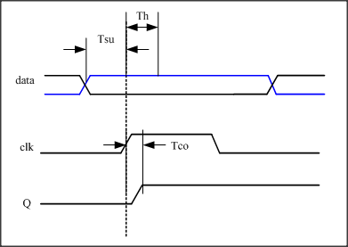

# 软件面经

## 商汤面经

### 一面

**项目**

1. icache设计中哪些是与高性能计算相关的(替换算法, 一致性协议, 一致性模型, 流水线等)
2. tlb miss从下到上的执行流程
3. 在momenta做的工作是哪些, 有哪些比较有挑战性的事情(各个模块线程之间的通信, )
4. 在美团做了哪些工作, op的内的优化做了哪些工作, op之间的工作做了哪些工作, tensorflow中图的组成, 以及图是如何计算的, 了解现有的一些优化方案吗

**问题**

1. opencv中的一resize是如何实现的

**总结**

感觉会问挺多opencv中的东西, 以及tensorflow中的优化方案, 可以重点复习一下

### 二面

**项目**

1. 讲一下最近的一年中做了那些工作:(中科芯片项目情况以及我做的工作; 美团项目情况以及我做的工作)
2. cache中进行新能分析的指标是什么
3. 美团的模型结构是什么样子的
4. 美团中如何做的模型加速的, inference会加速吗
5. 推荐系统中的模型一般是怎么样子的, 特征会有那些

**问题**

1. 给你一个bin文件, cpu如何执行这个文件
2. 当一访问一个数据不在内存中时, cpu将会如何

**代码**

后序便利非递归c++实现

**反问**

1. 就我所知百度那边的异构计算家属是有飞桨这样的一个平台的支撑, 想贵公司对于现在异构计算这样的事情如何商业化, 以及易用性方面如何进行考量
2. 现有的异构计算硬件除了GPU外, 其他的ASIC芯片你们是如何做到加速的呢

### 三面


## 字节推荐系统面经(挂)

**项目**

1. 在美团做的工作
2. 为什么要进行这样的一个op拆分的工作, 最终有什么样的收益
3. 你们的业务目标是什么, price是一个怎么样的指标, 需要预测吗
4. drop rank的方法是如何实现的, 你可以手动推理一下吗
5. esmm模型是为了解决一个什么眼的问题, ple模型相对于它来说有一个什么样的该改进

**问题**

1. logist回归你了解吗, 是为了解决什么样的问题
2. 一般常用的过拟合解决反问方案是什么
3. 在研究生学习过程中, 你用过什么样的模型
4. 推荐中为什么会出现数据偏斜的问题, 如何解决
5. 分类问题中一般使用什么损失函数, 可以写一下吗

**代码**

链表是否有环以及环的长度

**反问**

1. 内容推荐跟商品推荐的方法上有什么样的区别吗
2. 你们团队架构是怎么样, 跟工程的配合应该如何

# 硬件面经

## zeku

### 一面

问了下项目中的问题, 性格问题

### 二面

1. 项目中的问题
2. 你是做设计的流程是什么(文档需要准备好)
3. 你是如何优化你的cache的(替换算法以及压缩)
4. 你评价的cache的性能指标是什么(hit rate), 这样的一个指标会有什么样的一个问题(多核系统)

**反问**

1. 你们的主要工作是什么
2. 人员构成是一个怎么样子
3. 我看到职位简介中会有cpu芯片的要求, 想请问下你们会有cpu芯片的规划吗


## 百度CPU面经(挂)

### 一面

**项目**

1. boom中替换算法是什么, 你是如何进行改进的
2. boom中的一致性协议是什么, 会有什么样的问题, 优缺点.
3. 要是有一个处理器一需要写一个flag然后其他的处理器在轮训查询的话, 其他处理器是否会等待, 如何进行的(发送grant之后, 是否需要probe)
4. icache中使用两个bank的目的是什么(地址不对齐)
5. 重命名的作用是什么, 要是没有冲命名, lsu会有什么样的问题
6. 要是lsu推测执行错误的话, Dcache这边会有怎么样子的处理
7. lr/sc的过程是什么样子的
8. tlb miss的话, 会执行一个什么样的流程
9. boom的测试集太小, 不会发生miss的过程(需要进一步的验证), 你是如何验证自己的性能提升的

**问题**

1. 说一下建立时间, 保持时间, 时钟偏移, 以及clock tip的概念



* 建立时间(Tsu):

  是指在触发器的时钟信号上升沿到来以前，数据稳定不变的时间，如果建立时间不够，数据将不能在这个时钟上升沿被稳定的打入触发器，Tsu就是指这个最小的稳定时间.

* 保持时间(Th)

  是指在触发器的时钟信号上升沿到来以后，数据稳定不变的时间，如果保持时间不够，数据同样不能被稳定的打入触发器，Th就是指这个最小的保持时间。

* 输出相应时间(To)

  触发器输出的响应时间，也就是触发器的输出在clk时钟上升沿到来之后多长的时间内发生变化，也即触发器的输出延时

* 时钟抖动(jitter) 时钟在频率上的不确定

  两个时钟周期之间存在的差值，这个误差是在时钟发生器内部产生的，和晶振或者PLL内部电路有关，布线对其没有影响

  

* 时钟偏移(skew) 时钟在相位上的不确定

  同一个时钟信号到达两个不同寄存器之间的时间差值，时钟偏斜永远存在，到一定程度就会严重影响电路的时序

1. 异步fifo的实现方式(当时说了count计数器, 说错了, 就是格雷码)

2. 时钟偏移会对建立时间保持时间造成什么样的影响

   

3. 同步复位与异步复位的区别, 异步复位的话有什么样的好处

   **同步复位:**

   复位信号只有在时钟上升沿到来时，才能有效

   ```verilog
    always @(posedge clk_i) begin
   		if(!rst_n) 
   			dout <= 0;
   		else 
   			dout <= din;
   	end
   ```

   优点: 

   * 确保电路是100%同步的; 只发生在有效时钟沿
   * 可以作为过滤掉毛刺的手段

   缺点:

   * 复位信号的有效时长必须大于时钟周期，才能真正被系统识别并完成复位。同时还要考虑如：时钟偏移、组合逻辑路径延时、复位延时等因素
   * 由于大多数的厂商目标库内的触发器都只有异步复位端口，采用同步复位的话，就会耗费较多的逻辑资源

   **异步复位:**

   无论时钟沿是否到来，只要复位信号有效，就对系统进行复位

   ```verilog
   always @(posedge clk_i or negedge rst_n) begin
   		if(!rst_n) 
   			dout <= 0;
   		else 
   			dout <= din;
   	end
   ```

   优点:

   * 异步复位信号识别方便，而且可以很方便的使用全局复位
   * 由于大多数的厂商目标库内的触发器都有异步复位端口，可以节约逻辑资源。

   缺点:

   * 复位信号容易受到毛刺的影响。
   * 复位结束时刻恰在亚稳态窗口内时，无法决定现在的复位状态是1还是0，会导致亚稳态

   

基础知识需要进一步的加强

**反问**

1. 主要做的是什么样的处理器

2. 与pandelpandel的交互是怎么样的, 与其他框架的交互是如何的
3. training与predict如何在数据中心进行
4. 是否有车载芯片的规划, 以及规划是什么样子的

