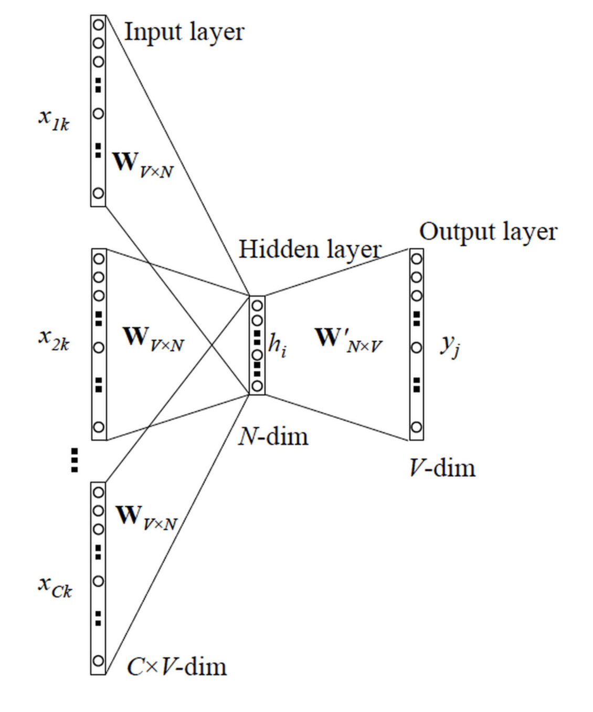
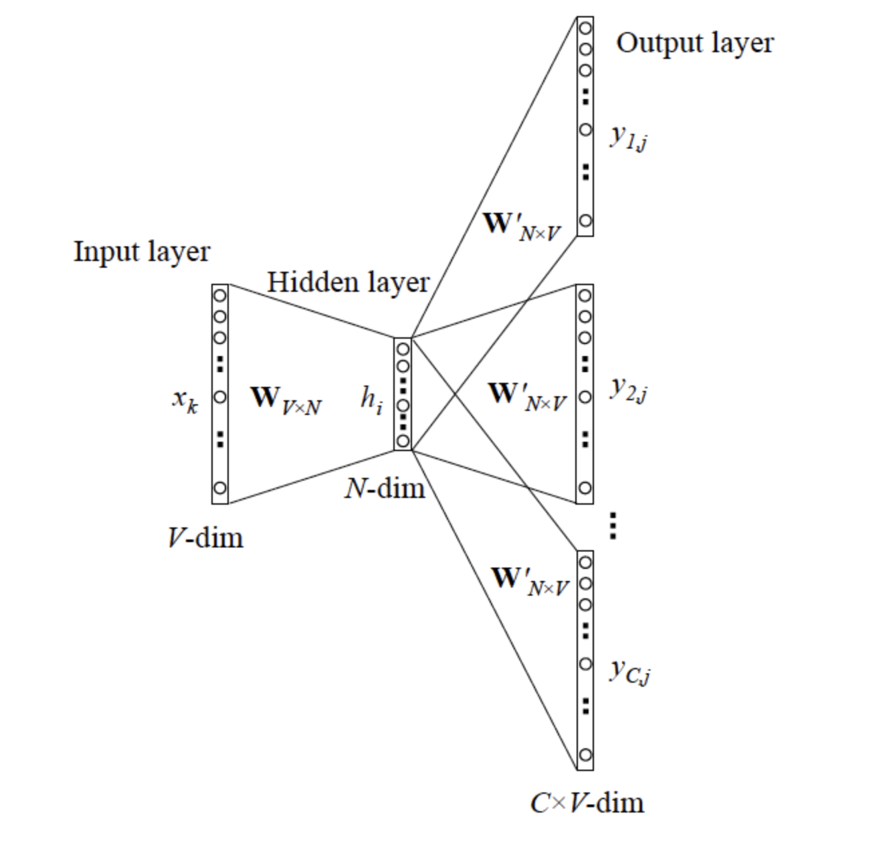
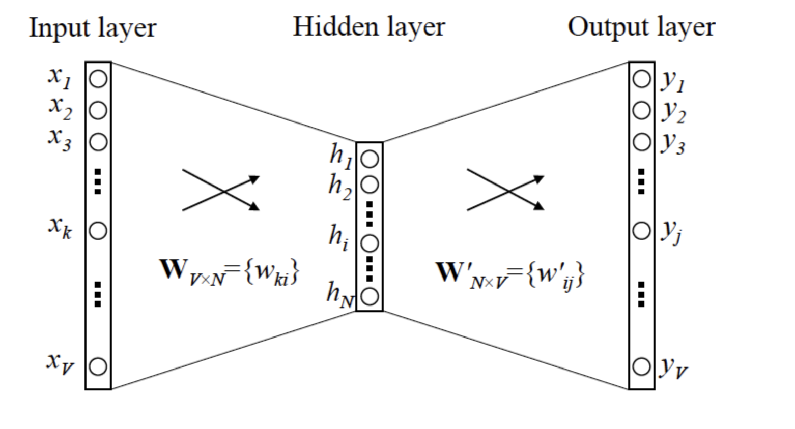

1. **逻辑回归的损失函数形式(简单)**

   当label为0, 1$P(y \mid x)=P(y=1 \mid x)^{y} P(y=0 \mid x)^{(1-y)}$

   对数似然函数为$=-\frac{1}{n} \sum_{i=1}^{n} y_{i} \log P\left(y_{i}=1 \mid x_{i}\right)+\left(1-y_{i}\right) \log P\left(y_{i}=0 \mid x_{i}\right)$

   

   label为-1, 1, $P(y \mid x)=\sigma(y z), 其中\sigma为sigmoid函数$

   对数似然函数为$=\frac{1}{n} \sum_{i=1}^{n} \log \left(1+e^{-y_{i} z_{i}}\right)$

2. **深度学习为什么需要有激活层(简单)**

   * 线性变换太简单（只是加权偏移），限制了对复杂任务的处理能力。**没有激活函数的神经网络就是一个线性回归模型**。激活函数做的非线性变换可以使得神经网络处理非常复杂的任务。同时，激活函数也使得反向传播算法变的可能。因为，这时候梯度和误差会被同时用来更新权重和偏移。没有可微分的线性函数，这就不可能了。
   * 首先对于y=ax+b 这样的函数，当x的输入很大时，y的输出也是无限大/小的，经过多层网络叠加后，值更加膨胀的没边了，这显然不符合我们的预期，很多情况下我们希望的输出是一个概率

3. **Batch Normalization 的原理&作用(中等)**

   传统的神经网络，只是在将样本x输入输入层之前对x进行标准化处理，以降低样本间的差异性。BN是在此基础上，不仅仅只对输入层的输入数据x进行标准化，还对每个隐藏层的输入进行标准化。无论使用哪种激活功能或优化器，BN都可加快训练过程并提高性能；解决梯度消失的问题；规范权重；优化网络梯度流...等等。

   * 为什么需要归一化

     > 神经网络学习过程本质上就是为了学习数据分布，如果训练数据与测试数据的分布不同，网络的泛化能力就会严重降低。

     输入层的数据，已经归一化，后面网络每一层的输入数据的分布一直在发生变化，前面层训练参数的更新将导致后面层输入数据分布的变化，必然会引起后面每一层输入数据分布的改变。而且，网络前面几层微小的改变，后面几层就会逐步把这种改变累积放大。训练过程中网络中间层数据分布的改变称之为："Internal Covariate Shift"(数据偏斜)。BN的提出，就是要解决在训练过程中，中间层数据分布发生改变的情况。

   * 减均值除方差: 远离饱和区域

     中间层神经元激活输入x从变化不拘一格的正态分布通过BN操作拉回到了均值为0，方差为1的高斯分布。这有两个好处：1、避免分布数据偏移；2、远离导数饱和区。
     $$
     \widehat{x}^{(k)}=\frac{x^{(k)}-\mathrm{E}\left[x^{(k)}\right]}{\sqrt{\operatorname{Var}\left[x^{(k)}\right]}}
     $$
     但这个处理对于在-1~1 之间的梯度变化不大的激活函数，效果不仅不好，反而更差。比如sigmoid函数，s函数在-1~1之间几乎是线性，BN变换后就没有达到非线性变换的目的；而对于relu，效果会更差，因为会有一半的置零。总之换言之，减均值除方差操作后可能会削弱网络的性能。

   * 放缩加位移: 避免线性区

     因此，必须进行一些转换才能将分布从0移开。使用缩放因子γ和移位因子β来执行此操作。下面就是加了缩放加移位后的BN完整算法。

     

   * 激活函数

     在所有情况下，BN都能显著提高训练速度, 如果没有BN，使用Sigmoid激活函数会有严重的梯度消失问题

   * 优化器

     Adam是一个比较犀利的优化器，但是如果普通的优化器 ,比如随机梯度下降法，加上BN后，其效果堪比Adam。

     ReLU +Adam≈ReLU+ SGD + BN

     所以说，使用BN，优化器的选择不会产生显着差异

   * 数据不平衡

     但是，如果对于具有分布极不平衡的二分类测试任务（例如，99：1），BN破坏性能并不奇怪。也就是说，这种情况下不要使用BN。

   * 批量大小

     对于小批量（即4），BN会降低性能，所以要避免太小的批量，才能保证批归一化的效果。

   * BN解决了梯度消失问题

     如下图所求，BN很好地解决了梯度消失问题，这是由前边说的减均值除方差保证的，把每一层的输出均值和方差规范化，将输出从饱和区拉倒了非饱和区（导数），很好的解决了梯度消失问题。

   * BN使模型正则化

     不用太依赖**drop out、L2正则化**解决归 一化，采用BN算法后可以选择更小的L2正则约束参数，因为BN本身具有提高网络泛化能力的特性。

4. **逻辑回归的梯度下降的原理&推导(中等)**

   

5. **word2vec的原理(中等)**

   CBOW(Continuous Bag-of-Words Model)和Skip-gram (Continuous Skip-gram Model)，是Word2vec 的两种训练模式。

   CBOW 通过上下文来预测当前值。相当于一句话中扣掉一个词，让你猜这个词是什么。

   

   

   Skip-gram: 用当前词来预测上下文。相当于给你一个词，让你猜前面和后面可能出现什么词。

   

   

   当模型训练完后，最后得到的其实是**神经网络的权重**，比如现在输入一个 x 的 one-hot encoder: [1,0,0,…,0]，对应刚说的那个词语『吴彦祖』，则在输入层到隐含层的权重里，只有对应 1 这个位置的权重被激活，这些权重的个数，跟隐含层节点数是一致的，从而这些权重组成一个向量 vx 来表示x，而因为每个词语的 one-hot encoder 里面 1 的位置是不同的，所以，这个向量 vx 就可以用来唯一表示 x。

   此外，我们刚说了，输出 y 也是用 V 个节点表示的，对应V个词语，所以其实，我们把输出节点置成 [1,0,0,…,0]，它也能表示『吴彦祖』这个单词，但是激活的是隐含层到输出层的权重，这些权重的个数，跟隐含层一样，也可以组成一个向量 vy，跟上面提到的 vx 维度一样，并且可以看做是**词语『吴彦祖』的另一种词向量**。而这两种词向量 vx 和 vy，正是 Mikolov 在论文里所提到的，『输入向量』和『输出向量』，一般我们用『输入向量』

   

   训练加速的方法: 负采样(选择一部分负样本对权重进行更新), hierarchical softmax(N分类问题变为log(N)次二分类)

6. **正则化的方法有哪些(中等)**

   意思是在模型中加入规则, 加入先验知识, 减小范化误差的技术

   * 参数惩罚:

     通过对目标函数加入惩罚参数, 限制模型的学习能力

     L2正则化: L2正则化也被称为权重衰减或岭回归, 通过向目标函数添加一个L2范数, 使权重更接近0点, l2正则有均匀化w的作用

     L1正则化: l1正则化更容易获得稀疏解，还可以挑选重要特征

   * 噪声注入

     模型容易过拟合的原因之一就是没有太好的抗噪能力，如果输入数据稍微改变一点点，就可能得到完全不一样的结果数据集增强在某种意义上也能看做是在输入层加入噪声，通过随机旋转、翻转，色彩变换，裁剪等操作人工扩充训练集大小。这样可以使得网络对于输入更加鲁棒。

   * 多任务学习

     多任务学习通过合并几个任务中的样例（可以视为对参数是假的软约束）来提高泛化的一种方式。正如为的训练样本能够将模型参数推向具有更好泛化能力的值一样，当模型的一部分被多个额外的任务共享时，这部分将被约束为良好的值（如果共享合理），通常会带来更好的泛化能力。

   * 提前终止

     　可以认为提前终止可以将优化过程的参数空间限制在初始参数的小邻域内, 提前终止的轨迹结束于L2正则化目标的绩效点在一定的条件下提前终止和L2正则化等价. 相比L2正则化, 提前终止还可以监控验证集误差以便在空间特别好的点处停止训练, 因此提前终止比权重衰减更有优势, 提前终止能自动确定正则化的正确量, 而权重衰减需要进行多个不同超参数值的训练实验

   * Dropout

     隐藏单元经过Dropout训练后, 它必须学习与不同采样神经元的合作, 使得神经元具有更强的健壮性, 并驱使神经元通过自身获取到有用的特征, 而不是依赖其他神经元去纠正自身的错误. 这可以看错对输入内容的信息高度智能化, 自适应破坏的一种形式. 而不是对输入原始值的破坏.

   * Batch Normalization

     一种非常有用的正则化方法,可以让大型的卷积网络训练速度加快很多倍,同时收敛后分类的准确率也可以大幅度的提高。BN在训练某层时,会对每一个mini-batch数据进行标准化(normalization)处理,使输出规范到N(0,1)的正态分布,减少了Internal convariate shift(内部神经元分布的改变), 传统的深度神经网络在训练是, 每一层的输入的分布都在改变, 因此训练困难, 只能选择用一个很小的学习速率, 但是每一层用了BN后, 可以有效的解决这个问题, 学习速率可以增大很多倍

   * 组合模型

     Baggging &Boosting，将弱分类器融合之后形成一个强分类器，而且融合之后的效果会比最好的弱分类器更好；

7. **softmax的损失函数为什么不用mse而用交叉熵(稍难)**

   损失函数用mse导数在绝对误差过大时可能变得特别平缓；

8. **gbdt，xgb， lgb的区别(中等)**

9. **xgb 和 rf的区别，哪个方差高、哪个偏差大(中等)**

10. **lstm三个门的含义并画出结构图(中等)**

11. **lstm相对于普通rnn为什么能够缓解梯度消失问题(中等)**

