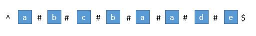
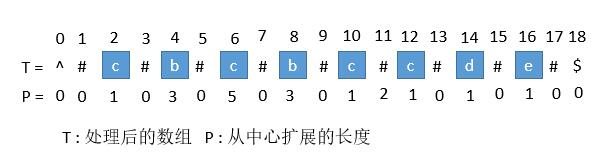
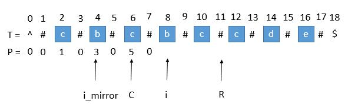
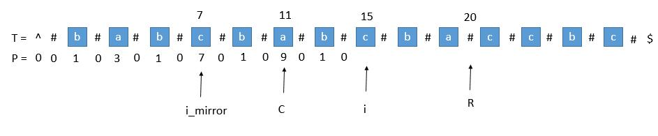
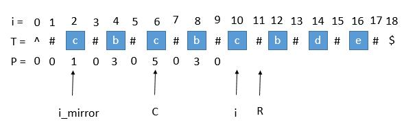

### 马拉车算法

为了统一字符串技术偶数长度, 在每个字符间插入"#"，并且为了使得扩展的过程中，到边界后自动结束，在两端分别插入 "^" 和 "$"，两个不可能在字符串中出现的字符，这样中心扩展的时候，判断两端字符是否相等的时候，如果到了边界就一定会不相等，从而出了循环。经过处理，字符串的长度永远都是奇数了。



首先我们用一个数组 P 保存从中心扩展的最大个数，而它刚好也是去掉 "#" 的原字符串的总长度。例如下图中下标是 6 的地方。可以看到 P[ 6 ] 等于 5，所以它是从左边扩展 5 个字符，相应的右边也是扩展 5 个字符，也就是 "#c#b#c#b#c#"。而去掉 # 恢复到原来的字符串，变成 "cbcbc"，它的长度刚好也就是 5。



#### 求字符串的原下标

用 P 的下标 i 减去 P [ i ]，再除以 2 ，就是原字符串的开头下标了。例如我们找到 P[ i ] 的最大值为 5 ，也就是回文串的最大长度是 5 ，对应的下标是 6 ，所以原字符串的开头下标是 （6 - 5 ）/ 2 = 0 。所以我们只需要返回原字符串的第 0 到 第 （5 - 1）位就可以了。

为什么: p[i]表示的是回文的半斤长度, i - p[i]表示的是新字符中的位置, 由于加入了“#”需要除以2求得原来的下标, 要是有小数向上取整数

#### 求每个 P [ i ]

我们用 C 表示回文串的中心，用 R 表示回文串的右边半径坐标，所以 R = C + P[ C ] 。C 和 R 所对应的回文串是当前循环中 R 最靠右的回文串。

用 i_mirror 表示当前需要求的第 i 个字符关于 C 对应的下标。



我们现在要求 P [ i ]， 如果是用中心扩展法，那就向两边扩展比对就行了。但是我们其实可以利用回文串 C 的对称性。i 关于 C 的对称点是 i_mirror ，P [ i_mirror ] = 3，所以 P [ i ] 也等于 3 。

##### 超出了 R



当我们要求 P [ i ] 的时候，P [ mirror ] = 7，而此时 P [ i ] 并不等于 7 ，为什么呢，因为我们从 i 开始往后数 7 个，等于 22 ，已经超过了最右的 R ，此时不能利用对称性了，但我们一定可以扩展到 R 的，所以 P [ i ] 至少等于 R - i = 20 - 15 = 5，会不会更大呢，我们只需要比较 T [ R+1 ] 和 T [ R+1 ]关于 i 的对称点就行了，就像中心扩展法一样一个个扩展。

##### 2. P [ i_mirror ] 遇到了原字符串的左边界



此时P [ i_mirror ] = 1，但是 P [ i ] 赋值成 1 是不正确的，出现这种情况的原因是 P [ i_mirror ] 在扩展的时候首先是 "#" == "#" ，之后遇到了 "^"和另一个字符比较，也就是到了边界，才终止循环的。而 P [ i ] 并没有遇到边界，所以我们可以继续通过中心扩展法一步一步向两边扩展就行了。

##### 3. i 等于了 R

此时我们先把 P [ i ] 赋值为 0 ，然后通过中心扩展法一步一步扩展就行了。

#### 考虑 C 和 R 的更新

就这样一步一步的求出每个 P [ i ]，当求出的 P [ i ] 的右边界大于当前的 R 时，我们就需要更新 C 和 R 为当前的回文串了。因为我们必须保证 i 在 R 里面，所以一旦有更右边的 R 就要更新 R。


此时的 P [ i ] 求出来将会是 3 ，P [ i ] 对应的右边界将是 10 + 3 = 13，所以大于当前的 R ，我们需要把 C 更新成 i 的值，也就是 10 ，R 更新成 13。继续下边的循环。

```java
public String preProcess(String s) {
    int n = s.length();
    if (n == 0) {
        return "^$";
    }
    String ret = "^";
    for (int i = 0; i < n; i++)
        ret += "#" + s.charAt(i);
    ret += "#$";
    return ret;
}

// 马拉车算法
public String longestPalindrome2(String s) {
    String T = preProcess(s);
    int n = T.length();
    int[] P = new int[n];
    int C = 0, R = 0;
    for (int i = 1; i < n - 1; i++) {
        int i_mirror = 2 * C - i;
        if (R > i) {
            P[i] = Math.min(R - i, P[i_mirror]);// 防止超出 R
        } else {
            P[i] = 0;// 等于 R 的情况
        }

        // 碰到之前讲的三种情况时候，需要利用中心扩展法
        while (T.charAt(i + 1 + P[i]) == T.charAt(i - 1 - P[i])) {
            P[i]++;
        }

        // 判断是否需要更新 R
        if (i + P[i] > R) {
            C = i;
            R = i + P[i];
        }

    }

    // 找出 P 的最大值
    int maxLen = 0;
    int centerIndex = 0;
    for (int i = 1; i < n - 1; i++) {
        if (P[i] > maxLen) {
            maxLen = P[i];
            centerIndex = i;
        }
    }
    int start = (centerIndex - maxLen) / 2; //最开始讲的求原字符串下标
    return s.substring(start, start + maxLen);
}
```

两个问题: 薪酬福利, 工作氛围

AI芯片的应用是自己找的, 还是客户指定的, 要是自己探索的出来的应用, 如何让客户更加易用