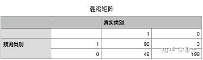
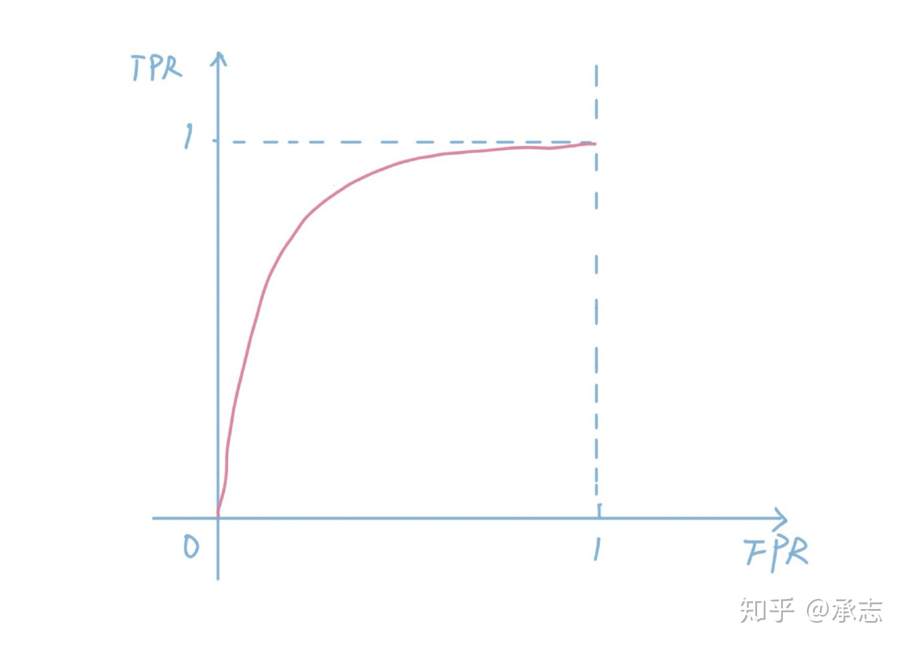
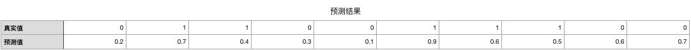
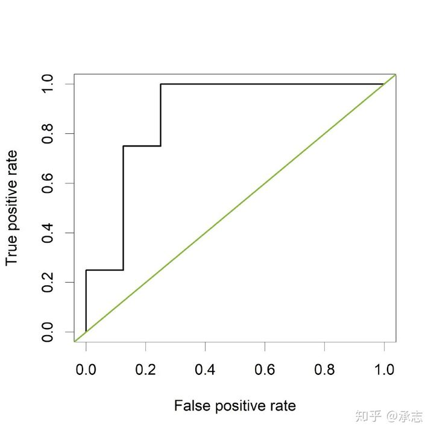
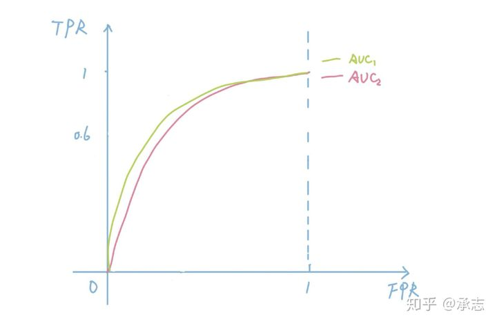
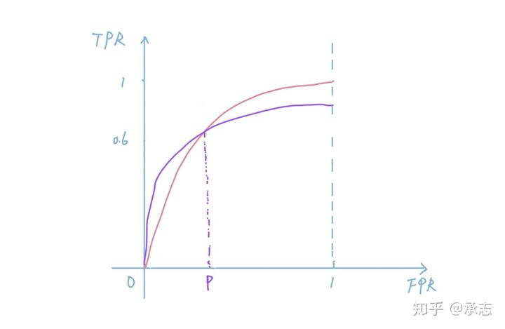

### **TP, TN, FP和FN**

**T表示true**，也就是真，那么**F自然表示false**，也就是假。**P表示positive**，可以理解成阳性，**N就是negative**，就是阴性。所以这四个就是真假和阴阳的排列组合，有T的都表示真，可以理解成**预测正确**。比如TP就是真阳，也就是说检测是阳性，实际上也是阳性。同理，TN就是真阴，检测是阴性，实际上也是阴性。有F则表示**预测错误**，FP是假阳，也就是检测是阳性，但是实际上是阴性，表示检测错了。同理，FN是假阴，检测是阴性，但是实际上是阳性。

### **召回率**, **精确率和准确率**

#### 召回率(recall)

召回率的英文是**recall**，假设一个场景，比如说甲是一个排长，手下有10个小兵，有一个任务需要甲召集所有成员去执行。甲一声令下，召来了8个。那么召回率就是80%。我们放入机器学习的场景当中去也是一样的，在二分类场景当中，一般情况下**模型考虑的主要都是正例**。所以召回率就是我们预测准确的正例占所有正例的比例。
$$
\text { recall }=\frac{T P}{T P+F N}
$$
TP就是我们预测准确的正例，也就是被我们召回的部分，那么所有的正例有多少呢？答案是**召回的正例加上没有召回的正例**，没有召回的正例说明预测错了，预测成负例了。但是它们并不是负例，所以就是假阴性的样本，自然也就是FN。这里有一点点绕，关键点是召回是针对正例的，不操心负例的情况。就好比你去淘金，你显然不会关心沙子的情况，只会关心金子有没有捞到，一个意思。

#### **精确率和准确率**

精确率的英文是precision，词典当中的解释是：precision is defined as the proportion of the true positives against all the positive results (both true positives and false positives). 翻译过来是**所有预测为正例的样本当中，正确的比例**。

准确率英文是accuracy，英文解释是:accuracy is the proportion of true results (both true positives and true negatives) in the population. 翻译过来也就是**预测结果准确的概率**，既然是预测结果准确，那么显然既包含了正例也包含了负例。

从英文的描述上我们可以明显地看出这两个概念的差异，两个都是预测正确的部分，但**精确率只针对正例，而准确率针对的是所有样本**，既包含正例也包含负例。

假设在国共内战期间，tg要抓军统的特务，已经锁定了一个村子中的100个百姓，交给甲乙两个人去找出特务。其中甲挑选了18个人，其中有12个特务，乙呢挑选了10个人，其中有8个特务。假设我们知道一共有20个特务，那么请问，这两个人的召回、准确和精确率分别是多少？

我们先来看甲，我们先从简单的召回开始，既然一共有20个特务，甲找出了其中的12个，那么召回率就是12/20 = 0.6。精确是筛选正确率，我们一共筛选出了18人，其中有12个是正确的，所以精确率是12/18 = 2/3。准确率呢是整体的正确率，它判断正确了12个特务和74个普通百姓，准确率是(12 + 82 - 8) / 100，也就是86%。

我们再来看乙，它的召回率是8 / 20 = 0.4，精确率呢是8 / 10 = 0.8，准确率是(8 + 90 - 12) /100 = 86%。

其中精确率是筛选正确的概率，就是筛选正确的数量除以筛选出来的样本数，筛选正确的数量自然就是TP，筛选出来的总数除了正确的还有错误的，筛选错误的也就是FP，所以：
$$
\text { precision }=\frac{T P}{T P+F P}
$$
准确率是整体上来正确率，也就是所有正确的除以所有样本数量：
$$
\text { accuracy }=(T P+T N) /(T P+T N+F P+F N)
$$

#### F1-score

我们继续研究刚才的例子，从甲乙两人的结果当中我们会发现他们两人的**准确率都很高，都是86%**。但是你会发现这个值没什么意义，因为我如果一个特务也没抓出来，准确率一样可以有80%。因为**负样本太多了，拉升了整体的准确率**，并不能说明问题。如果负样本占据的比例还要大，那么准确率还会进一步提升。

比如在医疗行业当中，一些疾病的检测看准确率是没有用的，因为发病率本身并不高，大量的都是负样本。如果啥也检测不出来，一样可以得出很高的准确率。明白了这点之后，也会减少很多忽悠，比如**很多假药或者假仪器骗子用准确率来说事**欺骗消费者。**在负例不重要的场景当中，我们一般不会参考准确率**，因为会受到负例的影响。那么recall和precision这两个值我们应该参考哪个呢？

哪一个更好完全取决于看待问题的角度和问题的场景，如果我们换一个场景就不一样了。如果是疾病筛查的场景，我可能会希望召回更高的，这样可以**尽可能多地召回正例**。至于检测结果不准确，我们可以多测几次来增加置信度，但是如果放过了一些样本就会带来患者漏诊的风险。如果是风控场景，由于查到了作弊行为后往往会采取严厉的处罚，我们当然更关注精确率，因为一旦抓错会给用户带来巨大的损伤，可能就卸载app再也不来了，所以宁可放过也不可杀错。

有没有一个指标可以**综合考虑召回和精确**呢？还是有的，这个值叫做**F1-score**。
$$
f 1-\text { score }=\frac{2}{\frac{1}{\text { recall }}+\frac{1}{\text { precision }}}=\frac{2 \cdot \text { precision } \cdot \text { recall }}{\text { precision }+\text { recall }}
$$
如果熟悉数学的同学会发现f1-score本质上是recall和precision的**调合平均数**，我们可以用它来均衡recall和precision，方便我们做取舍。我们也可以计算一下刚才甲和乙的f1-score，计算下来，甲的f1-score是0.631，乙的f1-score是0.533，所以整体上来说还是甲更好。

### 混淆矩阵

混淆矩阵其实本质上就是将这四个值展示在一个表格当中，这样方便我们观察结果做出分析。

假设某一个模型的预测结果的混淆矩阵是这样，我们从上面展示的数据当中很容易就分析出，我们**预测的错误主要发生在49这一格**，也就是假阴性这一格。也就是说模型将大量的阳性样本预测成了阴性，说明模型的阈值设置得过高，我们可以尝试降低阈值来提升扩大召回。

反之，如果假阳性的样本太多，则说明模型的阈值过低，将大量阴性的样本预测成了阳性。我们想要提升模型的效果，可以考虑提升一下模型分类的阈值。

### ROC

ROC的英文是**receiver operating characteristic curve**，翻译过来是接受者操作特征曲线，标一下关键点，**TPR和FPR以及曲线**。这里的TRP就是True Positive Rate，也就是真阳率，这里的FPR是假阳率。所谓的真阳率也就是召回率，也就是**所有阳性样本当中被我们预测成阳性的比例**。
$$
T P R(\text { recall })=\frac{T P}{T P+F N}
$$
FPR自然就是False Positive Rate，也就是假阳率，是**所有阴性样本当中被预测成阳性的比例**。分母显然是FP，分子是FP + TN。
$$
F P R=\frac{F P}{F P+T N}
$$
所以ROC曲线就是横轴是FPR纵轴是TPR的曲线，大概是下面这个样子。

### **AUC**

理解了ROC之后，AUC就容易了。因为AUC完全源于ROC，它的英文是**Area under curve**，也就是ROC曲线当中曲形的面积。

我们**设置不同的阈值就会得到不同的混淆矩阵**。

比如，如果我们设置阈值为0.5，得到的混淆矩阵如下：

这样算出来的TPR和FPR分别是0.8，0.4。如果我们进一步放宽阈值，可以提升召回，也就是提升TPR，但与此同时FPR也会提升。比如如果我们把阈值放宽到0.2，我们可以识别出所有的正例，但是同样的，FPR也会上升：

根据上面这个混淆矩阵计算得出的结果TPR是1.0，FPR是0.6。也就是说我们**选择不同的阈值会得到不同的TPR，和FPR**。如果样本较少的话，画出来的ROC可能是**锯齿形**：

我们结合一下AUC的图像以及上面的例子来深度理解一下这个概念，对于AUC曲线而言，我们发现它是**单调递增**的。也就是说FPR越大，对应的TPR也就越大。这个是比较直观的，因为**FPR越大，说明我们把更多的样本预测成了正例，那么显然TPR也就越大**。也就是说我们召回的正样本变多了，比例也就变多了。

当FPR=1的时候TPR也等于1，这个点表明我们把所有的样本都预测成了正例。显然在这种情况下，所有的正例都被预测对了，TPR自然就是1。我们再来看另外一个极值点，也就是FPR等于0的点。

FPR等于0表明了假阴率为0，也就是说没有一个负样本被预测错，也就对应着模型预测为正例的样本数非常少。所以FPR这个点对应的TPR越高，往往说明模型的效果越好。

我们理解了AUC的概念之后，免不了问一个问题，AUC这个值究竟代表了什么呢，能够反映什么结果呢？

下面这张图中的绿线围成的面积明显大于粉线，也就是AUC1 > AUC2。从这张图我们可以看出，AUC越大，说明曲线围成的面积越大，如果我们选择0-1当中去一个点做垂线，可以得到相同FPR下，通常AUC越大的，对应的TPR也越大. **TPR越大说明模型可以在分错同样数量负样本的情况下预测正确更多的正样本，这代表了模型区分正负样本的能力**。

为什么要比较AUC而不是设定一个阈值比较TPR呢？

在p点以前紫色模型的效果明显更好，但是p点之后就是粉红色的模型更好了。如果**只凭单个点的情况，我们很难反应模型整体的能力**。所以用AUC可以衡量模型**整体上**区分正负样本的能力。

AUC**最坏的情况是0.5**。因为如果是随机猜测正负例，那么我们猜测正确的正例数量应该永远占当前猜测数量的0.5，在这种情况下TPR和FPR一直相等，也就是我们画出来的是一条直线. 如果算出来的AUC小于0.5怎么办？说明模型可能**学习到了样本和特征之间负相关的关系**，我们可以试着调换一下0和1两个类别，算出来的AUC应该能变成0.5以上。