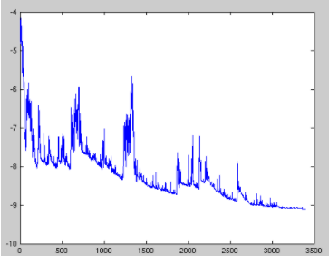
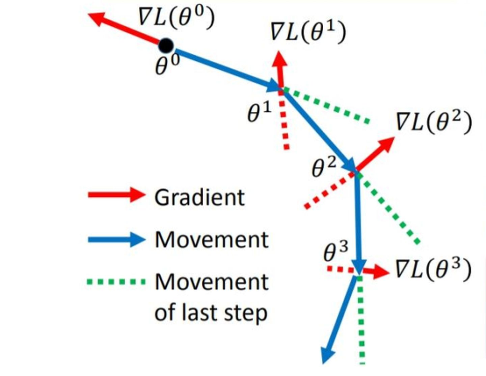

### 梯度下降法

**随机梯度下降(SDG)**

对每个样本进行一次参数的更新
$$
\theta=\theta-\eta \cdot \nabla_{\theta} J\left(\theta ; x^{(i)} ; y^{(i)}\right)
$$

缺点: 噪声比较多, 每次迭代方向并不能保证是最优的方向, 并不一定是全局最优, 更新频繁会袋子cost function震荡.

当我们稍微减小learning rate, SGD与BGD的收敛性是一样的

**批量梯度下降(BDG)**

采用整个数据集来进行梯度的计算
$$
\theta=\theta-\eta \cdot \nabla_{\theta} J(\theta)
$$
缺点: 在一次更新中, 采用整个数据集进行梯度计算, 所以计算起来非常缓慢, 不能投入新数据进行实时更新, 对于凸函数可以收敛到全局最小值, 对于非凸函数可以收敛到局部极小值

**小批量梯度下降(MBDG)**

MBDG每次利用一小批样本, 即n个样本进行计算, 可以降低参数更新时的方差, 收敛更稳定
$$
\theta=\theta-\eta \cdot \nabla_{\theta} J\left(\theta ; x^{(i : i+n)} ; y^{(i: i+n)}\right)
$$

### 梯度优化算法

#### 指数加权平均

指数移动平均, 窗口内的过滤函数取值从当前数据到之前第T-1的数据依次指数递减, 计算公式如下所示
$$
E M A_{t}= \begin{cases}y_{1} & \mathrm{t}=1 \\ \alpha y_{t}+(1-\alpha) E M A_{t-1} & \mathrm{t}>1\end{cases}
$$
其中$\alpha$​​是表示权重衰减程度, 越大观测值衰减越快, 近似周期计算公式为
$$
T \approx \frac{1}{1-\beta}
$$

#### SGDM(Momentum)

SGDM栋梁算法引入了动量$v$​充当速度的角色, 它代表参数在参数空间移动的方向和速率, 速度被设为负梯度的指数移动平均, 超参$\gamma$决定了之前的梯度贡献衰减有多快, 特别的, 当$\gamma=0$时, SGDM等价于小批量随机梯度下降
$$
\begin{gathered}
m_{t}=\gamma m_{t-1}-(1-\gamma)\left(\frac{\eta}{(1-\gamma)}\right) g_{t}=\gamma m_{t-1}-\eta g_{t} \\
\theta_{t}=\theta_{t-1}+m_{t}
\end{gathered}
$$

#### NAG

Nesterov动量与标准动量的区别体现在梯度计算上, Nesterov 动量中，梯度计算在施加当前速度之后。Nesterov 是 momentum算法得改进算法： Momentum保留了上一时刻的梯度$g_{\theta_t}$, 对其没有进行任何的变化, NAG是在梯度更新的时候做了一个矫正.

在动量法中，实际的参数更新方向$m_t$为上一步参数更新方向$m_{t-1}$和当前梯度$g_t$的叠加. 这样$m_t$可以被拆分为两步进行, 先根据$m_{t-1}$更新一次得到参数$\hat{\theta}$, 在利用本轮计算的梯度$g_t$进行叠加.
$$
\begin{gathered}
\hat{\theta}=\theta_{t-1}+\gamma m_{t-1} \\
\theta_{t}=\hat{\theta}-\eta g_{t}
\end{gathered}
$$
注意, 这里$g_t$为梯度在时间步$t$的梯度, 因此更为合理的更新方向应该是$\hat{\theta}$上的梯度, 合并之后的更新方向变为$\eta \nabla L\left(\theta_{t}+\gamma m_{t}\right)$.
$$
\begin{gathered}
m_{t}=\gamma m_{t-1}-\eta \nabla L\left(\theta_{t-1}+\gamma m_{t-1}\right)=m_{t-1}-\eta g_{\left(\theta_{t-1}+\gamma m_{t-1}\right)} \\
\theta_{t}=\theta_{t-1}+m_{t}
\end{gathered}
$$

### 自适应学习率优化

#### AdaGrad

AdaGrad算法会使用一个小批量随机梯度$g_t$按照元素平方累加到变量$s_t$, 在第0步, AdaGrad将$s_0$初始化为0. 在时间步t, 首先将小批量随机梯度$g_t$按照元素平方之后累加到$s_t$
$$
s_{t}=s_{t-1}+g_{t} \odot g_{t}
$$
接着我们将目标函数中每个元素的学习率进行调整
$$
\theta_{t}=\theta_{t-1}-\frac{\eta}{\sqrt{s_{t}+\epsilon}} \odot g_{t}
$$
该方法的缺点是经过一定次数的迭代仍然没有找到最优解时, 由于此时的学习率已经非常小, 很难在找到最优解

#### RMSProp

修改$s_t$为小批量随机梯度指数加权平均, AdaGrad 旨在应用于凸问题和梯度稀疏的快速收敛的问题, 但是在训练非凸且梯度密集神经网络时.  学习轨迹可能穿过了很多不同的结构最终达到一个局部为凸的区域而停止收敛. 

这是由于AdaGrad根据平方梯度的整个历史收缩学习率, 到时学习率迅速衰减, 可能使学习率达到这样的凸结构之前就变得太小了, 陷入局部最优, 这个问题在深度学习产生的高维问题中尤其严重.

RMSProp使用指数（衰减）移动平均，相当于丢弃了较早时间步的历史，只使用距离当前时间步最近的固定大小的项进行学习率的更新，使其能够在找到局部凸结构后快速收敛.
$$
s_{t}=\gamma s_{t-1}+(1-\gamma) g_{t} \odot g_{t}
$$
接下来和AdaGrad算法一样，RMSProp算法将目标函数自变量中每个元素的学习率通过按元素运算重新调整，然后更新自变量
$$
\theta_{t}=\theta_{t-1}-\frac{\eta}{\sqrt{s_{t}+\epsilon}} \odot g_{t}
$$
特点: 由于指数移动平局你的特点, 其值可以看作一定窗口内的数据平均, 这样学习率就不会在迭代的过程中不断的降低, 而是根据最近一段时间更新的方向进行自适应的调整

#### AdaDelta

AdaDelta没有学习率这一参数, AdaDelta算法也想RMSProp算法一样, 使用了小批量随机梯度$g_t$的指数加权平均
$$
s_{t}=\gamma s_{t-1}+(1-\gamma) g_{t} \odot g_{t}
$$
其与RMSProp算法的主要区别就是, AdaDelta算法引入了每次参数更新的差 $\Delta \theta$​​的平方的指数移动平均$\Delta x_i$​, 其中$\Delta x_0 = 0$​, 其更新公式如下所示
$$
\Delta x_{t}=\gamma \Delta x_{t-1}+(1-\gamma) \Delta \theta_{t} \odot \Delta \theta_{t}
$$
使用$\Delta x_{i-1} s_t$来更新参数$\Delta \theta_t$
$$
\Delta \theta_{t}=\sqrt{\frac{\Delta x_{t-1}+\epsilon}{s_{t}+\epsilon}} \odot g_{t}
$$
最后完成参数的更新
$$
\theta_{t}=\theta_{t-1}-\Delta \theta_{t}
$$
特点:

* 使用$\sqrt{\Delta x_{t-1}+\epsilon}$来代替学习率, 训练的初中期, 加速效果不错, 训练的后期, 反复在局部最小值附近抖动

### 其他优化方法

#### Adam

自适应动量估计（Adaptive Moment Estimation， Adam）算法是另一种自适应学习率算法，可以看作是动量法和 RMSprop 的结合，不但使用动量作为参数更新方向，而且可以自适应调整学习率。 **Adam = RMSProp + Momentum**

给定移动平均衰减率超参数 $\beta_1$(算法建议为0.9), 时间步t的动量变量 $m_t$即小批量随机梯度$g_t$的指数加权移动平均(和动量法类似):
$$
m_{t} \leftarrow \beta_{1} m_{t-1}+\left(1-\beta_{1}\right) g_{t}
$$
给定移动平均衰减率超参数$\beta_2$(算法建议为0.999)将小批量随机梯度按元素平方后的项指数加权移动平均得到$s_t$
$$
s_{t} \leftarrow \beta_{2} s_{t-1}+\left(1-\beta_{2}\right) g_{t} \odot g_{t}
$$
由于初始阶段$m_0, s_0$都初始化为0, 导致训练初期他们的方差以及均值都比真实值要小, 因此需要进行偏差修正
$$
\begin{aligned}
&\hat{m}_{t} \leftarrow \frac{m_{t}}{1-\beta_{1}^{t}} \\
&\hat{s_{t}} \leftarrow \frac{s_{t}}{1-\beta_{2}^{t}}
\end{aligned}
$$
根据修正偏差后的值来更新参数的差值
$$
\Delta \theta_{t} \leftarrow \frac{\eta}{\sqrt{\hat{s_{t}}}+\epsilon} \hat{m}_{t}
$$
最后更新参数
$$
m_{t} \leftarrow \beta_{1} m_{t-1}+\left(1-\beta_{1}\right) g_{t}
$$
