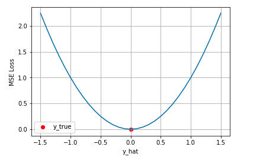
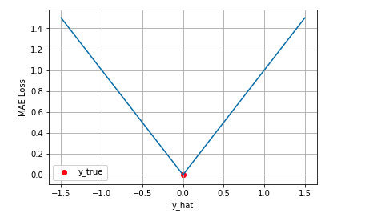
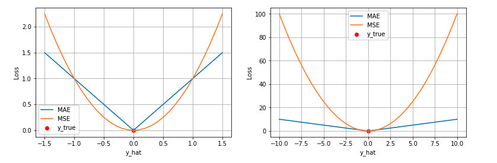
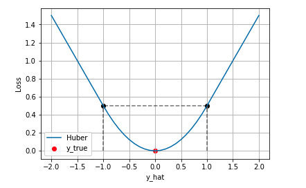
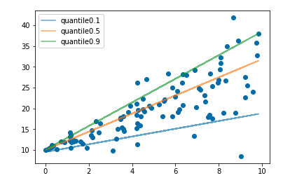
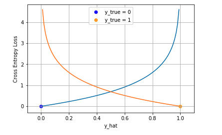
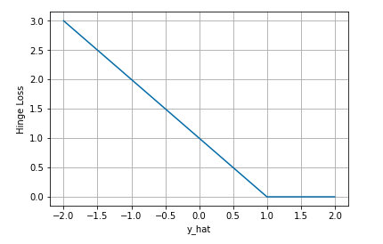

机器学习中的监督学习本质上是给定一系列训练样本$(x_i, y_i)$, 尝试学习$x\to y$的映射关系, 使得给定一个数据, 即使该数据并不在训练样本中, 也能够得到尽量接近真实的输出. 而损失函数(Loss Function)这是这个过程中关键的部分, 用来衡量真实输出与预测输出之间的差距.

先说下关于 Loss Function、Cost Function 和 Objective Function 的区别和联系. 在机器学习的语境下这三个术语经常被交叉使用。

* 损失函数 Loss Function 通常是**针对单个训练样本而言**，给定一个模型输出$\hat{y}$与模型的真实输出$y$, 损失函数输出一个实值损失$L = f(y_i, \hat{y_i}))$
* 代价函数 Cost Function 通常是**针对整个训练集**, 或者在使用 mini-batch gradient descent 时一个 mini-batch的总损失$J = \sum{_{i=1}^{N}}f(y_i, \hat{y_i})$
* 目标函数 Objective Function 是一个更通用的术语, 表示任意希望被优化的函数, 用于机器学习与非机器学习领域

三者之间的关系是A loss function is a part of a cost function which is a type of an objective function.

| 损失函数                                  | 类型 | 优点 | 缺点 |
| ----------------------------------------- | ---- | ---- | ---- |
| 均方差损失 Mean Squared Error Loss        | 回归 |      |      |
| 平均绝对误差损失 Mean Absolute Error Loss | 回归 |      |      |
| Huber Loss                                | 回归 |      |      |
| 分位数损失 Quantile Loss                  | 回归 |      |      |
|                                           | 分类 |      |      |

### 均方差损失 Mean Squared Error Loss

**基本形式与原理**

均方差(Mean Squared Error MSE)损失是机器学习、深度学习回归任务中最常用的一种损失函数，也称为 L2 Loss。其基本形式如下
$$
J_{M S E}=\frac{1}{N} \sum_{i=1}^{N}\left(y_{i}-\hat{y}_{i}\right)^{2}
$$

对于真实值0, 不同的预测值[-1.5, 1.5]的均方差损失的变化图, 横轴是不同的预测值，纵轴是均方差损失，可以看到随着预测与真实值绝对误差的增加, 损失呈现出二次方的增加.

**背后假设**

实际上在一定的假设下，我们可以使用最大化似然得到均方差损失的形式。假设**模型预测与真实值之间的误差服从标准高斯分布**, 给定一个输入, 其输出的概率为
$$
p\left(y_{i} \mid x_{i}\right)=\frac{1}{\sqrt{2 \pi}} \exp \left(-\frac{\left(y_{i}-\hat{y}_{i}\right)^{2}}{2}\right)
$$
进一步我们假设数据集中 N 个样本点之间相互独立, 则给定所有$x$输出真实值$y$​的概率, 即最大似然如下所示, 加上了负号表示将与$y$相差的概率最小变成求最大
$$
L(x, y)=\prod_{i=1}^{N} \frac{1}{\sqrt{2 \pi}} \exp \left(-\frac{\left(y_{i}-\hat{y}_{i}\right)^{2}}{2}\right)
$$
为了方便计算, 对似然函数求对数
$$
L L(x, y)=\log (L(x, y))=-\frac{N}{2} \log 2 \pi-\frac{1}{2} \sum_{i=1}^{N}\left(y_{i}-\hat{y}_{i}\right)^{2}
$$
去掉与$\hat{y}$​无关的项, 得到的形式与均方误差一致, 也就是说**在模型输出与真实值的误差服从高斯分布的假设下，最小化均方差损失函数与极大似然估计本质上是一致的**，因此在这个假设能被满足的场景中（比如回归），均方差损失是一个很好的损失函数选择；当这个假设没能被满足的场景中（比如分类），均方差损失不是一个好的选择。
$$
N L L(x, y)=\frac{1}{2} \sum_{i=1}^{N}\left(y_{i}-\hat{y}_{i}\right)^{2}
$$

### 平均绝对误差损失 Mean Absolute Error Loss

**基本形式与原理**

平均绝对误差 Mean Absolute Error (MAE) 是另一类常用的损失函数, 也称为L1 Loss, 基本形式如下所示
$$
J_{M A E}=\frac{1}{N} \sum_{i=1}^{N}\left|y_{i}-\hat{y}_{i}\right|
$$

对于真实值0, 不同的预测值[-1.5, 1.5]的绝对值损失的变化图, 横轴是不同的预测值，纵轴平均绝对值损失，可以看到随着预测与真实值绝对误差的增加, 损失呈现出一次方的增加.

**背后假设**

同样的我们可以在一定的假设下通过最大化似然得到 MAE 损失的形式，假设**模型预测与真实值之间的误差服从拉普拉斯分布 Laplace distribution**, 则给定一个输入, 模型输出真实值的概率为
$$
p\left(y_{i} \mid x_{i}\right)=\frac{1}{2} \exp \left(-\left|y_{i}-\hat{y}_{i}\right|\right)
$$
与上面推导 MSE 时类似，我们可以得到的负对数似然实际上就是 MAE 损失的形式
$$
\begin{gathered}
L(x, y)=\prod_{i=1}^{N} \frac{1}{2} \exp \left(-\left|y_{i}-\hat{y}_{i}\right|\right) \\
L L(x, y)=N \ln \frac{1}{2}-\sum_{i=1}^{N}\left|y_{i}-\hat{y}_{i}\right| \\
N L L(x, y)=\sum_{i=1}^{N}\left|y_{i}-\hat{y}_{i}\right|
\end{gathered}
$$

### MAE与MSE区别

MAE 和 MSE 作为损失函数的主要区别是：MSE 损失相比 MAE 通常可以更快地收敛，但 MAE 损失对于 outlier 更加健壮，即更加不易受到 outlier 影响。

**MSE 通常比 MAE 可以更快地收敛**。当使用梯度下降算法时，MSE 损失的梯度为$-\hat{y}$, 而 MAE 损失的梯度为$\pm1$, 即 MSE 的梯度的 scale 会随误差大小变化，而 MAE 的梯度的 scale 则一直保持为 1，即便在绝对误差很小的时候 MAE 的梯度 scale 也同样为 1，这实际上是非常不利于模型的训练的, 会导致梯度呈现Z字型下降. 当然你可以通过在训练过程中动态调整学习率缓解这个问题，但是总的来说，损失函数梯度之间的差异导致了 MSE 在大部分时候比 MAE 收敛地更快。这个也是 MSE 更为流行的原因。

**MAE 对于 outlier 更加 robust**。我们可以从两个角度来理解这一点：

* 第一个角度是直观地理解，下图是 MAE 和 MSE 损失画到同一张图里面，由于MAE 损失与绝对误差之间是线性关系，MSE 损失与误差是平方关系，当误差非常大的时候，MSE 损失会远远大于 MAE 损失。因此当数据中出现一个误差非常大的 outlier 时，MSE 会产生一个非常大的损失，对模型的训练会产生较大的影响。

  

* 第二个角度是从两个损失函数的假设出发，MSE 假设了误差服从高斯分布，MAE 假设了误差服从拉普拉斯分布。拉普拉斯分布本身对于 outlier 更加 robust。

### Huber Loss

上文我们分别介绍了 MSE 和 MAE 损失以及各自的优缺点，MSE 损失收敛快但容易受 outlier 影响，MAE 对 outlier 更加健壮但是收敛慢, Huber Loss 则是一种将 MSE 与 MAE 结合起来，取两者优点的损失函数，也被称作 Smooth Mean Absolute Error Loss 。其原理很简单，就是在误差接近 0 时使用 MSE，误差较大时使用 MAE，公式为
$$
J_{\text {huber }}=\frac{1}{N} \sum_{i=1}^{N} \mathbb{I}_{\left|y_{i}-\hat{y}_{i}\right| \leq \delta} \frac{\left(y_{i}-\hat{y}_{i}\right)^{2}}{2}+\mathbb{I}_{\left|y_{i}-\hat{y}_{i}\right|>\delta}\left(\delta\left|y_{i}-\hat{y}_{i}\right|-\frac{1}{2} \delta^{2}\right)
$$
上式中$\delta$是 Huber Loss 的一个超参数, $\delta$的值是 MSE 和 MAE 两个损失连接的位置, 上式等号右边第一项是 MSE 的部分，第二项是 MAE 部分，在 MAE 的部分公式为$\delta\left|y_{i}-\hat{y}_{i}\right|-\frac{1}{2} \delta^{2}$​是为了保证在分段函数的连接处连续可导

**Huber Loss的特点**

Huber Loss 结合了 MSE 和 MAE 损失，在误差接近 0 时使用 MSE，使损失函数可导并且梯度更加稳定；在误差较大时使用 MAE 可以降低 outlier 的影响，使训练对 outlier 更加健壮。缺点是需要额外地设置一个$\delta$超参

### 分位数损失 Quantile Loss

分位数回归 Quantile Regression 是一类在实际应用中非常有用的回归算法，通常的回归算法是拟合目标值的期望或者中位数，而分位数回归可以通过给定不同的分位点，拟合目标值的不同分位数。例如我们可以分别拟合出多个分位点，得到一个置信区间，如下图所示

分位数回归是通过使用分位数损失 Quantile Loss 来实现这一点的，分位数损失形式如下，式中的 r 分位数系数。
$$
J_{q u a n t}=\frac{1}{N} \sum_{i=1}^{N} \mathbb{I}_{\hat{y}_{i} \geq y_{i}}(1-r)\left|y_{i}-\hat{y}_{i}\right|+\mathbb{I}_{\hat{y}_{i}<y_{i}} r\left|y_{i}-\hat{y}_{i}\right|
$$
这个损失函数是一个分段的函数, 将$\hat{y_i} > y_i$做为高估以及$\hat{y_i} < y_i$作为低估, 当$r > 0.5$时, 低估的损失要比高估的损失更大, 特别的, 当$r=0.5$时, 分位数损失退化为 MAE 损失，从这里可以看出 MAE 损失实际上是分位数损失的一个特例 — 中位数回归

### 交叉熵损失 Cross Entropy Loss

对于分类问题, 常用的损失函数为交叉损失函数

#### 二分类

考虑二分类，在二分类中我们通常使用 Sigmoid 函数将模型的输出压缩到 (0, 1) 区间内, $\hat{y}$用来表示模型输入$x_{i}$为正的概率, 由于只有正负两类, 因此同时也得到了模型为负的概率
$$
\begin{gathered}
p\left(y_{i}=1 \mid x_{i}\right)=\hat{y}_{i} \\
p\left(y_{i}=0 \mid x_{i}\right)=1-\hat{y}_{i}
\end{gathered}
$$
将两个算式合并为一个, 可得到
$$
p\left(y_{i} \mid x_{i}\right)=\left(\hat{y}_{i}\right)^{y_{i}}\left(1-\hat{y}_{i}\right)^{1-y_{i}}
$$
求其最大似然概率
$$
L(x, y)=\prod_{i=1}^{N}\left(\hat{y}_{i}\right)^{y_{i}}\left(1-\hat{y}_{i}\right)^{1-y_{i}}
$$
再对似然函数取对数, 然后加上负号变成最小化似然函数, 交叉熵损失函数的形式
$$
N L L(x, y)=J_{C E}=-\sum_{i=1}^{N}\left(y_{i} \log \left(\hat{y}_{i}\right)+\left(1-y_{i}\right) \log \left(1-\hat{y}_{i}\right)\right)
$$
下图是对二分类的交叉熵损失函数的可视化，蓝线是目标值为 0 时输出不同输出的损失，黄线是目标值为 1 时的损失。可以看到约接近目标值损失越小，随着误差变差，损失呈指数增长。

#### 多分类

在多分类的任务中，交叉熵损失函数的推导思路和二分类是一样的，变化的地方是真实值现在是一个one-hot向量, 同时模型输出的压缩由原来的 Sigmoid 函数换成 Softmax 函数. Softmax 函数将每个维度的输出范围都限定在(0, 1)之间, 所有维度的和为1, 用于表示一个概率分布
$$
p\left(y_{i} \mid x_{i}\right)=\prod_{k=1}^{K}\left(\hat{y}_{i}^{k}\right)^{y_{i}^{k}}
$$
其中$k\in K$是K个类别中的一类, 同样的假设数据点之间独立同分布，可得到负对数似然为
$$
N L L(x, y)=J_{C E}=-\sum_{i=1}^{N} \sum_{k=1}^{K} y_{i}^{k} \log \left(\hat{y}_{i}^{k}\right)
$$
由于$y_i$是一个one-hot向量, 除了目标类为1之外, 其他类别的输出都为0, 因此上式可以写成
$$
J_{C E}=-\sum_{i=1}^{N} y_{i}^{c_{i}} \log \left(\hat{y}_{i}^{c_{i}}\right)
$$

### 合页损失 Hinge Loss

合页损失 Hinge Loss 是另外一种二分类损失函数，适用于 maximum-margin 的分类，支持向量机 Support Vector Machine (SVM) 模型的损失函数本质上就是 Hinge Loss + L2 正则化。合页损失的公式如下
$$
J_{\text {hinge }}=\sum_{i=1}^{N} \max \left(0,1-\operatorname{sgn}\left(y_{i}\right) \hat{y}_{i}\right)
$$
当真实为正类时, 即$sgn(y_i)=1$时, 不同合页损失示意图, 

可以看到, 当真实为正类时, 会对模型预测为负类有较大的惩罚, 当模型预测为正且在(0, 1)之间时, 会有一个比较小的惩罚. 即合页损失不仅惩罚预测错的，并且对于预测对了但是置信度不高的也会给一个惩罚，只有置信度高的才会有零损失。使用合页损失直觉上理解是要**找到一个决策边界，使得所有数据点被这个边界正确地、高置信地被分类**。