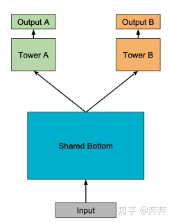

推荐系统组成

CTR预估

召回

多目标

多样性

序列化

特征工程

transformer

强化学习

### din结构

DIN结构与基线模型的区别在于DIN设计了局部激活单元。激活单元会计算候选商品与用户最近N个历史行为商品的相关性权重，然后将其作为加权系数对N个行为商品的embedding向量做sum pooling。用户的兴趣由加权后的embedding来体现。权重是根据候选商品和历史行为共同决定的，同一候选商品对不同用户历史行为的影响是不同的，与候选商品相关性高的历史行为会获得更高的权重。


Activation unit结构


din结构实现

```python
din_all = tf.concat(
            [queries, facts, queries - facts, queries * facts, context], axis=-1)
        d_layer_2_all = tf.layers.dense(
            din_all, 1, activation=None, kernel_initializer=tf.contrib.layers.variance_scaling_initializer(), name='f2_att' + stag)
        
```

### 多目标结构

多任务学习的本质就是共享表示以及相关任务的相互影响。通常，相似的子任务也拥有比较接近的底层特征，那么在多任务学习中，他们就可以很好地进行底层特征共享；而对于不相似的子任务，他们的底层表示差异很大，在进行参数共享时很有可能会互相冲突或噪声太多，导致多任务学习的模型效果不佳。

#### ESMM

**Sample Selection Bias (SSB)** 转化是在点击之后才“有可能”发生的动作，传统CVR模型通常以点击数据为训练集，其中点击未转化为负例，点击并转化为正例。但是训练好的模型实际使用时，则是对整个空间的样本进行预估，而非只对点击样本进行预估。即是说，训练数据与实际要预测的数据来自不同分布，这个偏差对模型的泛化能力构成了很大挑战

**Data Sparsity (DS)** 作为CVR训练数据的点击样本远小于CTR预估训练使用的曝光样本

介绍ESMM之前，我们还是先来思考一个问题——“**CVR预估到底要预估什么**”，论文虽未明确提及，但理解这个问题才能真正理解CVR预估困境的本质。想象一个场景，一个item，由于某些原因，例如在feeds中的展示头图很丑，它被某个user点击的概率很低，但这个item内容本身完美符合这个user的偏好，若user点击进去，那么此item被user转化的概率极高。CVR预估模型，预估的正是这个转化概率，**它与CTR没有绝对的关系，很多人有一个先入为主的认知，即若user对某item的点击概率很低，则user对这个item的转化概率也肯定低，这是不成立的。**更准确的说，**CVR预估模型的本质，不是预测“item被点击，然后被转化”的概率**（CTCVR）**，而是“假设item被点击，那么它被转化”的概率**（CVR）。这就是不能直接使用全部样本训练CVR模型的原因，因为咱们压根不知道这个信息：那些unclicked的item，假设他们被user点击了，它们是否会被转化。如果直接使用0作为它们的label，会很大程度上误导CVR模型的学习。
$$
\underbrace{p(z \& y=1 \mid \boldsymbol{x})}_{p C T C V R}=\underbrace{p(z=1 \mid y=1, \boldsymbol{x})}_{p C V R} \underbrace{p(y=1 \mid \boldsymbol{x})}_{p C T R}
$$
其中$z, y$分别表示conversion与click, 在全部样本空间中，CTR对应的label为click，而CTCVR对应的label为click & conversion，**这两个任务是可以使用全部样本的**, 通过学习这两个任务隐式的学习CVR.


1）**共享Embedding** CVR-task和CTR-task使用相同的特征和特征embedding，即两者从Concatenate之后才学习各自部分独享的参数；2）**隐式学习pCVR** 啥意思呢？这里pCVR（粉色节点）仅是网络中的一个**variable，没有显示的监督信号。**
$$
L\left(\theta_{c v r}, \theta_{c t r}\right)=\sum_{i=1}^{N} l\left(y_{i}, f\left(\boldsymbol{x}_{i} ; \theta_{c t r}\right)\right)+\sum_{i=1}^{N} l\left(y_{i} \& z_{i}, f\left(\boldsymbol{x}_{i} ; \theta_{c t r}\right) * f\left(\boldsymbol{x}_{i} ; \theta_{c v r}\right)\right)
$$
ESMM的结构是基于“乘”的关系设计——pCTCVR=pCVR*pCTR, 要是使用除法的关系容易导致数值上的不稳定, 因为真实场景中这两个预测的值都比较小.

#### MOE

基于share-bottom 结构的算法，即底层特征共享方式构建的网络模型，在多个任务之间目标比较相似或者相关性比较大的情况下回带来好的结果，但是对多个目标差异性比较大的情况下，效果就不佳。因此，有了和ESMM这种共享特征方式不同的多目标学习

MTL 的 Shared-Bottom DNN 网络在许多多目标学习中被广泛采用，因此，是多目标建模的基线版本，其结构如下图所示：



该模型由Shared-Bottom 网络, k个 tower network, 输入层之上建立共享底部网络，tower network建立在共享底部网络之上.

在MOE中, Shared-Bottom 网络, 被专家网络（expert network）和一个门控网络替代, 因为只有一个门控网络，这种结构称为 OMoE（One-gate Mixture-of-Experts），其结构如下图所示：


OMoE 可以表示为：
$$
y=\sum_{i=1}^{n} g(x)_{i} f_{i}(x)
$$
其中, $\sum_{i=1}^{n}g(x_i) = 1$​​, $g(x_i)$表示第i个专家网络的权重, $f_i$​​表示的是第i个专家网络, 两者相乘是所有专家网络加权的结果.

#### MMOE

MMoE（Multi-gate Mixture-of-Experts）在OMoE的基础上，用多个门控网络来控制加权的结果，结构如下图所示：


MMoE是利用MoE来对多目标学习进行优化，在OMoE的基础上将所有任务共享一个门控网络变成不同任务使用不同的门控网络，不同任务同一个专家也有不同的权重，更加利于模型捕捉到子任务间的相关性和差异性。另外，因为门控网络是轻量级的，专家网络所有任务共同使用，相对于论文中提到的其他算法具有参数和计算量的优势。

#### CGC

CGC的底层网络主要包括shared experts和task-specific expert构成，每一个expert module都由多个子网络组成，子网络的个数和网络结构（维数）都是超参数；上层由多任务网络构成，每一个多任务网络（towerA和towerB）的输入都是由gating网络进行加权控制，每一个子任务的gating网络的输入包括两部分，其中一部分是本任务下的task-specific部分的experts和shared部分的experts组成（即gating network网络结构中的vector1……vector m），输入input作为gating network的selector。而gating网络的结构也是比较简单的，只是一个单层的前向FC，利用输入作为筛选器（selector）从而获得不同子网络所占的权重大小，从而得到不同任务下gating网络的加权和。也就是说CGC网络结构保证了，每个子任务会根据输入来对task-specific和shared两部分的expert vector进行加权求和，从而每个子任务网络得到一个embedding，再经过每个子任务的tower就得到了对应子任务的输出。


#### PLE

上面看到了CGC网络是一种single-level的网络结构，一个比较直观的思路就是叠加多层CGC网络（获得更加丰富的表征能力），而PLE网络结构就是将CGC拓展到了multi-level下。具体网络结构如下图所示

与CGC网络（PLE里的Extraction Network）不同的是：（1）在底层的Extraction网络中，除了各个子任务的gating network外，还包含有一个share部分的gating network，这部分gating network的输入包含了所有input，而各个子任务的gating network的输入是task-specific和share两部分；（2）在上层Extraction Network中input不再是原始的input向量，而是底层Extraction Network网络各个gating network输出结果的fusion result。


### 过拟合的解决办法

**Batch Normalization**，一种非常有用的正则化方法,可以让大型的卷积网络训练速度加快很多倍,同时收敛后分类的准确率也可以大幅度的提高。BN在训练某层时,会对每一个mini-batch数据进行标准化(normalization)处理,使输出规范到N(0,1)的正态分布,减少了Internal convariate shift(内部神经元分布的改变),传统的深度神经网络在训练是,每一层的输入的分布都在改变,因此训练困难,只能选择用一个很小的学习速率,但是每一层用了BN后,可以有效的解决这个问题,学习速率可以增大很多倍。

**模型组合**，Baggging &Boosting，将弱分类器融合之后形成一个强分类器，而且融合之后的效果会比最好的弱分类器更好；

**选择合适的网络结构，**通过减少网络层数、神经元个数、全连接层数等降低网络容量；

**决策树剪枝**, 在决策树学习中将已生成的树进行简化的过程称为剪枝。又分为前剪枝和后剪枝。

**交叉验证**, 交叉验证的基本思想就是将原始数据（dataset）进行分组，一部分做为训练集来训练模型，另一部分做为测试集来评价模型。我们常用的交叉验证方法有简单交叉验证、S折交叉验证和留一交叉验证。

**dropout**, 可以看作是多模型的组合

**Early stopping**, Early stopping便是一种迭代次数截断的方法来防止过拟合的方法，即在模型对训练数据集迭代收敛之前停止迭代来防止过拟合。因为在初始化网络的时候一般都是初始为较小的权值，训练时间越长，部分网络权值可能越大。如果我们在合适时间停止训练，就可以将网络的能力限制在一定范围内。

**数据增强**, 通俗得讲，数据增强即需要得到更多的符合要求的数据，即和已有的数据是独立同分布的，或者近似独立同分布的。一般有以下方法：

**L1和L2正则化**, l1正则化更容易获得稀疏解，还可以挑选重要特征。l2正则有均匀化w的作用