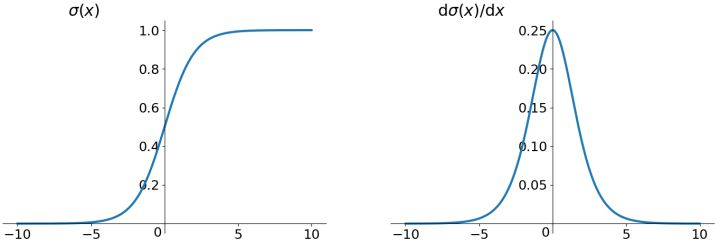
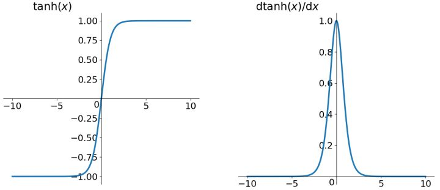
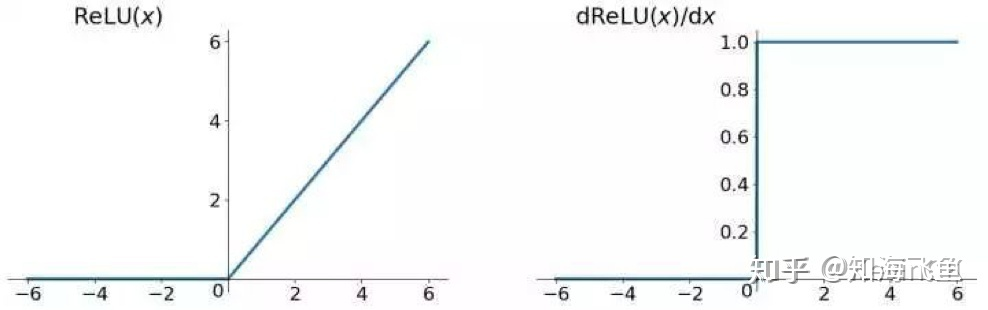
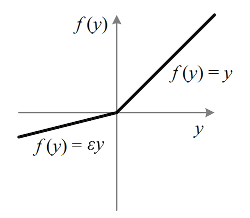

激活函数（activation functions）是神经网络非线性化的基础，是单调、连续、可导的。

| 激活函数                | 公式 | 缺点                                                         | 优点                                       |
| ----------------------- | ---- | ------------------------------------------------------------ | ------------------------------------------ |
| Sigmoid                 |      | 1. 会有梯度消失  2.不是远点对称, 梯度更新缓慢 3.计算指数耗时 | -                                          |
| Tanh                    |      | 梯度消失没有解决                                             | 1. 解决了原点对称问题 2.比sigmoid快   |
| ReLU                    |      | 1. 梯度消失问题没有完全解决 2. 神经元可能会死亡         | 1. 解决了原点对称的问题 2. 收敛速度快 |
| Leaky ReLU(LReLU/PReLU) |      | -                                                            | 1. 解决了神经元死亡的问题                  |
|                         |      |                                                              |                                            |

### sigmoid

sigmoid是平滑（smoothened）的阶梯函数（step function），可导（differentiable）。sigmoid可以将任何值转换为0~1概率，用于二分类。

公式: $y=\frac{1}{1+e^{-x}}$   	导数$y^{'} = y(1-y)$

当使用sigmoid作为激活函数时, 随着隐藏层的层数增加, 训练误差反而变大, 变现为:

1. 靠近输出层的隐含层梯度较大, 参数更新快, 很快会收敛
2. 靠近输入层的隐含层的梯度较小, 参数更新速度慢, 几乎跟初始状态一样, 随机分布
3. 在含有4个隐藏层的网络结构中, 第1层比第4层慢了接近100倍

由于sigmoid的倒数值的范围为[0, 0.25], x的变化速率快于y的变化速率, 随着层数的增加, 靠近输入层的梯度将会越来越小, 网络更倾向于更新后面的梯度.

参数更新

深度学习一般的学习方法是反向传播。简单来说，就是通过链式法则，求解全局损失函数对某一参数的偏导, 而后辅以学习率, 方向更新该参数$w \gets w_{i} - \eta\frac{\partial{L}}{\partial{w}}$

对具体的某一个神经元来说, 其输入输出关系为$f = f(\sum_{i}{w_ix_i + b})$

对于$w_i	$​​来说
$$
\frac{\partial{L}}{\partial{w}} = 
\frac{\partial{L}}{\partial{f}} \frac{\partial{f}}{\partial{z}} \frac{\partial{z}}{\partial{w}}  =
x_i \frac{\partial{L}}{\partial{f}} \frac{\partial{f}}{\partial{z}}
$$
在一次迭代的过程中, $\frac{\partial{L}}{\partial{f}} \frac{\partial{f}}{\partial{z}}$​可以视为参数, 因此参数的更新方向由$x_i$来确定, 由于sigmoid的输出都为正数, 因此不得不Z形更新梯度参数

**sigmoid缺点:**

* sigmoid涉及指数跟除法运算, 计算量较大
* 敏感区间较短, (-1, 1)为敏感区间, 其他的都为饱和区间
* 函数的导数取值范围为[0, 0.25], 会出现比较严重的梯度消失的情况
* 函数的输出全为真数, 方向传播正, weight的更新要么全是正数, 要么全是负数, 会导致权重下降呈现Z字型(因为除了激活函数之外, 其他的都是线性)

### tanh

tanh，即双曲正切（hyperbolic tangent），类似于幅度增大sigmoid，将输入值转换为-1至1之间。tanh的导数取值范围在0至1之间，优于sigmoid的0至1/4，在一定程度上，减轻了梯度消失的问题。tanh的输出和输入能够保持非线性单调上升和下降关系，符合BP（back propagation）网络的梯度求解，容错性好，有界。
$$
\begin{align}
y &= tanh(x) &= \frac{e^x - e^{-x}}{e^x + e^{-x}}\\
y &= tanh(x) &= 2sigmoid(2x)\\

y^{'} &= \frac{4e^{2x}}{(e^{2x}+1)^2}

\end{align}
$$
tanh:

* 函数的输出范围是(-1, 1), 解决了sigmoid中不是zero- centered的问题
* 导数的范围在(0, 1)之间, 相比于sigmoid梯度消失的问题有所缓解, 但是仍然存在
* 为了防止饱和, 现在主流的做法是会在激活函数之前加上bn,尽可能的保证每一层的输入具有较小的均值以及以0为中心分布

### ReLU

relu，即Rectified Linear Unit，激活部分神经元，增加稀疏性。

**relu的倒数在x>0时恒为1** 

导数为常数1的好处就是在“链式反应”中不会出现梯度消失，但梯度下降的强度就完全取决于权值的乘积，这样就可能会出现梯度爆炸问题。解决这类问题：一是控制权值，让它们在(0,1)范围内；二是做输入值裁剪，控制梯度下降强度，如$ReLu = min(6, max(x, 0))$

**relu的倒数在x<0时恒为0** 

描述该特征前，需要明确深度学习的目标：深度学习是根据大批量样本数据，从错综复杂的数据关系中，找到关键信息（关键特征）。换句话说，就是把密集矩阵转化为稀疏矩阵，保留数据的关键信息，去除噪音，这样的模型就有了鲁棒性。ReLU将x<0的输出置为0，就是一个去噪音，稀疏矩阵的过程。而且在训练过程中，这种稀疏性是动态调节的，网络会自动调整稀疏比例，保证矩阵有最优的有效特征。

但是ReLU 强制将x<0部分的输出置为0（置为0就是屏蔽该特征），可能会导致模型无法学习到有效特征，所以如果学习率设置的太大，可能出现某次更新的梯度过大，使得神经元的输入权重有一个很大的负偏置，导致该神经元永远“死掉”。所以使用ReLU的网络，学习率不能设置太大。

relu的优点：

- 相比Sigmoid和tanh，ReLU摒弃了复杂的计算，提高了运算速度
- 解决了梯度消失问题，收敛速度快于Sigmoid和tanh函数，但要防范ReLU的梯度爆炸
- 容易得到更好的模型，但也要防止训练中出现模型‘Dead’情况

### leaky ReLU

函数公式是
$$
f(y) = max(\epsilon y, y)
$$
其中$\epsilon$是一个很小的常数, 比如0.01，Leaky ReLU非线性函数图像如下图所示。这样做目的是使负轴信息不会全部丢失，解决了ReLU神经元“死掉”的问题。这个函数通常比 Relu 激活函数效果要好，但是效果不是很稳定，所以在实际中 Leaky ReLu 使用的并不多。更进一步的方法是PReLU，把$\epsilon$​当作神经元中的一个参数去学习

