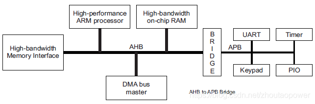
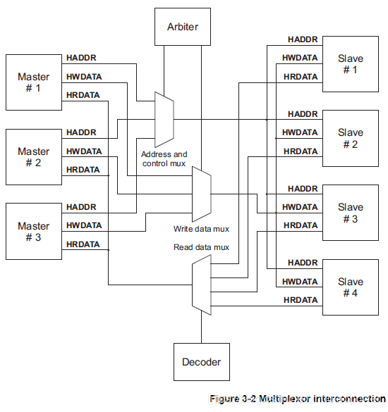
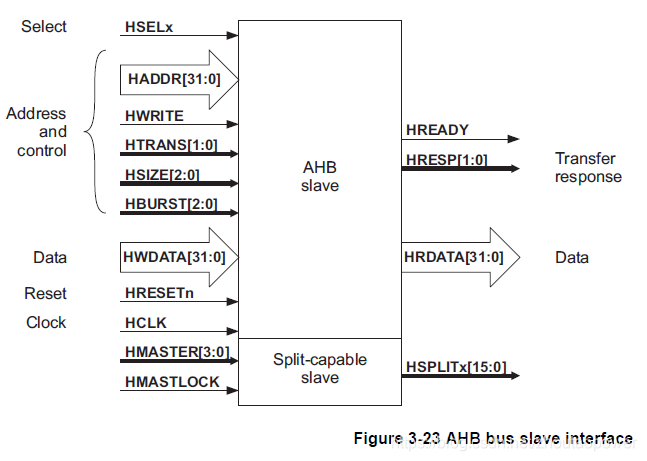
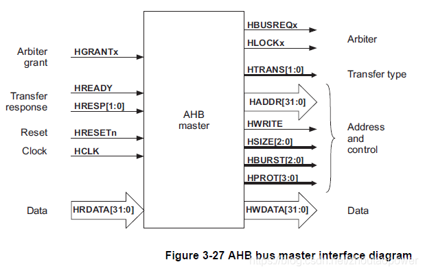
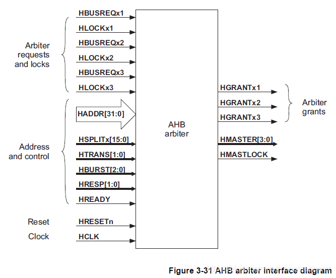

## 1. 简介

AHB 总线规范是AMBA总线规范的一部分，AMBA总线规范是ARM公司提出的总线规范，被大多数SoC设计采用，它规定了AHB (Advanced High-performance Bus)、ASB (Advanced System Bus)、APB (Advanced Peripheral Bus)。AHB用于高性能、高时钟频率的系统结构，典型的应用如ARM核与系统内部的高速RAM、NAND FLASH、DMA、Bridge的连接。APB用于连接外部设备，对性能要求不高，而考虑低功耗问题。ASB是AHB的一种替代方案。[官方链接](https://developer.arm.com/architectures/system-architectures/amba/specifications)

#### 1.1 AHB总线的架构

AHB总线的强大之处在于它可以将微控制器（CPU）、高带宽的片上RAM、高带宽的外部存储器接口、DMA总线master、各种拥有AHB接口的控制器等等连接起来构成一个独立的完整的SOC系统，不仅如此，还可以通过AHB-APB桥来连接APB总线系统。AHB可以成为一个完整独立的SOC芯片的骨架，下面的图摘抄至 AHB Specification：

AHB 高性能总线上可以接入 ARM 处理器核心，高带宽的片上 RAM，高速的内存总线，DMA master等等，通过 AHB2APB 桥接到 APB 总线；

#### 1.2 AHB基本特性

> - Burst传输
> - Split事务处理
> - 单周期master移交
> - 单一时钟沿操作
> - 无三态
> - 更宽的数据总线配置（64/128）
> - 流水线操作
> - 可支持多个总线主设备（最多16个）

## 2. AHB总线的组成

AHB总线由AHB总线主机(Master)、AHB总线从机(Slave)和Infrastructure构成。Infrastructure由仲裁器、数据多路选择器、地址控制多路选择器、译码器构成。

AMBA AHB 总线协议设计使用一个中央多路选择器互联方案。该方案中，所有总线主机设备输出地址和控制信号来指示它们想执行的传输，同时仲裁器决定哪一个主机能够将它
的地址和控制信号连通到所有的从机。当然也需要一个译码器来控制读数据和响应多路信号选择器，多路信号选择器选中来自传输中所包含从机的适当信号。

下图实现包含三个主机和四个从机的 AMBA AHB 设计的结构要求。

典型的 AMBA AHB 系统设计包含以下的部分：

> **AHB 主机**：总线主机能够通过提供地址和控制信息发起读写操作。任何时候只允许一个总线主机处于有效状态并能使用总线。
>
> **AHB 从机：**总线从机在给定的地址空间范围内响应读写操作。总线从机将成功、失败或者等待数据传输的信号返回给有效的主机。
>
> **AHB 仲裁器**：总线仲裁器确保每次只有一个总线主机被允许发起数据传输。即使仲裁协议已经固定，任何一种仲裁算法，比如最高优先级或者公平访问都能够根据应用要求而得到执行。AHB 必须只包含一个仲裁器，尽管在单总线主机系统中这显得并不重要。
>
> **AHB 译码器**：AHB 译码器用来对每次传输进行地址译码并且在传输中包含一个从机选择信号。所有 AHB 执行都必须仅要求有一个中央译码器。

## 3. 信号描述

所有 AMBA 信号的命名都用名称的第一个字母来指示信号和哪个总线相关联。信号名称中用一个小写的 n 表示该信号低电平有效，否则信号的名称总是用大写字母来表示。测试信号有一个前缀T而与总线类型无关. AHB信号前缀：H 表示一个 AHB 信号。例如， HREADY 是用来指示 AHB 部分数据传输完毕的信号。该信号高电平有效。

| 名称         | 来源       | 描述                                                         |
| ------------ | ---------- | ------------------------------------------------------------ |
| HCLK总线时钟 | 时钟源     | 时钟为所有总线传输提供时基。所有信号时序都和HCLK的上升沿相关。 |
| HRESETn复位  | 复位控制器 | 总线复位信号，低电平有效，用来复位系统和总线。这是唯一低电平有效的信号。 |

| 名称                   | 来源   | 描述                                                         |
| ---------------------- | ------ | ------------------------------------------------------------ |
| HADDR[31:0]地址总线    | 主机   | 32位地址总线                                                 |
| HTRANS[1:0]传输类型    | 主机   | 表示当前传输的类型，可以是连续，不连续，空闲和忙             |
| HWRITE传输方向         | 主机   | 该信号为高表示一个写传输，为低表示一个读传输                 |
| HSIZE[2:0]传输大小     | 主机   | 表示传输的大小，三位表示0…7,分别对应8bits(byte), 16bits(halfword),32bits(word),64bits, 128bits,256bits, 512bits,1024bits |
| HBRUST[2:0]突发类型    | 主机   | 表示传输是否组成了突发的一部分。支持4个，8个，16个节拍的突发传输，突发传输可以使增量或回环。 |
| HPROT[3:0]保护控制     | 主机   | 提供总线访问的附加信息，主要是给那些希望执行某种保护级别的模块使用的。这个信号指示当前传输是否为预取指令或者数据传输，同时也表示传输是保护模式访问还是用户模式访问。对带存储器管理单元的总线主机而言这些信号也用来指示当前传输是高速缓存的（cache）还是缓冲的（buffer）。 |
| HWDATA[31:0]写总线数据 | 主机   | 写数据总线用来在写操作期间从主机到总线从机传输数据。建议最小的数据总线宽度为 32 位。在要求高带宽运行时扩展（数据总线）还是很容易的。 |
| HSELx从机选择          | 译码器 | 每个 AHB 从机都有自己独立的从机选择信号并且用该信号来表示当前传输是否是打算送给选中的从机。该信号是地址总线的简单组合译码。 |
| HRDATA[31:0]读数据总线 | 从机   | 读数据总线用来在读操作期间从总线从机向总线主机传输数据。建议最小的数据总线宽度为 32 位。在要求高带宽运行时扩展（数据总线）还是很容易的。 |
| HREDAY传输完成         | 从机   | 当 HREADY 为高时表示总线上的传输已经完成。在扩展传输时该信号可能会被拉低。 注意：总线上的从机要求 HREADY 作为输入输出信号。 |
| HRESP[1:0]传输响应     | 从机   | 传输响应给传输状态提供了附加信息。提供四种不同的响应： OKEY、 ERROR、 RETRY 和 SPLIT。 |

AMBA AHB也有许多信号请求支持多主机操作。这些仲裁信号用于点对点连接， 下表中后缀x用来表示信号来自模块x。例如，一个系统中会有许多的信号. HBUSREQx，比如HBUSREQarm， HBUSREQdma和HBUSREQtic

| 名称                        | 来源           | 描述                                                         |
| --------------------------- | -------------- | ------------------------------------------------------------ |
| HBUSREQx 总线请求           | 主机           | 从总线主机 x 传向总线仲裁器用来表示该主机请求（控 制 ） 总 线 的信 号 。 系 统中 每 个 总 线主 机 都 有 一个 HBUSREQx 信号，最多 16 个总线主机。 |
| HLOCKx 锁定的传输           | 主机           | 当该信号为高时表示主机请求锁定对总线的访问并且 在该信号为低之前其他主机不应该被允许授予总线。 |
| HGRANTx 总线授予            | 仲裁器         | 该信号用来表示总线主机 x 目前是优先级最高的主机。 当 HREADY 为高时传输结束，地址/控制信号的所有权发生改变。所以主机应在 HREADY 和 HGRANTx 都为高时获得对总线的访问。 |
| HMASTER[3：0] 主机号        | 仲裁器         | 这些来自仲裁器的信号表示哪个总线主机正在执行传输和被支持分块传输的从机用来确定哪个主机正在尝试一次访问。HMASTER 的时序和地址以及控制信号对齐。 |
| HMASTLOCK 锁定顺序          | 仲裁器         | 表示当前主机正在执行一个锁定顺序的传输。该信号和HMASTER 有相同的时序。 |
| HSPLITx[15：0] 分块完成请求 | 从机(支持分块) | 从机用这 16 位的分块总线来指示仲裁器总线主机应该被允许重试一个分块传输。 分块总线上的每一位对应一个总线主机。 |

#### 3.1 AHB Slave 接口

作为 AHB Slave 信号接口定义如下所示：

#### 3.2 AHB Master 接口

#### 3.4 AHB Decoder 接口

AHB 仲裁器的定义如下：

仲裁机制保证了任意时刻只有一个master可以接入总线。arbiter决定哪个发出接入请求的master可以接入总线，这通过优先级算法实现。AHB规范并没有给出优先级算法，设计者需要根据具体的系统要求定义。一般情况下arbiter不会中断一个burst传输，将总线接入权让给其他master。当然未定义长度的burst传输是可以打断的，这要看优先级算法是如何规定的。如果一笔burst被打断，master再度获得接入权限时，会传递剩余的部分。如一笔长度为INCR8的传输在传递3 beat后被打断，master再次获得接入授权后，会继续传输剩余的5 beat，剩余部分可以由一个SINGLE和一个INCR4组成，或者一个INCR。

> **HBUSREQx**：master向arbiter发出接入请求的信号。
>
> **HLOCKx**：指示是否要进行不可中断的传输，这一信号与HBUSREQx同时由master向arbiter发出。
>
> **HGRANTx**：arbiter产生指示master获得授权，当HGRANTx信号为高同时HREADY为高时，master可以向总线传输地址信号。
>
> **HMASTER[3:0]**：arbiter产生指示哪个master获得授权，这一信号用于地址控制多路来选择哪个master接入总线。
>
> **HMASTERLOCK**：arbiter产生指示当前传输是否为锁定序列传输。
>
> **HSPLIT**：供支持SPLIT传输使用。

