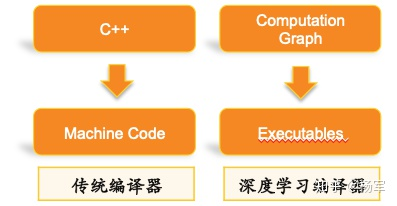
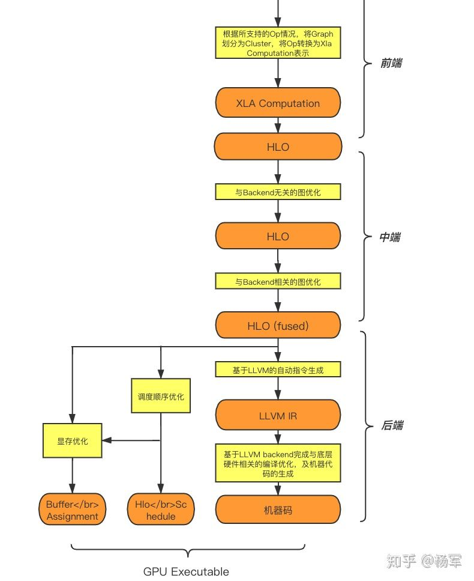

### AI编译器需求

随着AI模型结构的快速演化，底层计算硬件的层出不穷，用户使用习惯的推陈出新，单纯基于手工优化来解决AI模型的性能和效率问题越来越容易出现瓶颈。为了应对这些问题，AI编译优化技术已经成为一个获得广泛关注的技术方向。

几代框架之间有一个趋势，在上层的用户API层面，这些框架在变得越来越灵活，灵活性变强的同时也为底层性能问题提出了更大的挑战。另外一个技术趋势则是系统底层的深度学习的编译器近一段时间也开始活跃起来，这些编译器试图去解决框架的灵活性和性能之间的矛盾。

传统编译器是以高层语言作为输入，避免用户直接去写机器码，而用相对灵活高效的语言来工作，而深度学习编译器的作用相仿，其输入是比较灵活的，具备较高抽象度的计算图，输出包括CPU或者GPU等硬件平台上的底层机器码及执行引擎。

I编译器的目标是针对AI计算任务，以通用编译器的方式完成性能优化。让用户可以专注于上层模型开发，降低用户手工优化性能的人力开发成本，进一步压榨硬件性能空间。

主流编译框架XLA（针对访存密集算子）和TVM（针对计算密集算子），以及新近非常活跃的MLIR框架为代表（MLIR严格来说不是一个compiler，而是compiler infrastructure，后面会再进行展开介绍）

### XLA现状简述

#### 原理及主要收益来源

XLA（Accelerated Linear Algebra）是Google于2017年出推出的用于TensorFlow的编译器。XLA使用JIT编译技术来分析用户在运行时创建的 TensorFlow 图，将TensorFlow Op转换成为HLO（High LevelOptimizer）中间表示并在HLO层上完成包括Op Fusion在内的多种图优化，最后基于LLVM完成CPU／GPU等机器代码的自动生成。

上图是XLA的整体架构，其中有两层比较重要的IR（intermediate representation），HLO和底层的LLVM IR。HLO是专门适用于深度学习计算图的IR表示，与TensorFlow Graph的最大区别是其较细的颗粒度，以及有限数量的节点类型；LLVM IR是传统编译器领域的中间层表示，LLVM的中间层架构已经在传统编译器领域得到了充分的验证。注意传统编译器领域一般将LLVM IR之前的部分称作编译器的前端，LLVM IR到底层机器码的这部分称作编译器的后端。而在本文及同系列的后续文章中，会统一将HLO层以及这一层上的图优化工作称作中端，将TensorFlow Graph向HLO层的转换称做前端，而将HLO层向底层的CodeGen统一称做后端。

XLA采取了了一种相对比较朴素的技术路径。对于对自动CodeGen要求较高的计算密集型算子，如MatMul/Convolution等，和TensorFlow一样会直接调用cuBLAS/cuDNN等Vendor Library；而对于除此之外的访存密集型算子，XLA会进行完全自动的Op Fusion和底层代码生成（CodeGen）。除编译本身外，XLA还包含了一套静态的执行引擎。这个静态性体现在静态的Fixed Shape编译（ *即，在运行时为每一套输入shape进行一次完整编译并保留编译结果* ），静态的算子调度顺序，静态的显存/内存优化等方面，以期望相对于对计算图动态解释执行的TensorFlow，可以获得更好的性能/存储优化结果。

XLA的主要性能收益来源可以概括为如下几个方面：

- 访存密集型算子的Op Fusion收益，这是目前在大多数业务中XLA最主要的收益来源；
- Fixed Shape架构下，TensorFlow计算图中的shape计算相关的子图会在编译时被分析为静态的编译时常量，节省执行时的节点数量。
- HLO层在比TensorFlow Graph的颗粒度上可能存在更大的图优化空间。

此外，XLA的架构也可以方便开发者扩展更多的图优化Pass，包括Layout优化和并发调度优化等等。

#### 优劣

优势：

- 傻瓜式优化对用户通用透明
- 依托TensorFlow生态，天然支持TensorFlow
- 在GPU后端上，对于访存密集型算子的自动Op Fusion能够在大多数业务中获得明显收益，对于计算密集型算子占主导地位的业务类型，在配合FP16训练/INT8量化Inference之后，也可以在其基础上进一步获得明显性能收益。

劣势：

- 相较TVM/Tensor Comprehension等框架，CodeGen原理比较简单，对计算密集型算子进一步提升性能的发挥空间不大。
- 静态Shape的架构，可以应对单一shape的计算图，或shape变化的枚举数量有限的计算图。但当用户计算图的shape变化范围非常大的时候，应用会存在一定限制（关于这方面的支持，我们已经在积极和社区进行讨论交互，基于最近的演化趋势，propose了一些可能的解决方案，在不远的未来会有进一步的结果进行分享介绍）。

### TVM现状简述

TVM 是 MxNet、XGBoost作者陈天奇基于 Halide的思想提出的深度学习自动代码生成工具。它的提出是期望解决计算算子与各种各样的硬件后端之间的 gap，将统一的计算表示通过不同的编译后端来产生对应不同设备的代码。

另外 TVM 还引入了 Learning to Optimize 的 Auto Tuning 机制，在用户给定 schedule 的探索空间之后，Auto TVM 会用实际运行的性能数据作为反馈来指导下一个 schedule 的探索方向，最终得到一个性能非常好的算子实现。

#### 主要收益来源

TVM 基于一种 Tensor Expression Language 的表示方法而设计，其想法最初来源于 Halide，核心思想在于目标代码的计算和调度两个过程分离。这种对调度控制的分离和抽象，使得相同的计算逻辑在编译过程中可以很方便地针对不同硬件的计算特性进行调整，在不同的后端上生成对应的高效执行代码。经过优化的 TVM 算子能够达到甚至超越通用算子库和专家手动调优代码的性能。

在实际应用场景中，即使是相同类型的硬件也有可能由于参数配置差异对调度控制有不同的需求，如不同型号的 CPU 可能有不同大小的 cache 结构，不同型号的 GPU 在 SM 数量等方面也有所区别等。TVM 的 Auto Tuning 机制提供了自动化的性能探索能力，基于同一套调度模板，Auto TVM 能够通过在不同硬件上进行调优的方式寻找到最适合的模板参数，以达到最佳的性能。

#### 用户的使用方式

Relay 是更高层的图表示 API，包含了很多常见的计算图算子，如卷积、矩阵乘法、各类激活函数等。Relay 中的复杂算子由一系列预定义的 TOPI（TVM Operator Inventory）模板提供，TOPI 中包含了这些算子的计算定义以及调度定义，用户无需关注其中的细节即可很方便地实现自己需要的计算图。Relay 层 API 还提供了一系列图优化的能力，如 Op Fusion 等。Relay 计算图在执行时需要首先通过 graph runtime codegen 转换成底层 TVM IR 的表示方式，再进一步编译成对应硬件的可执行代码。

在Relay API之外，用户也可能通过 TVM API 直接在 TVM IR 层进行计算表达，这一步则需要用户同时完成计算表示以及调度控制两部分内容，但这一更贴近硬件的表示层相对 Relay 层来说更为灵活。底层硬件的特殊计算指令可以通过 TVM Intrinsic 调用得以实现。

#### 优劣势

优势

- Relay IR 与 TVM IR 的分层设计便于不同的优化可以在不同层级实现
- TVM 对计算、调度做了抽象分离，方便多硬件支持
- TVM 非常适合计算密集型算子

劣势

* 调度控制的撰写仍然需要专家经验

