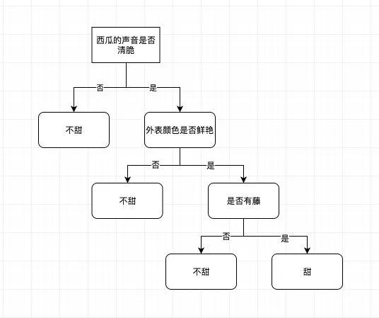
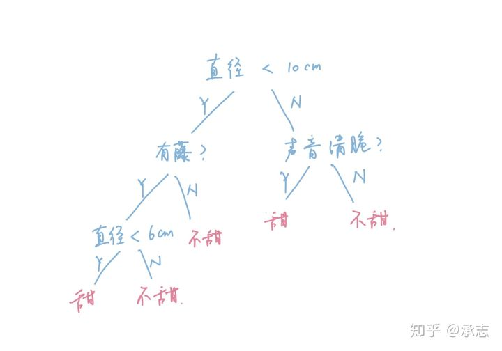
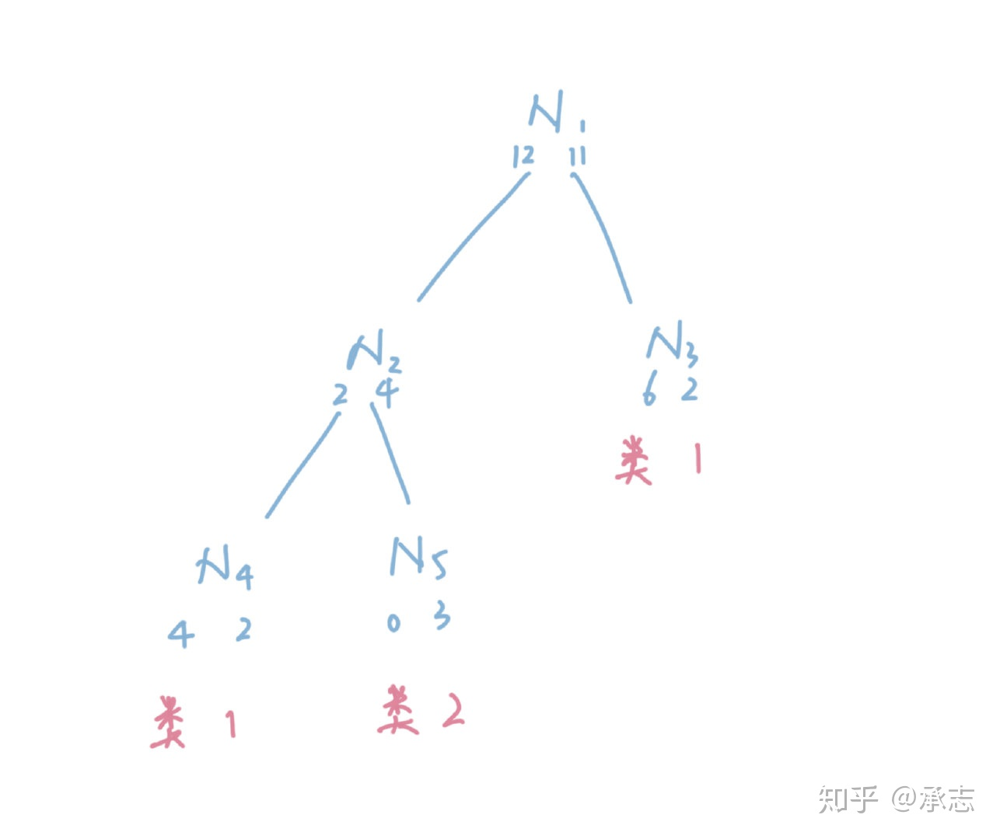

# 决策树定义

这个决策树本质上做的还是**分类**的工作，将西瓜分成了甜的和不甜的。也就是说决策树是一个**树形的分类器**，这个也是决策树的基本定义。另外从图中我们还有一个启示，在这个问题当中，决策树的特征都是离散值，而不是连续值。也就是说决策树可以接受像是类别、标识这样非数值型的特征，而逻辑回归这些模型则不太行。



对于每一条数据来说，它分类的过程其实就是在决策树上遍历的过程。**每到一个中间节点都会面临一次判断**，根据判断的结果选择下一个子树。而树上的叶子节点代表一种分类，当数据到了叶子节点，这个叶子节点的值就代表它的分类结果。

# 决策树训练

我们希望决策树得到的分类结果越准确越好, 而根据决策树的原理，树上的每一个叶子节点代表一个分类。那么我们显然希望最后到达叶子节点的数据尽可能纯粹，举个例子，如果一个叶子节点代表甜，那么我们肯定希望根据树结构被划归到这里的数据尽可能都是甜的，不甜的比例尽可能低。

如何实现这一点, 需要我们在越顶层提取规则的时候，越选择一些**区分度大的特征**作为切分的依据。所谓区分度大的特征，也就是能够将数据很好分开的特征。这是明显的贪心做法，使用这样的方法，我们只可以保证在尽可能高层取得尽可能好的分类结果，但是并不能保证这样得到的模型是最优的。生成最优的决策树本质上也是一个NP问题，我们当前的做法可以保证在尽量短的时间内获得一个足够优秀的解，但是没办法保证是最优解。

回到问题本身，我们想要用区分度大的特征来进行数据划分。要做到这一点的前提就是首先**定义区分度**这个概念，将它量化，这样我们才好进行选择。否则总不能凭感觉去衡量区分度，好在这个区分度还是很好解决的，我们只需要再一次引入信息熵的概念就可以了。

### 信息熵与信息增益(ID3, 越大越好)

#### 基本概念

熵在热力学中的定义为entropy, entropy本身是物理学和热力学当中的概念，用来衡量物体分散的**不均匀程度**. 也就是说熵越大，说明物体分散得程度越大，可以简单理解成越散乱。比如我们把房间里一盒整理好的乒乓球打翻，那么里面的乒乓球显然会散乱到房间的各个地方，这个散乱的过程可以理解成熵增大的过程。

信息熵也是一样的含义，用来衡量一份信息的散乱程度。熵越大，说明信息越杂乱无章，否则说明信息越有调理。信息熵出自大名鼎鼎的信息学巨著《**信息论**》，对于一个事件X来说，假设它发生的概率是P(X)，那么这个事件本身的信息量就是：
$$
I(X)=-\log _{2} P(X)
$$
比如说世界杯中国队夺冠的概率是1/128，那么我们需要用8个比特才能表示，说明它信息量很大。假如巴西队夺冠的概率是1/4，那么只要2个比特就足够了，说明它的信息量就很小。同样一件事情，根据发生的概率不同，它的信息量也是不同的。

那么信息熵的含义其实就是信息量的期望，也就是用信息量乘上它的概率：
$$
H(X)=-P(X) \log _{2} P(X)
$$
同样，假设我们有一份数据集合，其中一共有K类样本，每一类样本所占的比例是$P(K$), 那么我们把这个比例看成是概率的话, 就可以写出整个集合的信息熵:
$$
H(D)=-\sum_{i=1}^{K} P(K) \log _{2}(P(K))
$$
理解了信息熵的概念之后，再来看信息增益就很简单了。信息增益说白了就是我们**划分前后信息熵的变化量**，假设我们选择了某一个特征进行切分，将数据集D切分成了D1和D2。那么$H(D)-(H(D_1)+ H(D_2))$就是信息的增益, 也就是切分之后信息熵与之前的变换量.

我们根据熵的定义可以知道，如果数据变得纯粹了，那么**信息熵应该会减少**。减少得越多，说明切分的效果越好。所以我们就找到了衡量切分效果的方法，就是信息增益。我们根据信息增益的定义，可以很简单地理出整个决策树建立的过程。就是我们每次在选择切分特征的时候，都会遍历所有的特征，特征的每一个取值对应一棵子树，我们通过计算信息增益找到切分之后增益最大的特征。上层的结构创建好了之后， 通过递归的形式往下继续建树，直到切分之后的数据集变得纯粹，或者是所有特征都使用结束了为止。

这个算法称为**ID3算法**，它也是决策树最基础的构建算法。这里有一个小细节， 根据ID3算法的定义，每一次切分选择的是特征，而不是特征的取值。并且被选中作为切分特征的特征的**每一个取值都会建立一棵子树**，也就是说每一个特征在决策树当中都只会最多出现一次。因为使用一次之后，这个特征的所有取值就都被使用完了。

举个例子，比如拍打声音是否清脆这个特征，我们在一开始就选择了它。根据它的两个取值，是和否都建立了一棵子树。那么如果我们在子树当中再根据这个特征拆分显然没有意义，因为子树中的所有数据的这个特征都是一样的。另外，ID3算法用到的**所有特征必须是离散值**，因为连续值无法完全切分。如果西瓜的重量是一个特征，那么理论上来说所有有理数都可能是西瓜的质量，我们显然不可能穷尽所有的取值。

#### 代码实现

首先，我们来创造实验数据：

```python
import numpy as np
import math
def create_data():
    X1 = np.random.rand(50, 1)*100
    X2 = np.random.rand(50, 1)*100
    X3 = np.random.rand(50, 1)*100
    
    def f(x):
        return 2 if x > 70 else 1 if x > 40 else 0
    
    y = X1 + X2 + X3
    Y = y > 150
    Y = Y + 0
    r = map(f, X1)
    X1 = list(r)
    
    r = map(f, X2)
    X2 = list(r)
    
    r = map(f, X3)
    X3 = list(r)
    x = np.c_[X1, X2, X3, Y]
    return x, ['courseA', 'courseB', 'courseC']
```

这份数据模拟的是学生考试，一共考三门，一共要考到150分以上才算是通过。由于ID3算法只能接受离散值的特征，所以我们要先将连续值转成离散值，我们根据每一门的考试分数，生成三个档次。大于70分的是2档，40到70分的是1档，小于40分的是0档。

为了方便编码，我们把预测值Y放在特征的最后，并且返回这三个特征的名称，方便以后用来建树。

下面，我们实现计算集合信息熵的函数。这个函数也很简单，我们只需要计算出每个类别的占比，然后套用一下信息熵的公式即可。

```python
from collections import Counter

def calculate_info_entropy(dataset):
    n = len(dataset)
    # 我们用Counter统计一下Y的数量
    labels = Counter(dataset[:, -1])
    entropy = 0.0
    # 套用信息熵公式
    for k, v in labels.items():
        prob = v / n
        entropy -= prob * math.log(prob, 2)
    return entropy
```

有了信息熵的计算函数之后，我们接下来实现拆分函数，也就是根据特征的取值将数据集进行拆分的函数。

```python
def split_dataset(dataset, idx):
   # idx是要拆分的特征下标
    splitData = defaultdict(list)
    for data in dataset:
       # 这里删除了idx这个特征的取值，因为用不到了
        splitData[data[idx]].append(np.delete(data, idx))
    return list(splitData.values())
```

接下来我们就要实现核心的**特征的选择函数**了，也就是要选择信息增益最大的特征对数据进行切分。

```python
def choose_feature_to_split(dataset):
    n = len(dataset[0])-1
    m = len(dataset)
    # 切分之前的信息熵
    entropy = calculate_info_entropy(dataset)
    bestGain = 0.0
    feature = -1
    for i in range(n):
       # 根据特征i切分
        split_data = split_dataset(dataset, i)
        new_entropy = 0.0
        # 计算切分后的信息熵
        for data in split_data:
            prob = len(data) / m
            new_entropy += prob * calculate_info_entropy(data)
        # 获取信息增益
        gain = entropy - new_entropy
        if gain > bestGain:
            bestGain = gain
            feature = i
    return feature
```

到这里，我们所有工具方法都已经开发完了，下面就到了我们紧张刺激的建树部分了。建树其实并没有什么大不了的，无非是**通过递归来重复调用上面的方法**来创造每一个分支节点而已。如果你熟悉树形数据结构，会发现它和其他树形数据结构的构建过程并没有什么两样。

我们来看下代码，整个过程也只有十几行而已。

```python
def create_decision_tree(dataset, feature_names):
    dataset = np.array(dataset)
    counter = Counter(dataset[:, -1])
    # 如果数据集值剩下了一类，直接返回
    if len(counter) == 1:
        return dataset[0, -1]
    
    # 如果所有特征都已经切分完了，也直接返回
    if len(dataset[0]) == 1:
        return counter.most_common(1)[0][0]
    
    # 寻找最佳切分的特征
    fidx = choose_feature_to_split(dataset)
    fname = feature_names[fidx]
    
    node = {fname: {}}
    feature_names.remove(fname)
    
    # 递归调用，对每一个切分出来的取值递归建树
    split_data, vals = split_dataset(dataset, fidx)
    for data, val in zip(split_data, vals):
        node[fname][val] = create_decision_tree(data, feature_names[:])
    return node
```

#### 总结

我们的决策树虽然构建完了，但是仍然有很多不完美的地方。比如说，目前我们的模型只能接受离散值的特征，如果是连续值则无法进行拆分。而且我们每个特征**只能用一次**，有时候我们希望能够多次使用同一个特征。在这种情况下ID3就无法实现了。所以我们还需要引入其他的优化。

缺点: 其中最大的问题很明显，就是它**无法处理连续性的特征**。不能处理的原因也很简单，因为ID3在每次在切分数据的时候，选择的不是一个特征的取值，而是一个具体的特征。这个特征下有多少种取值就会产生多少个分叉，如果使用连续性特征的话，比如说我们把西瓜的直径作为特征的话。那么理论上来说每个西瓜的直径都是不同的，这样的数据丢进ID3算法当中就会产生和样本数量相同的分叉，这显然是没有意义的。

其实还有一个问题，藏得会比较深一点，是关于**信息增益**的。我们用划分前后的信息熵的差作为信息增益，然后我们选择带来最大信息增益的划分。这里就有一个问题了，这会导致模型在选择的时候，倾向于选择分叉比较多的特征。极端情况下，就比如说是连续性特征好了，每个特征下都只有一个样本，那么这样算出来得到的信息熵就是0，这样得到的信息增益也就非常大。这是不合理的，因为**分叉多的特征并不一定划分效果就好**，整体来看并不一定是有利的。

```python
from collections import Counter, defaultdict
import numpy as np
import math


def createData():
    x1 = np.random.rand(50, 1) * 100
    x2 = np.random.rand(50, 1) * 100
    x3 = np.random.rand(50, 1) * 100

    def f(x):
        return 2 if x > 70 else 1 if x > 40 else 0

    y = x1 + x2 + x3
    y = (y > 150).astype(int)
    r = map(f, x1)
    x1 = list(r)

    r = map(f, x2)
    x2 = list(r)

    r = map(f, x3)
    x3 = list(r)

    x = np.c_[x1, x2, x3, y]
    return x, ['courseA', 'courseB', 'courseC']


def caculateInfoEntropy(dataset):
    n = len(dataset)
    dataset = np.array(dataset)
    labels = Counter(dataset[:, -1])
    entropy = 0.0
    # 信息熵计算
    for k, v in labels.items():
        prob = v / n
        entropy -= prob * math.log(prob, 2)
    return entropy


def splitDataset(dataset, idx):
    splitData = defaultdict(list)

    for data in dataset:
        splitData[data[idx]].append(np.delete(data, idx))

    return splitData


def chooseFeature(dataset):
    n = len(dataset[0]) - 1
    m = len(dataset)

    entropy = caculateInfoEntropy(dataset)
    best_gain = 0
    feature = -1

    for i in range(n):
        split_data = splitDataset(dataset, i).values()

        new_entropy = 0
        for data in split_data:
            prob = len(data) / m
            new_entropy += prob * caculateInfoEntropy(data)
        gain = entropy - new_entropy
        if gain > best_gain:
            best_gain = gain
            feature = i

    return feature


def createDesitionTree(dataset, feature_names):
    dataset = np.array(dataset)
    counter = Counter(dataset[:, -1])

    if len(counter) == 1:
        return dataset[0, -1]
    if len(dataset[0]) == 1:
        return counter.most_common(1)[0][0]

    fidx = chooseFeature(dataset)
    fname = feature_names[fidx]

    node = {fname: {}}
    feature_names.remove(fname)

    split_data = splitDataset(dataset, fidx)
    for val, data in split_data.items():
        node[fname][val] = createDesitionTree(data, feature_names.copy())

    return node

def classify(node, feature_name, data):
    key = list(node.keys())[0]
    node = node[key]
    idx = feature_name.index(key)

    pred = None
    for key in node:
        if data[idx] == key:
            if isinstance(node[key], dict):
                pred = classify(node[key], feature_name, data)
            else:
                pred = node[key]
    if pred is None:
        for key in node:
            if not isinstance(node[key], dict):
                pred = node[key]
                break
    return pred

if __name__ == '__main__':
    dataset, feature_name = createData()

    tree = createDesitionTree(dataset, feature_name.copy())
    print(tree)
    pred = classify(tree, feature_name, [1, 0, 2])
    print(pred)

```


### 信息增益比(C4.5, 越大越好)

#### 基本概念

把信息增益改成**信息增益比**。所谓的信息增益比就是用信息增益除以我们这个划分本身的信息熵，从而得到一个比值。对于分叉很多的特征，它的自身的信息熵也会很大。因为分叉多，必然导致纯度很低。所以我们这样可以均衡一下特征分叉带来的偏差，从而让模型做出比较正确的选择。
$$
{ Gainratio }=\frac{\operatorname{Gain}(D, a)}{I V(a)}
$$
里的D就是我们的训练样本集，a是我们选择的特征，**IV(a)就是这个特征分布的信息熵**
$$
I V(a)=-\sum_{v=1}^{V} p_{v} \log _{2} p_{v}
$$
V是特征a所有取值的集合, $p_v$是每一个V对应的占比, 所以这个就是特征a的信息熵公式

**连续值**

C4.5算法对于连续值同样进行了优化，**支持了连续值**，支持的方式也非常简单，对于特征a的取值集合V来说，我们**选择一个阈值t进行划分**，将它划分成小于t的和大于t的两个部分。

也就是说C4.5算法对于连续值的切分和离散值是不同的，对于离散值变量，我们是对每一种取值进行切分，而对于连续值我们**只切成两份**。其实这个设计非常合理，因为对于大多数情况而言，每一条数据的连续值特征往往都是不同的。而且我们也没有办法很好地确定对于连续值特征究竟分成几个部分比较合理，所以比较直观的就是固定切分成两份，总比无法用上好。在极端情况下，连续值特征的取值数量等于样本条数，那么我们怎么选择这个阈值呢？即使我们遍历所有的切分情况，也有n-1种，这显然是非常庞大的，尤其在样本数量很大的情况下。针对这个问题，也有解决的方法，就是按照特征值排序，**选择真正意义上的切分点**。什么意思呢，我们来看一份数据：

**直径是否甜**: 3甜4甜5不甜6不甜7甜8不甜9不甜

这份数据是我们队西瓜直径这个特征排序之后的结果，我们可以看出来，**训练目标改变的值其实只有3个**，分别是直径5，7还有8的时候，我们只需要考虑这三种情况就好了，其他的情况可以不用考虑。

#### 代码实现

首先我们先来改造构造数据的部分，我们依然沿用上次的数据，学生的三门考试等级以及它是否通过达标的数据。我们认为三门成绩在150分以上算是达标，大于70分的课程是2等级，40-70分之间是1等级，40分以下是0等级。在此基础上我们**增加了分数作为特征**，我们在分数上增加了一个误差，避免模型直接得到结果。

```python
import numpy as np
import math
def create_data():
    X1 = np.random.rand(50, 1)*100
    X2 = np.random.rand(50, 1)*100
    X3 = np.random.rand(50, 1)*100
    
    def f(x):
        return 2 if x > 70 else 1 if x > 40 else 0
    
    # 学生的分数作为特征，为了公平，加上了一定噪音
    X4 = X1 + X2 + X3 + np.random.rand(50, 1) * 20
    
    y = X1 + X2 + X3
    Y = y > 150
    Y = Y + 0
    r = map(f, X1)
    X1 = list(r)
    
    r = map(f, X2)
    X2 = list(r)
    
    r = map(f, X3)
    X3 = list(r)
    x = np.c_[X1, X2, X3, X4, Y]
    return x, ['courseA', 'courseB', 'courseC', 'score']
```


由于我们需要计算信息增益比，所以需要开发一个**专门的函数用来计算信息增益比**。由于这一次的数据涉及到了连续型特征，所以我们需要多传递一个阈值，来判断是否是连续性特征。如果是离散型特征，那么阈值为None，否则为具体的值。

```python
def info_gain(dataset, idx):
    # 计算基本的信息熵
    entropy = calculate_info_entropy(dataset)
    m = len(dataset)
    # 根据特征拆分数据
    split_data, _ = split_dataset(dataset, idx)
    new_entropy = 0.0
    # 计算拆分之后的信息熵
    for data in split_data:
        prob = len(data) / m
        # p * log(p)
        new_entropy += prob * calculate_info_entropy(data)
    return entropy - new_entropy


def info_gain_ratio(dataset, idx, thred=None):
    # 拆分数据，需要将阈值传入，如果阈值不为None直接根据阈值划分
    # 否则根据特征值划分
    split_data, _ = split_dataset(dataset, idx, thred)
    base_entropy = 1e-5
    m = len(dataset)
    # 计算特征本身的信息熵
    for data in split_data:
        prob = len(data) / m
        base_entropy -= prob * math.log(prob, 2)
    return info_gain(dataset, idx) / base_entropy, thred
```


split_dataset函数也需要修改，因为我们拆分的情况多了一种根据阈值拆分，通过判断阈值是否为None来判断进行阈值划分还是特征划分。

```python
def split_dataset(dataset, idx, thread=None):
    splitData = defaultdict(list)
    # 如果阈值为None那么直接根据特征划分
    if thread is None:
        for data in dataset:
            splitData[data[idx]].append(np.delete(data, idx))
        return list(splitData.values()), list(splitData.keys())
    else:
        # 否则根据阈值划分，分成两类大于和小于
        for data in dataset:
            splitData[data[idx] < thread].append(np.delete(data, idx))
        return list(splitData.values()), list(splitData.keys())
```


前面说了我们在选择阈值的时候其实并不一定要遍历所有的取值，因为有些取值并不会引起label分布的变化，对于这种取值我们就可以忽略。所以我们需要一个函数来**获取阈值所有的可能性**，这个也很简单，我们直接根据阈值排序，然后遍历观察label是否会变化，记录下所有label变化位置的值即可：

```python
def get_thresholds(X, idx):

    # numpy多维索引用法
    new_data = X[:, [idx, -1]].tolist()
    # 根据特征值排序
    new_data = sorted(new_data, key=lambda x: x[0], reverse=True)
    base = new_data[0][1]
    threads = []

    for i in range(1, len(new_data)):
        f, l = new_data[i]
        # 如果label变化则记录
        if l != base:
            base = l
            threads.append(f)

    return threads
```


有了这些方法之后，我们需要**开发选择拆分值的函数**，也就是计算所有特征的信息增益比，找到信息增益比最大的特征进行拆分。其实我们将前面拆分和获取所有阈值的函数都开发完了之后，要寻找最佳的拆分点就很容易了，基本上就是利用一下之前开发好的代码，然后搜索一下所有的可能性：

```python
def choose_feature_to_split(dataset):
    n = len(dataset[0])-1
    m = len(dataset)
    # 记录最佳增益比、特征和阈值
    bestGain = 0.0
    feature = -1
    thred = None
    for i in range(n):
        # 判断是否是连续性特征，默认整数型特征不是连续性特征
        # 这里只是我个人的判断逻辑，可以自行diy
        if not dataset[0][i].is_integer():
            threds = get_thresholds(dataset, i)
            for t in threds:
                # 遍历所有的阈值，计算每个阈值的信息增益比
                ratio, th = info_gain_ratio(dataset, i, t)
                if ratio > bestGain:
                    bestGain, feature, thred = ratio, i, t
        else:
            # 否则就走正常特征拆分的逻辑，计算增益比
            ratio, _ = info_gain_ratio(dataset, i)    
            if ratio > bestGain:
                bestGain = ratio
                feature, thred = i, None
    return feature, thred
```


到这里，基本方法就开发完了，只剩下建树和预测两个方法了。这两个方法和之前的代码改动都不大，基本上就是细微的变化。我们先来看建树，建树唯一的不同点就是在dict当中需要额外存储一份阈值的信息。如果是None表示离散特征，不为None为连续性特征，其他的逻辑基本不变。

```python
def create_decision_tree(dataset, feature_names):
    dataset = np.array(dataset)
    # 如果都是一类，那么直接返回类别
    counter = Counter(dataset[:, -1])
    if len(counter) == 1:
        return dataset[0, -1]
    
    # 如果只有一个特征了，直接返回占比最多的类别
    if len(dataset[0]) == 1:
        return counter.most_common(1)[0][0]
    
    # 记录最佳拆分的特征和阈值
    fidx, th = choose_feature_to_split(dataset)
    fname = feature_names[fidx]
    
    node = {fname: {'threshold': th}}
    feature_names.remove(fname)
    
    split_data, vals = split_dataset(dataset, fidx, th)
    for data, val in zip(split_data, vals):
        node[fname][val] = create_decision_tree(data, feature_names[:])
    return node
```


最后是预测的函数，逻辑和之前一样，只不过加上了阈值是否为None的判断而已，应该非常简单：

```python
def classify(node, feature_names, data):
    key = list(node.keys())[0]
    node = node[key]
    idx = feature_names.index(key)
    
    pred = None
    thred = node['threshold']
    # 如果阈值为None，那么直接遍历dict
    if thred is None:
        for key in node:
            if key != 'threshold' and data[idx] == key:
                if isinstance(node[key], dict):
                    pred = classify(node[key], feature_names, data)
                else:
                    pred = node[key]
    else:
        # 否则直接访问
        if isinstance(node[data[idx] < thred], dict):
            pred = classify(node[data[idx] < thred], feature_names, data)
        else:
            pred = node[data[idx] < thred]
            
    # 放置pred为空，挑选一个叶子节点作为替补
    if pred is None:
        for key in node:
            if not isinstance(node[key], dict):
                pred = node[key]
                break
    return pred
```

#### **总结**


到这里整个决策树的C4.5算法就开发完了，整体来说由于加上了信息增益比以及连续性特征的逻辑，所以整体的代码比之前要复杂一些，但是基本上的逻辑和套路都是一脉相承的，基本上没什么太大的变化。


决策树说起原理来非常简单，但是很多细节如果没有亲自做过是意识不到的。比如说连续性特征的阈值集合应该怎么找，比如说连续性特征和离散型的特征混合的情况，怎么在代码当中区分，等等

```python
from collections import Counter, defaultdict
import numpy as np
import math

def creatDataset():
    x1 = np.random.randn(50, 1) * 100
    x2 = np.random.randn(50, 1) * 100
    x3 = np.random.randn(50, 1) * 100

    def f(x):
        return 2 if x > 70 else 1 if x > 40 else 0

    x4 = x1 + x2 + x3 + np.random.randn(50, 1) * 20

    y = x1 + x2 + x3
    y = (y > 150).astype(int)

    r = map(f, x1)
    x1 = list(r)

    r = map(f, x2)
    x2 = list(r)

    r = map(f, x3)
    x3 = list(r)

    x = np.c_[x1, x2, x3, x4, y]
    return x, ['courseA', 'courseB', 'courseC', 'score']

def caculateInfoEntropy(dataset):
    n = len(dataset)
    dataset = np.array(dataset)
    labels = Counter(dataset[:, -1])
    entropy = 0.0
    # 信息熵计算
    for k, v in labels.items():
        prob = v / n
        entropy -= prob * math.log(prob, 2)
    return entropy

def splitDataset(dataset, idx, thread=None):
    split_data = defaultdict(list)

    if thread is None:
        for data in dataset:
            split_data[data[idx]].append(np.delete(data, idx))
    else:
        for data in dataset:
            split_data[data[idx] < thread].append(np.delete(data, idx))
    return list(split_data.values()), list(split_data.keys())

def infoGain(dataset, idx, thread=None):
    m = len(dataset)
    entropy = caculateInfoEntropy(dataset)
    split_data, _ = splitDataset(dataset, idx, thread)
    new_entropy = 0

    for data in split_data:
        prob = len(data) / m
        new_entropy += prob * caculateInfoEntropy(data)
    return entropy - new_entropy

def infoGainRatio(dataset, idx, thread=None):
    m = len(dataset)
    split_data, _ = splitDataset(dataset, idx, thread)
    base_entropy = 1e-5
    for data in split_data:
        prob = len(data) / m
        base_entropy -= prob * np.log2(prob)
    return infoGain(dataset, idx, thread) / base_entropy

def getThresholds(x, idx):
    new_data = x[:, [idx, -1]].tolist()

    new_data = sorted(new_data, key=lambda x: x[0], reverse=True)
    base = new_data[0][1]
    threads = []
    for i in range(len(new_data)):
        f, l = new_data[i]

        if (l != base):
            base = l
            threads.append(f)

    return threads

def chooseFeature(dataset):
    n = len(dataset[0])-1
    m = len(dataset)
    best_gain = 0
    feature = -1
    thread = None

    for i in range(n):

        if not dataset[0][i].is_integer():
            threads = getThresholds(dataset, i)

            for t in threads:
                ratio = infoGainRatio(dataset, i, t)
                if ratio > best_gain:
                    best_gain = ratio
                    thread = t
                    feature = i
        else:
            ratio = infoGainRatio(dataset, i)
            if ratio > best_gain:
                best_gain = ratio
                feature = i
                thread = None

    return feature, thread

def createDesitoionTree(dataset, featurename):
    dataset = np.array(dataset)
    counter = Counter(dataset[:, -1])

    if len(counter) == 1:
        return dataset[0][0]
    if len(dataset[0]) == 1:
        return counter.most_common(1)[0][0]
    fixd, t = chooseFeature(dataset)
    fname = featurename[fixd]
    node = {fname:{'threshold': t}}
    featurename.remove(fname)
    split_data, vals = splitDataset(dataset, fixd, t)
    for data, val in zip(split_data, vals):
        node[fname][val] = createDesitoionTree(data, featurename.copy())
    return node


def classify(node, feature_names, data):
    key = list(node.keys())[0]
    node = node[key]
    idx = feature_names.index(key)

    pred = None
    thread = node['threshold']

    if thread is None:
        for key in node:
            if key != 'threshold' and data[idx] == key:
                if isinstance(node[key], dict):
                    pred = classify(node[key], feature_names, data)
                else:
                    pred = node[key]

    else:
        if isinstance(node[data[idx] < thread], dict):
            pred = classify(node[data[idx] < thread], feature_names, data)
        else:
            pred = node[data[idx] <thread]
    if pred is None:
        for key in node:
            if not isinstance(node[key], dict):
                pred = node[key]
                break
    return pred


if __name__ == '__main__':
    dataset, feature_name = creatDataset()

    tree = createDesitoionTree(dataset, feature_name.copy())
    print(tree)
    pred = classify(tree, feature_name, [1, 0, 2, 45])
    print(pred)

```

### 决策树CART算法

CART算法全称是**Classification and regression tree**，也就是分类回归树的意思。CART称为分类回归树, 它既能支持分类又可以支持回归, 决策树的确支持回归操作，但是我们一般不会用决策树来进行回归。这里面的原因很多，除了树模型拟合能力有限效果不一定好之外，还与特征的模式有关系，树回归模型受到特征的影响非常大。

正因为回归树模型效果表现都不太理想，所以CART算法实现决策树**基本都是用来做分类问题**。那么在分类问题上，它与之前的ID3算法和C4.5算法又有什么不同呢？

主要细究起来大约有两点，第一点是CART算法使用Gini指数而不是信息增益来作为划分子树的依据，第二点是CART算法每次在划分数据的时候，固定将整份数据拆分成两个部分，而不是多个部分。由于CART每次将数据拆分成两个部分，所以**它对于拆分的次数没有限制**，而C4.5算法对特征进行了限制，限制了每个特征最多只能使用一次。因为这一点，同样CART对于剪枝的要求更高，因为不剪枝的话很有可能导致树过度膨胀，以至于过拟合。

#### **Gini指数**(越小越好)

在ID3和C4.5算法当中，在拆分数据的时候用的是信息增益和信息增益比，这两者都是基于信息熵模型。信息熵模型本身并没有问题，也是非常常用的模型。唯一的问题是，在计算熵的时候需要涉及到log运算，相比于四则运算来说，**计算log要多耗时很多**。

Gini指数本质上也是基于信息熵模型，只是我们在计算的时候做了一些转化，从而避免了使用log进行计算，加速了计算的过程。两者的内在逻辑是一样的。那怎么实现的加速计算呢？这里用到了高等数学当中的**泰勒展开**，我们将log运算通过泰勒公式展开，转化成多项式的计算，从而加速信息熵的计算。
$$
\ln (x) \approx \ln \left(x_{0}\right)+\left(x-x_{0}\right) \ln ^{\prime}\left(x_{0}\right)+o(x)
$$
我们把$x_0=1$带入, 可以得到$\ln (x)=x-1+o(x)$其中$o(x)$相当于高阶无穷小, 我们把上述算式带入信息熵中可以得到
$$
\begin{aligned}
H(x) &=-\sum_{i=1}^{k} p_{i} \ln p_{i} \\
& \approx \sum_{i=1}^{k} p_{i}\left(1-p_{i}\right)
\end{aligned}
$$
这个就是Gini指数的计算公式，这里的$p_i$表示的是第i类的概率, 其实就是类别i的样本占全体样本的比例。那么上面的式子也可以看成是从数据集当中抽取两条样本，它们类别不一致的概率。

因此**Gini指数越小，说明数据集越集中**，也就是纯度越高。它的概念等价于信息熵，熵越小说明信息越集中，两者的概念是非常近似的。所以当我们使用Gini指数来作为划分依据的时候，选择的是切分之后Gini指数尽量小的切分方法，而不是尽量大的

从上面的公式当中，我们可以发现相比于信息熵的log运算，Gini指数只需要简单地计算比例和基础运算就可以得到结果了，显然运算速度要快得多。并且由于是通过泰勒展开逼近的，整体的性能也并不差，我们可以看下下面这张经典的图感受一下：


从上图当中可以看出来，Gini指数和信息熵的效果非常接近，一样可以非常好地反应数据划分的纯度。

#### 拆分与剪枝

刚才我们介绍CART算法特性的时候提到过，CART算法**每次拆分数据都是二分的**，这点和C4.5处理连续性特征的逻辑很像。但有两点不同，第一点是CART对于离散型和连续性特征都如此操作，另外一点是，CART算法当中一个特征可以重复使用。

举个例子，在之前的算法当中，比如说西瓜的直径是一个特征。那么当我们判断过西瓜的直径小于10cm之后，西瓜的直径这个特征就会从数据当中移除，之后再也不会用到。但是在CART算法当中不是如此，比如当我们先后根据西瓜的直径以及西瓜是否有藤这两个特征对数据进行拆分之后，对于ID3和C4.5算法来说，西瓜的直径这个特征已经不可以再用来作为划分的依据了，但是CART算法当中可以，我们仍然可以继续使用之前已经用过的特征。



我们观察一下最左侧的子树，直径这个特征出现了不止一次，这其实是很合理的。然而这也会有一个问题，就是由于没有了特征只能用一次这个限制，这样**会导致这棵树无限膨胀**，尤其是在连续性特征很多的情况下，很容易陷入过拟合。为了放置过拟合，增加模型的泛化能力，我们需要对生成的这棵树进行剪枝。

剪枝的方案主流的有两种，**一种是预剪枝，一种是后剪枝**。所谓的预剪枝，即是在生成树的时候就对树的生长进行限制，防止过度拟合。而后剪枝则是在树已经生成之后，对过拟合的部分进行修剪。其中预剪枝比较容易理解，比如我们可以限制决策树在训练的时候每个节点的数据只有在达到一定数量的情况下才会进行分裂，否则就成为叶子节点保留。或者我们可以限制数据的比例，当节点中某个类别的占比超过阈值的时候，也可以停止生长。

后剪枝相对来说复杂一些，需要我们在生成树之后通过一些机制寻找可以剪枝的部分，对整棵树进行修剪。比如在CART算法当中常用的剪枝策略是CCP，它的英文全写是Cost-Complexity Pruning，即**代价复杂度剪枝**。这个策略设计了一个指标来衡量一棵子树的复杂度代价，我们可以对这个代价设置阈值来进行剪枝。
$$
c=\frac{R(t)-R\left(T_{t}\right)}{\left|N_{t}\right|-1}
$$
这个式子当中的c就是指的剪枝带来的代价，t代表剪枝之后的子树, $T_t$代表剪枝之前的子树, R(t)代表剪枝之后的误差代价, $R(T_t)$就是剪枝之前的误差代价, 其中误差代价的定义是$R(t)=r(t)*p(t)$, r(t)是t节点的误差率, p(t)是t上所占的数据比例



假设我们有100条数据, 则$R(t)=r(t) * p(t)=\frac{11}{23} * \frac{23}{100}=\frac{11}{100}$, 修剪前的误差代价为$R\left(T_{t}\right)=\sum R(i)=\left(\frac{2}{6} * \frac{6}{100}\right)+\left(\frac{0}{3} * \frac{3}{100}\right)+\left(\frac{2}{8} * \frac{8}{100}\right)=\frac{4}{100}$最终得到$c=\frac{11 / 100-4 / 100}{3-1}=\frac{7}{200}$, 其中c越大代表误差代价越大, 越不能减. 我们只需要设置阈值，然后计算每一棵子树的c来判断是否能够剪枝即可。

#### 算法实现

我们之前已经实现过了C4.5算法，再来实现CART可以说是非常简单了，因为它相比于C4.5还少了离散类型这种情况，可以全部当做是连续型类型来处理。

我们**只需要把之前的信息增益比改成Gini指数**即可

